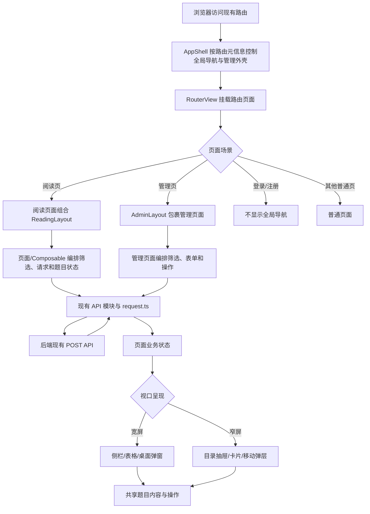

# 前端多端呈现架构模块开发设计

> 本文档针对 408 考研真题知识点阅读网站前端的多端呈现架构，描述桌面宽屏与移动窄屏在同一 Vue Web 应用中的模块边界、页面流程、数据边界和接口约束。本文中的“移动端”暂指浏览器 H5 窄屏，不包含原生 App 或独立跨端运行时。

---

## 1. 需求

### 1.1 模块目标

当前前端已经区分用户页面和管理员页面，但桌面端与移动端主要通过同一页面中的 Tailwind 响应式类、媒体查询和条件模板混合实现。随着题库浏览、管理和出题功能继续增加，页面模板、设备判断和业务请求容易互相耦合，导致以下问题：

- 同一业务页面同时维护宽屏侧栏、窄屏抽屉、表格和卡片等多套呈现逻辑；
- 页面组件逐渐承担请求、筛选、答案状态、设备判断和布局职责；
- 桌面端或移动端新增交互时，容易影响另一端已有行为；
- 相似的真题、模拟题和改编题页面继续复制结构；
- 后续若移动端需要独立产品形态，缺少可复用的业务核心边界。

本模块的目标不是立即建立两个独立前端项目，而是先形成“共享业务内核、宽屏/窄屏呈现层分离、路由和接口保持一致”的渐进式架构。

### 1.2 已确认的项目事实

| 事实 | 当前实现依据 |
|---|---|
| 前端使用 Vue 3、TypeScript、Vite、Vue Router、Pinia、Axios 和 Tailwind CSS | `frontend/package.json`、`frontend/tsconfig.app.json`、`frontend/vite.config.ts` |
| 页面已经按用户端和管理端分布 | `frontend/src/views/user/`、`frontend/src/views/admin/` |
| 当前共有 16 个前端页面，桌面/窄屏逻辑分布在同一批页面中 | `frontend/src/views/` |
| 全局导航由 `Navigation.vue` 组合 `NavigationDesktop.vue` 与 `NavigationMobile.vue`；`useNavigation` 共享菜单状态和业务动作 | `frontend/src/components/business/Navigation.vue`、`NavigationDesktop.vue`、`NavigationMobile.vue`、`frontend/src/composables/useNavigation.ts` |
| 真题、模拟题、改编题阅读页已经共用窄屏目录入口和底部抽屉 | `MobileQuestionNav.vue`、`BottomSheet.vue` |
| 桌面科目侧栏在窄屏隐藏，窄屏通过目录抽屉替代 | `SubjectSidebar.vue`、`SubjectNavList.vue` |
| 项目统一使用 420/640/768/1024/1280 五档响应式基线，窄屏和宽屏主要以 768px 区分 | `frontend/src/styles/tailwind.css` |
| 路由页面已经使用动态导入，后端 API 和前端请求入口已经集中封装 | `frontend/src/router/index.ts`、`frontend/src/api/request.ts` |

### 1.3 功能需求

1. **统一业务入口**
   - 桌面端和移动端继续使用同一套 URL、路由参数、认证状态和后端接口。
   - 不新增 `/mobile`、`/desktop` 等重复路由。

2. **应用布局分层**
   - 全局应用布局负责导航、认证页面和路由视图承载。
   - 阅读布局提供阅读页导航插槽和内容滚动区；宽屏侧栏、窄屏目录入口由阅读页面及其导航组件呈现。
   - 管理布局负责管理页面外壳与横向布局边界；工具栏、列表/表格和编辑入口由具体管理页面及可复用业务组件负责。

3. **设备相关呈现分离**
   - 纯视觉和尺寸差异继续由 CSS/Tailwind 处理。
   - 交互模型明显不同的场景拆分为宽屏和窄屏组件，例如侧栏与底部抽屉、桌面表格与移动卡片、桌面 Dialog 与移动 BottomSheet。
   - 题目加载、筛选、分页、答案显隐、分类分组等业务逻辑不得在宽屏和窄屏组件中复制。

4. **业务模块边界清晰**
   - 真题、模拟题、改编题、目录和管理能力按业务模块组织。
   - 业务页面只编排页面状态和组件，不直接创建 Axios 实例或重复处理底层响应。
   - API 类型、领域模型、表单模型和组件 Props 保持可区分。

5. **渐进式迁移**
   - 第一阶段不整体重命名或搬迁现有目录。
   - 优先改造共享程度最高的真题/模拟题/改编题阅读页面，再改造大型管理页面。
   - 每个阶段保持现有路由、接口和权限行为不变。

### 1.4 非功能需求

- **兼容性**：现有路由、请求路径、统一响应结构、认证和管理员权限不改变。
- **响应式一致性**：沿用项目已有断点，避免 CSS 断点和 JavaScript 媒体查询使用不同阈值。
- **异步可靠性**：筛选、路由切换和窗口变化不能让旧请求覆盖新状态；区分首次加载、刷新、分页、空数据、取消和错误状态。
- **可访问性**：窄屏抽屉、弹层和菜单继续支持焦点管理、Escape、键盘操作、语义标签和 `aria` 状态。
- **性能**：继续使用路由懒加载；不因设备分层重复加载同一份业务数据；暂不引入新的依赖或服务端渲染方案。
- **可回滚**：布局提取和页面迁移均以独立阶段提交，任一阶段可恢复原页面入口，不涉及数据库迁移。

### 1.5 范围与边界

**本模块负责：**

- 前端应用布局、宽屏/窄屏呈现边界和迁移规则；
- 阅读端和管理端页面的设备适配组织方式；
- 前端响应式状态、组件和业务 composable 的职责划分；
- 保持现有 API、数据库和权限契约的前端设计。

**本模块不负责：**

- 后端业务模块、数据库表结构和 API 业务语义重构；
- 题目、分类、用户和图片数据模型变更；
- 原生 App、UniApp、Flutter 或其他独立移动运行时；
- 将移动端改造成离线应用、推送应用或独立发布渠道。

### 1.6 验收标准

- 相同 URL 在宽屏和窄屏下均可完成原有业务流程。
- 768px 以下不显示桌面侧栏，目录、筛选和题目操作可通过窄屏交互完成；768px 以上不残留移动抽屉和移动遮罩。
- 浏览器缩放或窗口旋转后，移动抽屉能够关闭或重新适配，业务筛选和答案状态不被错误重置。
- 新增页面不直接复制一套宽屏业务逻辑和一套窄屏业务逻辑。
- 题目 API、管理 API、登录权限和统一错误处理保持现有行为。
- 每个迁移阶段均能通过项目既有类型检查、测试和构建命令；本设计文档本身不执行这些命令。

---

## 2. 该项目的模块结构与流程

### 2.1 当前结构与问题边界

当前前端主要结构如下：

```text
frontend/src/
├─ api/                  # Axios API 封装
├─ app/layouts/          # AppShell、ReadingLayout、AdminLayout
├─ components/
│  ├─ basic/             # 通用交互组件
│  └─ business/          # 业务组件，同时包含部分设备差异
├─ composables/          # 可复用组合式逻辑
├─ constants/            # 前端常量
├─ router/               # Vue Router 路由
├─ shared/responsive/    # 统一断点与视口监听
├─ stores/               # 认证和科目等跨路由状态
├─ styles/               # 全局样式
├─ types/                # API 与业务类型
├─ utils/                # 转换、内容和交互工具
└─ views/
   ├─ user/              # 学习者页面
   └─ admin/             # 管理员页面
```

当前关键协作关系：

- `App.vue` 只挂载 `AppShell`；`AppShell` 根据路由元信息控制全局导航、管理员外壳和 `keep-alive`，并承载 `router-view`。
- `router/index.ts` 通过动态导入加载用户端和管理端页面，并在路由守卫中处理登录与管理员权限体验。
- `Navigation.vue` 组合 `NavigationDesktop.vue` 与 `NavigationMobile.vue`；两端的具体呈现由子组件负责，共用交互状态和业务动作由 `useNavigation` 提供。
- `ExamClassify.vue`、`MockClassify.vue`、`AdaptationClassify.vue` 和 `ExamList.vue` 已共用 `ReadingLayout`；三个分类阅读页共用 `useCategoryOutline`。题库请求、筛选和题目业务状态仍由相应页面及既有 composable 编排，尚未统一迁入 feature 目录。
- `SubjectSidebar`、`YearNav` 等桌面导航外壳在窄屏隐藏；`MobileQuestionNav`、`BottomSheet` 承担窄屏替代交互。
- `api/request.ts` 统一处理 API 地址、Token、响应信封、字段转换和基础错误；具体 API 模块负责端点和请求类型。

当前问题不是业务模块缺失，而是“设备呈现边界”与“页面业务编排边界”重叠。设计应优先抽取外壳和共享状态，不应先进行全量目录搬迁。

### 2.2 目标结构

目标结构用于新增和逐步迁移的页面。`app/layouts/` 与 `shared/responsive/` 已在当前代码中落地；`features/*`、`shared/ui/`、`shared/content/` 属于渐进整理方向，当前尚未建立完整目录，不作为多端适配的前置条件。已有 `api/`、`types/`、`stores/`、`router/` 在迁移初期保留，不要求一次性移动。

```text
frontend/src/
├─ app/
│  └─ layouts/
│     ├─ AppShell.vue              # 全局导航、认证布局和路由承载
│     ├─ ReadingLayout.vue         # 阅读端宽屏/窄屏布局外壳
│     └─ AdminLayout.vue            # 管理端页面外壳
├─ features/
│  ├─ exam/
│  │  ├─ pages/
│  │  ├─ components/
│  │  │  ├─ shared/                # 题目业务的设备无关组件
│  │  │  ├─ wide/                  # 宽屏专用呈现
│  │  │  └─ compact/               # 窄屏专用呈现
│  │  └─ composables/              # 真题读取、筛选和导航逻辑
│  ├─ mock/
│  ├─ adaptation/
│  └─ catalog/
├─ shared/
│  ├─ ui/                          # 从现有 basic 逐步归拢的通用组件
│  ├─ responsive/
│  │  ├─ breakpoints.ts            # 响应式断点单一来源
│  │  └─ useViewport.ts             # 仅供需要行为切换的场景使用
│  └─ content/                     # Markdown、公式、图片等内容能力
├─ api/
├─ router/
├─ stores/
├─ types/
└─ utils/
```

### 2.3 目标层次职责

| 层次 | 职责 | 不承担的职责 |
|---|---|---|
| `AppShell` | 全局导航、认证页显示、路由视图承载、全局布局状态 | 题目筛选、题目请求、管理表单业务 |
| `ReadingLayout` | 阅读页宽屏/窄屏导航具名插槽与内容滚动容器；具体导航组件及断点显隐由页面负责 | 真题/模拟题/改编题具体查询规则 |
| `AdminLayout` | 管理页统一外壳与横向溢出隔离 | 页面专属标题、工具栏、列表/详情、表单校验和写入规则 |
| `features/*/composables` | 请求编排、筛选、分页、分组、答案显隐、竞态处理 | DOM 布局和设备专属视觉 |
| `features/*/components/shared` | 设备无关的题目内容、标签、状态、业务卡片 | 侧栏、底部抽屉等设备专属导航 |
| `wide` / `compact` | 宽屏或窄屏的布局与交互实现 | 复制 API 请求逻辑、修改题目领域状态 |
| `shared/ui` | Button、Dialog、BottomSheet、Table 等通用交互能力 | 题库业务规则 |
| `api` | 端点、请求模型、响应模型、字段转换和统一请求入口 | 页面布局、Toast 决策和题目分组 |
| `stores` | 跨路由或跨模块的最小共享状态 | 当前页面的抽屉开关、局部加载状态 |

### 2.4 响应式设计规则

1. **样式差异优先 CSS**
   - 间距、字号、列数、显隐、排列方向继续使用 Tailwind 和现有断点。
   - 不为每个组件建立桌面和移动两份模板。

2. **语义交互差异才拆组件**
   - `SubjectSidebar` 与 `MobileQuestionNav` 属于合理的设备专用组件。
   - 桌面表格和移动卡片在信息密度、操作方式确实不同的管理页中分别实现。
   - 共享题目正文、答案、标签和状态组件。

3. **设备判断集中管理**
   - `breakpoints.ts` 维护 420、640、768、1024、1280 断点。
   - `useViewport.ts` 仅用于需要 JS 行为差异的场景，例如窗口变宽时关闭 BottomSheet。
   - 页面不得分散使用 `window.innerWidth`、用户代理或自定义阈值。

4. **不将设备模式提升为全局业务状态**
   - 当前视口模式、菜单打开状态和局部抽屉状态默认留在布局或页面组件。
   - Pinia 只保存认证、科目等确实跨页面共享的状态。

5. **不向后端传递设备参数**
   - 桌面与窄屏默认使用相同的业务请求和分页语义。
   - 只有未来出现明确的服务端内容裁剪需求，才单独设计 API 字段或能力协商。

### 2.5 核心流程

当前实现中，路由元信息驱动全局导航与管理员外壳；阅读页由页面组件内部组合 `ReadingLayout`，路由元信息不单独选择阅读布局。



### 2.6 数据流与状态流

#### 阅读页面

1. 路由提供年份、科目、分类、题目定位等上下文。
2. 页面 composable 根据路由和筛选条件构造请求参数。
3. `frontend/src/api/*.ts` 调用 `request.ts`，沿用现有响应信封和命名转换。
4. composable 维护首次加载、刷新、分页、空数据、错误和取消状态。
5. 领域数据转换为题目分组、分类大纲和答案状态。
6. 阅读页面按统一响应式断点控制宽屏和窄屏导航组件的显隐；`ReadingLayout` 提供导航插槽与内容滚动容器，不自行判断视口或创建目录入口。目录状态由页面及相关导航组件按现有业务边界共享。
7. 题目内容由共享组件渲染，宽屏/窄屏只改变容器和操作入口。

#### 管理页面

1. 路由守卫提供登录和管理员访问体验，服务端权限仍是最终边界。
2. 页面 composable 维护筛选、分页、排序、表单、提交中和删除确认状态。
3. API 模块通过现有管理接口读写数据。
4. 宽屏使用表格、侧栏和 Dialog；窄屏按页面信息密度选择横向滚动、卡片或 BottomSheet。
5. 写入成功后由现有页面刷新或局部更新列表，不将管理操作状态放入设备级 Store。

### 2.7 分阶段实施计划

| 阶段 | 目标与主要文件 | 前置依赖 | 优先级 | 工作量 | 当前状态 |
|---|---|---|---|---|---|
| P0 | 固化本设计、断点单一来源、组件分层和迁移验收规则 | 本文档 | 阻塞 | S | 已完成：设计文档与统一响应式断点已建立。 |
| P1 | 提取 `AppShell`、`ReadingLayout`、`AdminLayout`；拆分 `Navigation.vue` 的宽屏/窄屏呈现，保留共享菜单数据和动作 | P0 | 核心 | M | 已完成：布局外壳和导航宽/窄屏组件已落地。 |
| P2 | 改造 `ExamClassify.vue`、`MockClassify.vue`、`AdaptationClassify.vue`、`ExamList.vue`；抽取阅读外壳和共用 composable | P1 | 核心 | L | 已完成：4 个页面使用 `ReadingLayout`；3 个分类页共用 `useCategoryOutline` 和 `useInfiniteQuestionList`。领域请求参数、筛选及排序/去重规则仍由页面适配层负责。用户反馈手动测试无问题。 |
| P3 | 引入统一的响应式弹层包装；先改造 `CategoryManage.vue`、`QuestionCompose.vue`，再迁移其他管理页面 | P1 | 核心 | L | 核心目标已落地：`ResponsiveDialog` 已建立并在多个管理流程使用；`QuestionCompose.vue` 通过 `MockEditDialog` 间接复用。 |
| P4 | 将新增或已稳定页面逐步归入 `features/*`；旧 `views/` 仅在确认无引用后再移动 | P2/P3 | 可延后 | M | 尚未开始：当前无完整 `features/*` 目录；按实际维护收益延期，不阻塞多端呈现。 |
| P5 | 若移动端未来变成独立 App，再拆分 `apps/web`、`apps/mobile` 和共享核心包 | 移动端产品形态确认 | 可选 | L | 未来条件项：当前不纳入验收范围。 |

P0–P3 的核心目标已在当前实现中落地。P2 的共享布局、分类大纲和分页状态已抽取；领域请求参数、筛选及题目排序/去重继续留在页面适配层，避免强行统一不同题库规则。P4 目录迁移不作为多端适配的前置条件，是否启动按实际维护收益决定。后续如有未覆盖的交互验收项，单独跟踪；不修改后端数据和 API。

---

## 3. 数据库的设计

### 3.1 持久化范围

本模块不直接持久化数据库数据，也不新增 SQLite 表、字段、索引、外键或迁移。

题目、分类、科目、用户、图片和管理数据继续由后端现有业务模块负责，数据库设计以 `doc/数据库设计.md` 和后端模型为准。前端多端呈现架构只改变组件组织和页面布局，不改变数据事实源。

### 3.2 前端内存状态

以下状态属于页面或布局临时状态，不写入数据库：

| 状态 | 所属边界 | 生命周期 |
|---|---|---|
| 宽屏/窄屏视口模式 | `shared/responsive` | 随浏览器视口变化计算 |
| 移动菜单、目录抽屉、弹层开关 | `AppShell`、`ReadingLayout` 或页面 | 页面卸载、路由切换或布局变化时关闭 |
| 侧栏/目录展开状态 | 阅读页面或导航组件 | 由当前页面维护，按现有 `keep-alive` 行为保留或重置 |
| 题目答案显隐和当前选项反馈 | 题目阅读页面 | 当前阅读页面生命周期，不视为学习记录 |
| 加载、刷新、分页和请求竞态状态 | 页面 composable | 当前请求或页面生命周期 |
| 管理表单、删除确认和提交状态 | 管理页面 | 当前操作完成、取消或离开页面后结束 |

### 3.3 浏览器本地状态边界

现有认证辅助信息、科目缓存、页面导航状态和分类收藏继续由现有 Store/工具负责。多端呈现模块不新增第二套 `localStorage` 键，也不把视口模式、抽屉状态或设备类型作为跨设备数据保存。

如果未来要保存用户偏好的导航折叠、阅读密度或主题，应单独定义存储键、版本、清理和迁移规则，不在本次架构迁移中隐式加入。

### 3.4 一致性、删除和隐私

- 本模块没有数据库事务、并发写入、备份、导出或删除责任。
- 页面写操作仍由后端对应 Service 持有事务，前端只负责提交状态和结果反馈。
- 设备切换、窗口旋转和组件卸载不得触发题目、分类或用户数据删除。
- 前端状态和错误日志不得记录 Token、密码、完整敏感请求体或不必要的个人数据。
- 未来拆分多个前端应用时，仍共享后端数据模型，不因应用拆分新增一套题库数据库。

---

## 4. API 接口的设计

### 4.1 API 设计结论

本模块不新增、不删除、不改名现有后端 API，也不引入设备专用 API。桌面和窄屏使用相同业务请求、鉴权方式、响应信封和错误语义。

现有接口继续按照项目约定使用 POST 和业务动作路径区分操作；前端请求统一经过 `frontend/src/api/request.ts`。本模块的变化仅限于调用方从页面模板调整为页面 composable 或 feature API 边界。

### 4.2 现有调用边界

| 调用层 | 当前职责 | 多端架构中的约束 |
|---|---|---|
| `frontend/src/api/request.ts` | Axios 实例、API 地址、Token、响应信封校验、snake_case/camelCase 转换和基础 HTTP 错误处理 | 保持唯一基础请求入口；组件和布局不得创建 Axios 实例或重复拼接 Token |
| `frontend/src/api/subject.ts`、`category.ts` | 科目和分类查询/维护调用 | 宽屏和窄屏共用同一请求函数和类型 |
| `frontend/src/api/exam.ts`、`examProcessImage.ts` | 真题查询、详情、统计、分类统计导出和过程图片调用 | 阅读布局只消费业务结果，不关心 HTTP 细节 |
| `frontend/src/api/mock.ts` | 模拟题查询、管理、出题状态和统计调用 | 管理表格与移动卡片共用同一写入边界 |
| `frontend/src/api/adaptation.ts` | 改编题查询、管理和来源解析调用 | 来源弹窗和移动详情抽屉不得直接拼接请求 |
| 页面 composable | 组装筛选、分页、竞态、加载/空/错误状态 | 设备呈现组件只接收状态和发出业务事件 |
| 后端现有路由 | 鉴权、业务校验、事务和最终权限判断 | 不因前端设备类型放宽或替代服务端权限 |

### 4.3 现有接口范围

以下接口族继续作为共享业务数据源，具体请求字段和响应模型以现有 API 模块及后端 Schema 为准：

- 认证：`/api/auth/*`；
- 科目和分类：`/api/subject/*`、`/api/category/*`；
- 真题：`/api/exam/*`；
- 模拟题：`/api/mock/*`；
- 改编题：`/api/adaptation/*`；
- 图片上传和资源治理：`/api/upload/*`。

前端继续使用当前 `ApiResponse<T>` 信封和字段转换行为。不能在布局组件中直接解释后端 `snake_case` 字段，也不能为移动端另造一套响应类型。

### 4.4 请求、响应和错误规则

1. **请求参数**
   - 路由参数、筛选、分页、排序和表单数据由业务页面或 composable 组装。
   - 宽屏和窄屏不得因为布局不同而改变业务筛选语义。
   - 设备类型默认不作为请求参数发送。

2. **响应处理**
   - 由 `request.ts` 校验统一响应信封并完成字段命名转换。
   - API 模块负责端点请求类型、响应类型和必要的领域转换。
   - 页面只消费已转换的业务数据，不直接读取 Axios 原始响应。

3. **错误处理**
   - 401、403、网络错误和服务端错误继续遵循现有拦截器和页面反馈规则。
   - 页面 composable 需要区分加载失败、空数据、取消和旧请求被新请求替代。
   - 取消请求不应显示为普通系统错误；非幂等管理写操作不自动重试。

4. **请求竞态与重复提交**
   - 筛选条件、路由或科目变化时只接受当前请求结果；可继续使用现有请求版本号，并在适合的调用中引入 AbortController。
   - 创建、更新、删除和批量操作在提交期间禁用重复入口。
   - 共享 composable 负责状态一致性，宽屏和窄屏组件不分别实现一套竞态处理。

5. **权限**
   - 路由守卫只负责前端导航体验。
   - 管理 API 的管理员权限仍由后端依赖和业务路由最终判断。
   - 移动端隐藏管理入口不等于授权控制。

### 4.5 未来独立移动应用的接口边界

如果后续确认移动端需要原生 App、UniApp 或完全独立的移动 Web 产品，应先完成本模块中 API、领域模型和 composable 的设备无关化，再评估：

```text
apps/web      ─┐
               ├─ shared/domain、shared/api、shared/content
apps/mobile   ─┘
```

该阶段仍应优先复用现有后端 API。只有在移动端有明确的性能、离线、推送或数据裁剪需求时，才另行设计能力协商、分页优化或专用接口；本设计不预先增加这些接口。
