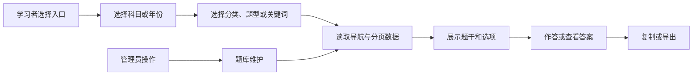

# 历年真题学习模块开发设计

> 本文档针对 408考研真题知识点阅读网站中的历年真题学习模块，描述该模块的需求、项目内结构与流程、数据库和 API 设计。

---

## 1. 需求

### 1.1 模块目标

历年真题学习模块解决真题内容分散、定位困难以及阅读时答案干扰复习的问题。它提供年份入口、科目/分类筛选、题号导航、题目阅读、选择题即时反馈、答案显隐、复制和导出，并允许管理员从阅读上下文进入题目维护。

**已确认事实**：真题数据存于 `exam_question`；学习端由 `ExamIndex.vue`、`ExamList.vue` 和 `ExamClassify.vue` 提供年份视图与分类视图；后端由 `modules/exam/query_service.py`、`command_service.py` 提供分页、年份、导航索引、详情、查重和 CRUD，分类统计与 Markdown 导出由 `modules/reporting/service.py` 提供。

**当前契约**：后端 `ExamResponse` 返回分类数组和结构化 `options` 对象；前端 `request.ts` 在 JSON 响应边界统一做 snake_case → camelCase 转换，`api/exam.ts` 在出站请求边界把领域字段转换为 snake_case，并将历史 `size` 分页别名归一为 `page_size`。页面只使用 camelCase 领域字段。

**设计假设**：继续使用服务端返回完整答案、客户端控制答案显示的方式，不增加服务端“隐藏答案”字段或作答记录表；答案显隐和选择结果属于当前页面临时状态。

### 1.2 功能需求

| 编号 | 需求 | 可观察行为 |
|---|---|---|
| EXAM-01 | 年份入口 | 学习者看到按年份聚合的真题数量，点击年份进入该年份题目视图。 |
| EXAM-02 | 分类浏览 | 学习者选择科目和分类后看到对应题目；点击父分类时包含该分类及其启用子孙分类，按左侧分类树顺序分组，同一题只在最后一个匹配标签中显示。 |
| EXAM-03 | 题号导航 | 年份视图显示轻量题目导航，选择题号后定位到对应题目卡片。 |
| EXAM-04 | 阅读与作答 | 展示题干、选择题选项、主观题答案解析；选择题点击选项后即时反馈并显示答案。 |
| EXAM-05 | 答案控制 | 答案默认隐藏，学习者可以逐题显示/隐藏；切换年份、科目、分类或重载时清理旧答案状态。 |
| EXAM-06 | 内容带走 | 学习者可复制题目、选项、答案或完整内容为 Markdown/纯文本；图片复制提供题目+选项、答案和全部三种范围，并从当前视图导出 Markdown/Word。 |
| EXAM-07 | 管理协作 | 管理员在阅读卡片中可进入编辑或删除；管理操作完成后当前列表、导航和统计应刷新。 |

### 1.3 非功能需求

- **性能**：年份导航使用轻量索引；分类浏览使用分页/加载更多，默认批次不超过当前页面约定；避免为导航加载所有答案和大段内容。
- **一致性**：题目按年份和题号排序；分页追加不能重复或漏题；父分类筛选包含选中节点及其启用子孙分类；多标签题目在阅读展示中按题目 ID 去重，并只归入左侧分类树中最后一个匹配标签。
- **安全**：公开学习查询只读；编辑/删除必须服务端管理员授权；Markdown、SVG、图片和公式必须使用统一安全渲染，不能把答案内容拼成未清洗 HTML。
- **可靠性**：筛选、路由切换和加载更多可能产生竞态，只接受当前筛选上下文的最新结果；加载失败时保留可用旧数据或提供重试，不显示为“暂无题目”。
- **可用性**：支持空状态、无分类题目、答案缺失、选项 JSON 解析失败、复制失败和导出失败的独立反馈；题目卡片和答案按钮应键盘可用并具备可访问名称。

### 1.4 范围、边界与不做项

- **本模块负责**：真题学习入口、真题阅读查询、题型/分类过滤、题号导航、临时答案显隐、选择题反馈、复制和导出调用。
- **题库内容维护负责**：真题新增/编辑/删除、唯一性、题型字段和 Markdown 原文校验。
- **目录模块负责**：科目和分类树、分类启用状态和分类统计口径。
- **收藏模块负责**：分类级本地收藏，本模块只提供可被跳转的科目/分类上下文。
- **不做项**：服务端作答记录、错题本、单题收藏、学习进度、在线协作编辑、AI 解析和外部题库同步。

### 1.5 验收标准

1. 真题入口能按年份显示数量，选择年份后题目按题号顺序加载；无数据和加载失败状态可区分。
2. 分类视图选择科目/分类后，列表仅展示匹配题目；选择父分类时覆盖其启用子孙分类，分组按左侧分类树顺序展示，同一题只出现一次并归入最后一个匹配标签；题型筛选和加载更多不会覆盖旧筛选结果。
3. 选择题选项可点击，正确/错误反馈与答案解析一致；答案默认隐藏，单题显隐互不影响。
4. Markdown、数学公式、代码、SVG 和图片在题干、选项和答案中均可安全展示，图片超长时不破坏布局。
5. 复制内容包含题号/题型/分类及对应题干、选项或答案；支持 Markdown、纯文本和 PNG 图片，图片范围为题目+选项、答案或全部，空内容、图片生成失败和剪贴板不支持均有明确反馈。
6. 非管理员不能通过直接调用管理动作修改或删除真题；管理员删除后列表、年份导航和统计重新加载。
7. 过滤、路由切换和页面从 keep-alive 恢复时，科目、年份、题目定位和滚动上下文不互相污染。

## 2. 该项目的模块结构与流程

### 2.1 项目级关系

| 方向 | 当前项目位置 | 协作内容 |
|---|---|---|
| 学习入口 | `frontend/src/views/user/ExamIndex.vue` | 调用年份统计，生成年份卡片并保留分类查询上下文。 |
| 年份阅读 | `frontend/src/views/user/ExamList.vue`、`frontend/src/components/business/YearNav.vue` | 调用导航索引和按年份查询，维护题号定位、答案状态、复制和导出。 |
| 分类阅读 | `frontend/src/views/user/ExamClassify.vue`、`SubjectSidebar.vue` | 调用科目、分类树和分页查询，维护题型过滤、分组、加载更多和 hash 定位。 |
| 题目展示 | `frontend/src/components/business/ExamEntryCard.vue`、`ExamQuestionCard.vue`、`QuestionCopyMenu.vue`、`QuestionImageRenderer.vue` | 统一渲染元数据、题干、选项、答案和 Markdown/纯文本/图片复制命令。 |
| 后端入口 | `backend-fastapi/app/modules/exam/router.py`、`backend-fastapi/app/modules/reporting/router.py` | 分别暴露真题查询/维护和统计/导出接口；共同保持现有 `/api/exam` POST 路径。 |
| 业务/数据 | `backend-fastapi/app/modules/exam/query_service.py`、`command_service.py`、`repository.py`、`schemas.py`、`mapper.py`、`models.py`、`backend-fastapi/app/modules/reporting/service.py` | 查询、分页、分类 JSON 转换、统计、导出和 `exam_question` 持久化。 |
| 上游/下游 | 学科目录、账户权限、题库维护、统计导出、收藏和图片资源 | 提供筛选上下文、管理员身份、题目事实、派生统计、收藏跳转和图片访问。 |

### 2.2 当前代码边界

后端 `modules/exam/router.py` 是题库路由入口，已删除 `ExamService` 兼容门面；查询、写入 Service 通过 `repository.py` 使用异步 SQLModel Session，统计与导出由 `modules/reporting/router.py` 和 `service.py` 负责；`mapper.py` 负责纯响应转换，科目和作者名称由查询 Service 取得。前端页面通过 `frontend/src/api/exam.ts` 调用统一 `request.ts`，题目卡片使用 `MarkdownViewer`，编辑器由 `ExamEditDialog` 提供。

当前实现的两个重要事实：

1. `ExamList.vue` 使用导航索引按年份分组，再按年份一次性读取题目；`ExamClassify.vue` 使用分页查询并在前端按分类/题型分组。
2. `ExamClassify.vue` 等页面使用 camelCase 领域参数；`api/exam.ts` 在出站前将 `pageSize`/历史 `size`、`subjectId`、`noCategory` 等字段转为后端的 `page_size`、`subject_id`、`no_category`。管理页复用同一请求边界。
3. 当前 `modules/exam/router.py` 与 `modules/reporting/router.py` 的查询、导航、统计、详情、导出及维护路由均使用 POST + Request Schema；统一 JSON 响应为 `ApiResponse`，分页数据为 `lists`/`pagination`。第 4 节仍保留未来公开契约的命名建议，不能将目标路径当作现有路由。

### 2.3 核心业务流程

### 2.4 数据流和状态流

1. `ExamIndex.vue`读取年份统计；年份卡片只保存年份和数量，不保存完整题目。
2. `ExamList.vue`读取轻量导航索引，按年份组织侧栏；用户选年后读取完整题目并放入当前页面状态。
3. `ExamClassify.vue`读取启用科目和分类树，再用 `ExamQueryParams` 查询分页题目；服务端在指定科目下将父分类展开为选中节点及其启用子孙分类，响应的 `category` 经请求拦截器转为数组，前端通过 `frontend/src/utils/examCategoryGrouping.ts` 按左侧树顺序分组并按题目 ID 去重。
4. `ExamQuestionCard.vue`在本地维护所选选项，父页面按题目 ID 维护 `showAnswers`；点击选择题先做本地判定，再触发展示答案，不写数据库。
5. 复制由 `QuestionCopyMenu.vue` 处理命令，图片复制按“题目+选项、答案、全部”三种范围通过 `QuestionImageRenderer.vue` 复用 `MarkdownViewer` 生成 PNG 并写入图片剪贴板；剪贴板能力不可用时下载 PNG。Markdown/Word 导出由浏览器生成，按科目导出当前直接访问后端文件响应。
6. 管理员编辑/删除通过 `ExamEditDialog.vue` 和 `exam.ts` 写入数据库；成功后页面主动重新加载列表和导航，图片引用仍由图片资源模块治理。

### 2.5 异常、重试、并发和事务

- **查询异常**：Schema 约束失败为 422；数据库读取失败为 5xx；不存在题目为 404。前端不得把失败响应当空列表。
- **内容异常**：无效 `options` JSON、无效 `category` JSON 只能降级为无选项/无分类并记录受控日志，不能让整页渲染失败。
- **竞态**：分类、年份和题型改变时增加请求上下文或 AbortController；只接受最后一次筛选结果。加载更多仅在当前筛选未变更时追加。
- **写入并发**：创建/更新先由 Service 做友好查重，当前模型已声明 `question_number IS NOT NULL` 条件下的 `(year, question_number)` 唯一索引；唯一冲突仍需按 409 处理，避免把并发冲突误报为成功。
- **事务**：当前 `ExamCommandService` 是真题写用例事务所有者，查重、校验和新增/更新/删除在同一事务内完成并显式提交，异常由请求会话回滚；导出只读，不开启额外写事务。
- **重试**：只读列表、统计和详情允许有限手动重试；删除、创建和更新不可自动重试。文件导出失败需可重新触发且不修改题库。
- **长任务**：当前没有后台任务或流式导出；导出在请求内生成文件，若数据量超出可接受范围，应先另行设计持久任务，不在本模块隐式使用 `BackgroundTasks`。

### 2.6 关键技术选择

- 保留 `ExamQuestion.category` JSON 字符串作为当前数据边界，Service 解析为数组；直接改成多对多表会影响分类筛选、统计、编辑器、导出和历史数据，超出本模块最小变更范围。
- 导航使用轻量 `ExamNavItem`，完整阅读使用 `ExamResponse`，避免侧栏重复加载 Markdown 内容。
- 分类阅读的范围和展示职责分离：后端查询负责展开选中分类的启用子孙范围，前端按分类树展示顺序分组并按题目 ID 去重；该规则只影响阅读展示，不改写题目分类 JSON 或统计口径。
- Markdown 阅读统一使用 `MarkdownViewer`；公式先保护再由 KaTeX 渲染，SVG/HTML 遵循共享白名单，避免题目页面各自实现渲染规则。

## 3. 数据库的设计

### 3.1 数据库与连接

- **数据库**：SQLite，默认 URL 为 `sqlite+aiosqlite:///./data/web408.db`。
- **访问方式**：`ExamQueryService`、`ExamCommandService` 使用异步 SQLModel `AsyncSession`；Session 由 `SessionDep` 注入，每请求创建并关闭，写用例显式提交，异常时回滚。
- **Schema 初始化**：应用启动时执行 `SQLModel.metadata.create_all`；现有数据库保留历史 `schema_migrations` 记录。后续模型结构变化按项目授权规则处理，删除/重建已有数据库必须先获用户明确授权。
- **连接事实**：`connection.py` 为 SQLite 连接启用 `check_same_thread=False`、WAL、外键约束和忙等待；题目删除是物理删除，科目删除按迁移外键将题目 `subject_id` 置空，章节/分类关系则级联，业务入口仍需确认影响范围。

### 3.2 `exam_question` 实体

| 字段 | 类型 | 可空/默认 | 约束与用途 |
|---|---|---|---|
| `id` | `INTEGER` | 数据库生成 | `PRIMARY KEY`，来自 `BaseModel`。 |
| `create_time` | `DATETIME` | 非空；UTC 工厂默认 | 题目创建时间。 |
| `update_time` | `DATETIME` | 非空；UTC 工厂默认并 on update | 列表排序和编辑追踪。 |
| `year` | `INTEGER` | 非空 | 真题年份；请求 Schema 当前限制 1990～2100。 |
| `question_number` | `INTEGER` | 可空 | 题号；当前允许无题号记录。 |
| `question_type` | `TEXT` | 非空；默认 `ESSAY` | `CHOICE`/`ESSAY`，当前模型声明检查约束。 |
| `title` | `TEXT` | 可空 | 题目标题和关键词搜索字段。 |
| `content` | `TEXT` | 非空 | Markdown 题干。 |
| `options` | `TEXT` | 可空 | 选择题选项 JSON 字符串；主观题应为 NULL。 |
| `answer` | `TEXT` | 可空 | Markdown 答案/解析；允许没有答案。 |
| `category` | `TEXT` | 可空 | JSON 字符串数组；历史无分类可为 NULL/空字符串/无效 JSON。 |
| `subject_id` | `INTEGER` | 可空 | 外键 `subject.id`；当前允许无科目题目。 |
| `difficulty` | `TEXT` | 可空 | `EASY`/`MEDIUM`/`HARD`，当前模型声明检查约束。 |
| `author_id` | `INTEGER` | 非空 | 外键 `user.id`；记录创建者。 |

### 3.3 关系、索引和唯一性

- `Subject 1:N ExamQuestion`，`User 1:N ExamQuestion`；当前题目不直接外键引用 `ExamCategory`。
- 已确认模型声明 `(year, question_number)` 非空部分唯一索引；现有数据库还保留 `subject_id`、`author_id` 历史索引，重建数据库时需按查询计划重新评估。列表仍常按年份、科目过滤并按更新时间/题号排序。
- **设计建议**：评估 `(subject_id, year, question_number)` 和 `update_time` 复合/辅助索引是否必要，必须以 SQLite 查询计划和实际数据规模为依据，避免无证据堆索引。
- 当前唯一性由 Service 预检查和数据库部分唯一索引共同保护：非空题号按 `year + question_number` 唯一，题号为 NULL 时仍可有多条记录。若业务决定题号必填，应先修改请求/模型规则再调整约束。
- 分类和关键词使用 JSON 文本/LIKE 或内存 JSON 解析，普通分类索引无法保证有效；大规模查询应另行设计规范化关系表或 SQLite JSON 索引，当前不擅自新增。

### 3.4 生命周期、删除和导出

- 题目从创建进入可读状态，更新直接覆盖字段，删除为物理删除且当前无回收站/审计表。
- 删除题目不自动删除图片文件；图片模块通过全量引用扫描决定资源是否可清理。
- 导出是只读派生结果，不写入导出记录、不保存答案显隐和作答结果。
- 题目内容可能含个人上传图片 URL，但当前没有独立敏感数据分类；备份/导出必须保护数据库和图片目录，不把作者密码或 Token带入结果。
- 当前数据库只有历史 `schema_migrations` 记录，没有迁移脚本或完整通用迁移框架；结构变化不能在未授权情况下删除或重建当前 `web408.db`。

### 3.5 事务与一致性

创建/更新/删除由单个 API 请求事务拥有；查重查询和写入应在同一事务内完成。应用层查重不是并发安全的最终保证，必须依赖数据库唯一约束或捕获冲突。读取和导出只读，分页总数与列表读取可能因并发写入产生时间点差异，前端应以本次响应为准，不承诺跨请求快照。

## 4. API 接口的设计

### 4.1 当前已实现边界（事实）

- 公共前缀实际为 `/api`；当前没有公开 `/api/v1` URL 段。
- `backend-fastapi/app/modules/exam/router.py` 当前提供：分页查询、按年份查询、按科目查询分类、年份统计、完整/轻量导航索引、按科目分类查询、详情、查重、创建、更新和删除；`backend-fastapi/app/modules/reporting/router.py` 提供分类统计、按科目导出和管理员分类统计汇总导出。
- 当前查询、导航、统计、详情和维护接口均使用 POST；筛选与分页由对应 Request Schema 接收，前端 API 入口统一通过 `request.ts` 调用。
- 当前成功响应使用 `ApiResponse[T]`（`code=200`）；分页数据为 `data.lists` 与 `data.pagination`，其中分页字段经拦截器转为 camelCase。按科目导出直接返回文件流，不使用 JSON 信封。

### 4.2 目标契约与统一规则

后续新增或改动接口全部使用 POST；查询条件进入 Pydantic Request Schema JSON Body，不使用 Query 参数。当前普通响应已使用 `ApiResponse[T]`，列表响应使用 `ApiResponse[PaginatedResponse[T]]`，分页字段为 `lists` 和 `pagination`。下表仅描述目标路径或未来 DTO 命名，不能替代 4.1 所列实际边界。

### 4.3 查询、导航和统计接口

下表是后续公开契约的目标命名；当前实际路径见 4.1 和 `frontend/src/api/exam.ts`。目标路径未实现前，不应作为可调用接口对外承诺。

| 接口名称 | 目标路径与方法 | Request Schema / 输入 | 成功响应 | 鉴权、错误、分页与竞态 |
|---|---|---|---|---|
| 分页查询真题 | `POST /api/exam/query-page` | 现有 `ExamQueryParams`：`page`、`page_size`、可选 `year`、`category`、`subject_id`、`no_category`、`keyword`、`sort_field`、`sort_order`；`category` 指定父分类时由服务端展开为该节点及其启用子孙分类。 | `ApiResponse[PaginatedResponse[ExamResponse]]`，`lists` 为题目，`pagination` 含页码/大小/总数。 | 公开只读；页码从 1 开始，大小 1～100；仅接受白名单排序字段；可取消旧请求。 |
| 按年份查询 | `POST /api/exam/query-by-year` | `ExamYearQueryRequest { year: int, category: str | null, subject_id: int | null }`。 | `ApiResponse[List[ExamResponse]]`，按 `question_number` 升序。 | 公开；年份非法 422；无数据返回空列表而非错误。 |
| 查询年份统计 | `POST /api/exam/query-year-stats` | `ExamYearStatsRequest { category: str | null }`。 | `ApiResponse[List[ExamYearStatResponse]]`，包含总数/选择题/主观题数。 | 公开；按年份降序；统计查询失败不得转成空年份。 |
| 查询轻量导航 | `POST /api/exam/query-nav-index` | `ExamNavIndexRequest { category: str | null }`。 | `ApiResponse[List[ExamNavItem]]`，仅导航所需 ID、年份、题号、标题和分类。 | 公开；只读；前端按分类缓存，筛选变化时使缓存失效。 |
| 查询完整索引 | `POST /api/exam/query-index` | `ExamIndexRequest { subject_id: int | null }`。 | `ApiResponse[ExamIndexResponse]`。 | 公开；仅在确实需要完整索引时调用，避免替代轻量导航。 |
| 查询科目分类 | `POST /api/exam/query-categories-by-subject` | `ExamCategoriesRequest { subject_id: int }`。 | `ApiResponse[List[str]]`，从题目 JSON 去重排序。 | 公开；无分类返回空数组；无效 JSON跳过并记录受控日志。 |
| 按科目分类查询 | `POST /api/exam/query-by-category` | `ExamCategoryQueryRequest { subject_id: int | null, category: str }`。 | `ApiResponse[List[ExamResponse]]`，按年份降序、题号升序。 | 公开；分类名称按 JSON 数组成员匹配；不得使用未经转义的 LIKE 片段。 |
| 分类统计 | `POST /api/exam/query-category-stats` | `ExamCategoryStatsRequest { subject_id: int | null }`。 | `ApiResponse[ExamCategoryStatsResponse]`。 | 公开；分类统计按题目去重总量，题型数按题目归属。 |
| 查询详情 | `POST /api/exam/query-detail` | `ExamDetailRequest { exam_id: int }`。 | `ApiResponse[ExamResponse]`。 | 公开；不存在 404；不返回作者密码等敏感字段。 |

上述 `ExamYearQueryRequest` 等名称是目标契约示例；当前实际路由和模型名称以 `backend-fastapi/app/modules/exam/router.py`、`app/modules/exam/schemas.py` 及 `frontend/src/api/exam.ts` 为准，不得用无约束 `body: dict` 代替 Request Schema。

### 4.4 管理和导出接口

| 接口名称 | 目标路径与方法 | Request Schema / 输入 | 成功响应 | 鉴权、事务与错误 |
|---|---|---|---|---|
| 检查重复 | `POST /api/exam/check-duplicate` | `ExamDuplicateRequest { year: int, question_number: int | null, exclude_id: int | null }`。 | `ApiResponse[ExamDuplicateCheckResponse]`。 | ADMIN；同一事务内用于提示，不能替代数据库唯一性；不存在不算错误。 |
| 创建真题 | `POST /api/exam/create` | 现有 `ExamCreateRequest`：年份、题号、题型、标题、内容、选项、答案、分类、科目、难度。 | `ApiResponse[ExamResponse]`。 | ADMIN；必填/题型结构 422，重复 409，作者从当前身份取得；单请求事务。 |
| 更新真题 | `POST /api/exam/update` | `ExamUpdateRequest` + `exam_id`；部分更新只允许白名单字段。 | `ApiResponse[ExamResponse]`。 | ADMIN；不存在 404，唯一性冲突 409；不可自动重试。 |
| 删除真题 | `POST /api/exam/delete` | `ExamDeleteRequest { exam_id: int, confirm: bool }`。 | `ApiResponse[None]`。 | ADMIN；物理删除，需确认；不存在 404；图片不随题目删除。 |
| 按科目导出 | `POST /api/exam/export-by-subject` | `ExamExportRequest { subject_id: int, format: Literal['markdown'], include_answer: bool = true }`。 | 文件流；成功时 Content-Type/文件名正确，失败时在开始文件流前返回统一错误。 | 公开只读（沿用当前）；查询失败 5xx；生成内容按年份/题号排序；当前 `format` 实际只生成 Markdown。 |

### 4.5 内容、响应和错误边界

- `ExamResponse` 对外返回 `category` 数组和结构化 `options`；数据库仍将选项/分类保存为 JSON 文本，由 Service/Schema 解析和序列化，API 不直接暴露数据库实体。
- Pydantic Schema 负责年份、题号、长度和结构；Service 负责题型-选项关系、分类归属、查重和数据库查询；API 层只做依赖注入、`response_model` 和统一成功/错误构造。
- 422 表示字段或 JSON 结构错误；401/403 表示认证/权限；404 表示题目不存在；409 表示题号冲突；5xx 表示数据库或导出基础设施失败。
- 统一异常处理不得将 SQL、堆栈、文件路径或原始内部异常放入响应；当前全局兜底已记录受控日志并返回固定的“服务器内部错误”，后续实现必须保持该边界。
- 前端 `request.ts` 是唯一 Axios 入口；`api/exam.ts` 负责出站 snake_case DTO 映射和 Blob 导出，页面负责加载/空/错误/分页状态。转换边界已有 API 测试覆盖，后续新增字段仍须在该边界同步。

### 4.6 兼容、重试和前端协作

- 当前 `/api/exam` 等路径已被 `ExamIndex.vue`、`ExamList.vue`、`ExamClassify.vue`、`ExamManage.vue` 使用；现有路由已经是 POST-only，目标表中的动作语义路径属于后续公开契约设计，不能直接替换当前调用。
- 前端列表请求需要将页面 camelCase 领域状态映射成 Request Schema 的 snake_case；响应再集中转回 camelCase，不能让每个页面手工转换。
- 查询可使用 AbortController 或请求序号抑制旧响应；创建/更新/删除不自动重试，删除前端已有确认应保留。
- 当前按分类统计页面的“统计导出”调用管理员专用 `POST /api/exam/export-category-stats`，通过统一 Blob 请求下载 Markdown/Excel；本模块只设计真题阅读端导出，统计导出细节见“统计与导出模块”文档。
