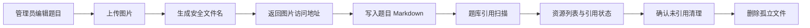

# 图片资源治理模块开发设计

> 本文档针对 408考研真题知识点阅读网站中的图片资源治理模块，描述该模块的需求、项目内结构与流程、数据库和 API 设计。

---

## 1. 需求

### 1.1 模块目标

图片资源治理模块负责题目 Markdown 中图片的上传、访问、引用识别和清理，解决编辑器产生孤立图片、管理员无法确认引用关系以及误删图片可能破坏题目阅读的问题。

**已确认事实**：图片文件写入 `settings.upload.upload_dir`，默认目录为 `uploads/images`；`UploadService`通过扫描文件系统构造图片元数据，并扫描真题/模拟题的题干、选项和答案文本判断引用；当前没有使用 `ResourceFile` 表保存上传记录。

**已实现约束**：上传、列表、单张删除和批量清理均由服务端管理员依赖保护；列表和删除使用 Request Schema，单张删除默认拒绝仍被题目引用的图片。

**设计假设**：图片访问必须支持公开题目阅读，因此静态图片读取保持公开；上传、列表、单张删除和批量清理均属于管理员/题库编辑能力，不新增用户上传空间或外部对象存储。

### 1.2 功能需求

| 编号 | 需求 | 可观察行为 |
|---|---|---|
| IMG-01 | 图片上传 | 题目编辑器可上传允许类型的图片，成功后获得可插入 Markdown 的访问地址。 |
| IMG-02 | 图片访问 | 真题和模拟题阅读页可以加载题目引用的图片；图片 URL 不暴露本地绝对路径。 |
| IMG-03 | 资源列表 | 管理员可查看文件名、大小、修改时间、引用状态和引用题目。 |
| IMG-04 | 未引用筛选 | 管理员可只查看同时未被真题和模拟题引用的图片。 |
| IMG-05 | 单张删除 | 管理员确认后可删除指定文件；删除失败或文件不存在时显示明确结果。 |
| IMG-06 | 批量清理 | 管理员确认后删除扫描时未被任何真题/模拟题引用的图片，并返回实际删除数量。 |
| IMG-07 | 引用一致性 | 图片引用扫描覆盖题干、选项和答案，且同时覆盖真题与模拟题。 |

### 1.3 非功能需求

- **安全**：服务端校验上传大小、扩展名、MIME 和实际文件内容；文件名由服务端生成；删除文件名必须阻止路径穿越；管理动作必须服务端鉴权。
- **一致性**：清理依据是同一轮引用扫描结果；删除题目后不立即假设图片已孤立，删除图片也不自动改写题目 Markdown。
- **可靠性**：文件写入失败不返回成功 URL；批量清理部分文件失败时返回真实删除数量并记录失败文件，不把部分成功伪装为全部成功。
- **并发**：上传、题目保存和清理可能并发；清理必须容忍扫描后文件被新增/删除，不能因为单文件竞态导致整个请求失败。
- **性能**：当前实现会读取所有题目内容并在内存中逐图片匹配；图片/题目规模变大时需要限制列表范围或优化引用索引，但当前不创建异步任务队列。
- **隐私**：文件 URL、题目标题和引用信息只返回管理页面需要的数据；日志不得记录文件内容、Token 或内部绝对路径。

### 1.4 范围、边界与不做项

- **本模块负责**：图片文件上传、公开读取、资源元数据扫描、真题/模拟题引用检查、未引用清理和管理员删除。
- **题库内容维护负责**：图片 Markdown 引用的创建、修改和删除；本模块不解析或重写题目业务内容。
- **内容渲染负责**：图片 URL 的安全渲染、尺寸限制和点击预览；本模块只提供可访问 URL。
- **不做项**：通用附件、图片裁剪/压缩、图片数据库元数据、用户头像、外部对象存储、图片版本回收站和删除审计表。

### 1.5 验收标准

1. 非允许类型、空文件、超过配置大小、MIME 与实际内容不匹配的上传被拒绝；成功上传的文件名不包含用户原始路径。
2. 未登录或非管理员无法调用上传、列表、删除和清理动作；公开图片读取仍能被题目阅读页访问。
3. 列表引用状态同时依据真题和模拟题的题干、选项、答案扫描，引用题目名称/年份/题号展示正确。
4. 未引用筛选只返回当前扫描未引用的文件；批量清理返回实际删除数量，文件系统失败不会被计数为成功。
5. 单张删除使用文件名 Schema 且拒绝 `..`、斜杠和反斜杠；不存在文件返回 404；删除确认不由前端单独承担。
6. 上传、列表和清理出现数据库读取或文件系统异常时返回统一错误，不泄露堆栈、绝对路径或原始异常文本。
7. 图片删除后，受影响题目在阅读端出现可识别的缺图/失败状态，不发生页面整体崩溃；清理不会修改题目文字。

## 2. 该项目的模块结构与流程

### 2.1 项目级关系

| 方向 | 当前项目位置 | 协作内容 |
|---|---|---|
| 编辑入口 | `frontend/src/components/basic/MarkdownEditor.vue` | 选择或粘贴图片，调用上传 API，并把返回地址插入 Markdown。 |
| 管理入口 | `frontend/src/views/admin/ImageManage.vue` | 列表、预览、未引用筛选、单张删除和批量清理。 |
| 前端调用 | `frontend/src/api/upload.js`、`frontend/src/api/request.js` | 发送 multipart/JSON 请求，拼接图片访问 URL，处理错误。 |
| 后端入口 | `backend-fastapi/app/api/v1/upload.py` | 暴露上传、列表、清理和删除动作；图片静态目录由 `app/main.py` 挂载。 |
| 业务处理 | `backend-fastapi/app/services/upload_service.py` | 文件校验、UUID 文件名、写入、扫描引用和删除。 |
| 数据来源 | `backend-fastapi/app/models/entities.py` 中 `ExamQuestion`/`MockQuestion` | 提供题干、选项和答案文本，用于引用扫描。 |
| 下游 | `MarkdownViewer.vue`、真题学习、模拟题学习 | 通过图片 URL 渲染和预览题目内容。 |

### 2.2 当前代码边界与事实

当前模块是“文件系统 + 题库文本扫描”的边界，不是数据库实体 CRUD：

- `UploadService.upload_image()`校验扩展名、MIME、文件头和大小限制，生成 UUID 文件名并异步写入临时文件后原子替换。
- `list_images()`遍历上传目录，读取文件系统大小和修改时间，再扫描所有真题和模拟题文本；返回 `ImageResourceResponse`及引用题目列表。
- `_check_image_references()`扫描 `content`、`answer`、`options`，真题引用带年份/题号，模拟题使用带“模拟题”前缀的标题；标题自身不参与扫描。
- `cleanup_unreferenced_images()`先列出未引用文件，再逐个 unlink；`delete_image()`只做文件名安全检查和存在性检查，当前不会检查引用。
- `app/main.py`把 `settings.upload.upload_dir`以 `/uploads/images`静态目录挂载，学习页面可直接读取。
- `ImageManage.vue`通过统一 API 模块以 POST Request Schema 调用列表、删除和清理接口；编辑器上传入口来自 `MarkdownEditor.vue`。

图片治理接口已按 POST、Request Schema 和服务端管理员鉴权落地；静态图片读取仍保持公开只读。

### 2.3 核心业务流程

### 2.4 数据流和状态流

1. 浏览器选择图片或粘贴图片，`MarkdownEditor`通过统一请求入口发送 multipart；服务端验证后将二进制写入配置目录。
2. 服务端返回相对访问地址；编辑器把完整 URL 插入题干/选项/答案 Markdown，随后由题库内容模块保存文本。
3. 资源列表请求读取目录元数据，并批量读取真题/模拟题文本；每个文件形成引用状态和 `exams` 列表，数据只存在本次响应。
4. 单张删除根据管理员确认删除未引用文件，不更新数据库或题目文本；批量清理在逐文件复核引用后删除。
5. 图片访问由静态文件挂载提供；阅读端/`MarkdownViewer`负责渲染和点击预览，删除后访问失败由前端内容渲染边界承受。
6. 当前没有 `ResourceFile` 元数据写入、文件上传任务表、清理任务状态或事件通知；所有动作在请求内完成。

### 2.5 异常、重试、并发、事务和任务

- **上传异常**：空文件/扩展名不支持/大小或内容不合法返回 400/422；磁盘写入失败返回 5xx；写入失败不得返回可用 URL。
- **删除异常**：文件名路径穿越返回 400/422；文件不存在返回 404；权限不足 401/403；unlink 失败返回 5xx或明确部分失败结果。
- **引用扫描异常**：单条无效题目 JSON 不应阻塞其他文件扫描；数据库读取失败应使列表/清理整体失败并返回 5xx，不能把所有图片误标为未引用。
- **并发竞态**：批量清理在删除每个文件前再次扫描题目引用；仍无法提供跨题目事务的强一致性，但不会依赖前端筛选结果作为安全保证。
- **事务**：当前上传/删除只涉及文件系统，不属于数据库事务；题目保存由题库模块自己的 `AsyncSession` 请求事务拥有。若未来增加 ResourceFile 表，必须明确数据库记录与文件写入的补偿顺序。
- **重试**：上传不是可无条件自动重试的操作，避免产生重复文件；列表可以手动刷新；删除/批量清理应由管理员重新确认后重试。当前没有后台任务、流式处理或持久化清理任务。
- **日志**：记录上传/删除数量、失败类型和关联文件名即可；不记录图片二进制、题目全文、Token、绝对路径或原始异常给客户端。

### 2.6 关键技术选择

- 继续使用 UUID 文件名，避免原始文件名冲突和路径注入。
- 继续使用文本扫描而不是 `ResourceFile` 表：这是当前项目真实实现，且删除题目后可以自动发现孤立文件；代价是列表/清理成本随题目和图片数增长。
- 采用公开静态读取、管理员写治理的分离边界，兼顾学习端展示与管理安全；若以后图片包含私密内容，应改为带授权的文件读取方案，不在本模块隐式扩大。

## 3. 数据库的设计

### 3.1 本模块不直接持久化图片元数据

图片资源治理模块不直接创建或更新数据库记录。当前数据来源和责任如下：

| 数据 | 所属存储 | 本模块用途 | 删除责任 |
|---|---|---|---|
| 图片二进制 | `settings.upload.upload_dir` 文件目录 | 读取大小、修改时间、文件名并执行删除。 | 本模块在管理员动作下负责文件删除。 |
| 真题题干/选项/答案 | `exam_question` | 扫描图片文件名是否被引用。 | 题库内容模块负责题目数据删除/修改。 |
| 模拟题题干/选项/答案 | `mock_question` | 扫描图片文件名是否被引用。 | 题库内容模块负责题目数据删除/修改。 |
| `ResourceFile` 表 | SQLModel 已定义实体 | 当前 `UploadService` 未使用，不能作为现有图片元数据来源。 | 不在本模块新增或清理。 |

### 3.2 数据库连接与读取边界

- 数据库为 SQLite，默认连接 `sqlite+aiosqlite:///./data/web408.db`；引用扫描通过异步 SQLModel `AsyncSession`读取题目表。
- `SessionDep`每请求创建并关闭 Session，当前请求结束自动提交/回滚；图片上传和删除本身不写数据库，Session 只用于引用扫描。
- 应用启动通过 `SQLModel.metadata.create_all`初始化表；本模块不改变 Schema，不创建迁移、任务表或图片元数据表。
- 当前连接已启用 WAL 和外键约束；引用扫描使用每请求独立的异步 Session。数据库迁移脚本保留原有题库数据。

### 3.3 查询、生命周期和一致性

- 引用扫描读取两张题目表的 `content`、`answer`、`options`；不读取或依赖 `ResourceFile`、题目分类和作者字段。
- 资源元数据是实时派生值，不缓存、不备份为独立事实；服务重启后从文件目录重新发现。
- 上传成功后文件立即进入目录，但只有题目文本保存了文件名引用后才被标记为 referenced；取消编辑会留下待清理孤立文件。
- 删除题目不会级联删除图片；批量清理和单张删除均需要管理员确认，服务端拒绝删除仍被引用的图片。
- 备份需要同时保存数据库和图片目录；只备份数据库无法恢复题目图片，只备份图片也无法恢复引用关系。

### 3.4 事务与文件一致性

上传文件写入和题目保存是两个独立操作，无法由当前 SQLite 事务原子覆盖。建议保持“先上传、后保存引用”的顺序；上传成功但题目取消时由未引用清理回收。清理与题目写入存在竞态，不能宣称强一致；高风险场景应在删除前再次扫描或引入独立锁/审计设计。本文档不执行任何文件或数据库清理。

## 4. API 接口的设计

### 4.1 当前已实现边界（事实）

- 实际公共前缀为 `/api`；图片静态读取路径由应用挂载为 `/uploads/images`，它不是 JSON 业务 API。
- 已实现 `POST /api/upload/image` 上传，`POST /api/upload/images` 列表，`POST /api/upload/images/cleanup` 批量清理，`POST /api/upload/image/delete` 单张删除。
- 上传、列表、删除和清理均使用管理员依赖；列表使用 `ImageListRequest`，删除使用 `ImageDeleteRequest`。
- JSON 响应使用 `ApiResponse[T]`（`code=200`）；上传返回相对 URL，列表返回 `ImageResourceResponse`，清理返回删除数量。

### 4.2 目标方法、权限与统一响应

后续新增或改动业务接口全部使用 POST。JSON 输入必须使用 Pydantic Request Schema；multipart 上传使用 `UploadFile`/`File`并在 Service 校验内容。目标 JSON 响应使用 `ApiResponse[T]`；当前 `Response` 仅是现状，不能被视为已满足统一规范。

| 接口名称 | 目标路径与方法 | 请求输入 | 成功响应 | 鉴权与资源边界 |
|---|---|---|---|---|
| 上传图片 | `POST /api/upload/image` | multipart `file: UploadFile`；不使用 JSON Body。 | `ApiResponse[ImageUploadResult]`，含相对 URL、文件名和必要元数据。 | ADMIN；编辑器通过统一上传 API 调用；文件类型/大小/实际内容校验失败 422。 |
| 查询图片列表 | `POST /api/upload/query-images` | `ImageListRequest { only_unreferenced: bool = false }`。 | `ApiResponse[List[ImageResourceResponse]]`。 | ADMIN；扫描两类题目引用；列表为空是成功空结果。 |
| 清理未引用图片 | `POST /api/upload/cleanup-unreferenced` | `EmptyRequest { confirm: bool = true }`。 | `ApiResponse[ImageCleanupResult]`，至少含删除数量和失败数量。 | ADMIN；服务端再次扫描；不可逆，拒绝未确认请求。 |
| 删除指定图片 | `POST /api/upload/delete-image` | `ImageDeleteRequest { filename: str, confirm: bool = true, force: bool = false }`。 | `ApiResponse[None]`。 | ADMIN；默认拒绝仍被引用文件；`force`若保留必须单独审计并明确影响。 |
| 读取图片文件 | 静态 `/uploads/images/{filename}` | 路径文件名。 | 二进制图片响应。 | 公开只读以支持题目阅读；服务端只允许映射到配置目录内的安全文件名。 |

`ImageListRequest`、`ImageCleanupRequest` 和 `ImageDeleteRequest`已作为当前代码 Request Schema；实现时不得退回使用 `body: dict` 或 Query 参数替代。

### 4.3 响应字段与错误映射

- `ImageResourceResponse`保留 `filename`、`url`、`size`、`last_modified`、`referenced` 和 `exams`；`exams`使用 `ImageUsageResponse`返回题目 ID、年份、题号和标题。模拟题年份可为空，标题需明确模拟题来源。
- 422：文件为空、类型/大小/内容不合法、文件名不符合 Schema。
- 401/403：未登录、Token 无效或非管理员。
- 404：指定图片不存在；数据库题目数据不存在时按引用扫描错误处理，不伪造未引用结果。
- 409：目标设计中被引用文件删除冲突或清理状态冲突。
- 5xx：文件系统、数据库读取或扫描基础设施失败；对外固定公开消息，详细异常只写受控日志。
- API 层使用 `response_model`和统一成功/错误构造；Service 只返回业务数据或抛出业务异常，不返回 `ApiResponse`。

### 4.4 前端调用、重试和安全落地

- `frontend/src/api/upload.js`是上传、列表、删除和清理的统一调用模块；`MarkdownEditor.vue`只调用上传函数，不自行创建 Axios 实例或拼接认证头。
- `ImageManage.vue`负责管理员确认、加载态、空态、局部删除态和批量清理态；删除前端确认不能替代服务端 `confirm`/引用检查。
- 请求层应支持 multipart 取消、上传失败重试和统一错误；清理/删除不可自动重放，列表可手动刷新。
- 当前 `request.js`会把非 200 处理为错误并显示消息，但对文件流和请求取消没有专门模型；目标实现应区分文件下载/静态读取与 JSON 错误。
- 静态图片 URL 不应包含服务器绝对路径；如果未来不再公开图片，需同步改造 MarkdownViewer 的访问凭证和缓存策略。
