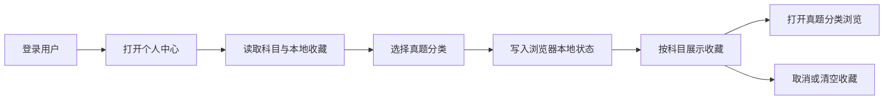

# 收藏与个人中心模块开发设计

> 本文档针对 408考研真题知识点阅读网站中的收藏与个人中心模块，描述该模块的需求、项目内结构与流程、数据库和 API 设计。

---

## 1. 需求

### 1.1 模块目标

收藏与个人中心模块为学习者提供一个轻量的个人入口，用于保存经常复习的“科目 + 真题分类”，并从个人中心快速回到对应的真题分类浏览上下文。它不改变题库内容，也不记录答题进度。

**已确认事实**：当前实现只收藏分类而不是单道题；收藏数据写入浏览器 `localStorage` 的 `user_favorites_categories` 键；个人中心路由要求登录；分类来源是启用科目和该科目下实际存在真题的分类列表。

**事实风险**：收藏键没有按用户或账户命名空间隔离，退出登录也不会清空收藏；同一浏览器切换账户可能看到前一账户的收藏。当前 `useFavorites()`也没有监听多标签页 `storage` 事件。

**设计假设**：本模块继续采用浏览器本地持久化，不为收藏新增数据库表或 HTTP API；若产品需要跨设备同步、服务端备份或学习进度，另行建立账户数据模块。

### 1.2 功能需求

| 编号 | 需求 | 可观察行为 |
|---|---|---|
| FAV-01 | 收藏分类 | 学习者可以把当前科目下的真题分类加入收藏，再次操作不会产生重复项。 |
| FAV-02 | 取消收藏 | 学习者可以从添加弹窗或收藏列表取消指定分类，并得到即时反馈。 |
| FAV-03 | 分类查看 | 个人中心按科目 Tab 展示收藏分类，按收藏时间倒序排列。 |
| FAV-04 | 快速回访 | 点击收藏项在新的浏览上下文打开真题分类页面，并带上科目和分类筛选条件。 |
| FAV-05 | 批量清理 | 学习者确认后可清空全部分类收藏，题库原始分类不受影响。 |
| FAV-06 | 身份展示 | 登录用户在个人中心看到用户名和普通用户/管理员角色文本。 |
| FAV-07 | 数据容错 | 本地数据损坏、分类被删除、科目加载失败或无分类时仍能展示可理解状态。 |

### 1.3 非功能需求

- **隐私隔离**：至少按当前登录账户隔离本地收藏；退出登录、账户切换和账户信息恢复时不能泄露上一账户的收藏。
- **可靠性**：本地 JSON 解析失败时只丢弃无法解析的收藏，不阻塞个人中心；写入失败应给出提示而不是假装保存成功。
- **一致性**：收藏唯一标识必须同时包含科目 ID 和分类名称；分类展示来源与真题浏览使用同一科目上下文。
- **并发**：同一页面重复点击不能添加重复项；多标签页写入冲突要么同步更新，要么明确不承诺跨标签页实时一致。
- **可用性**：加载、空科目、空收藏、无分类、确认弹窗和错误提示清晰；删除/清空按钮具备可访问名称和键盘操作。
- **性能**：收藏数据规模预期较小，使用本地数组过滤和排序；不把题目全文、答案或图片写进收藏记录。

### 1.4 范围与职责边界

- **本模块负责**：个人中心页面、分类收藏的本地增删查清、按科目展示、角色展示和回访导航。
- **账户模块负责**：登录状态、角色鉴权和会话清理；个人中心路由必须由账户状态保护。
- **目录/真题模块负责**：启用科目、真题分类列表和目标浏览页面；本模块只保存分类上下文，不复制分类树。
- **不做项**：服务端收藏、跨设备同步、单题收藏、错题本、学习进度、答题历史、收藏夹分组、收藏导出和模拟题收藏。

### 1.5 验收标准

1. 登录用户打开个人中心后能按科目看到收藏分类；未登录访问被路由守卫引导登录。
2. 同一科目同一分类重复添加只保留一项；取消、清空后刷新页面，已删除项不再出现。
3. 收藏项包含科目和分类上下文，点击后能打开真题分类浏览并正确定位筛选条件。
4. 分类数据为空、科目 API 失败、localStorage 内容非法或存储空间不足时，页面不崩溃且有可理解状态。
5. 用户 A 退出后用户 B 在同一浏览器登录，不会读取用户 A 的收藏；未登录状态不能继续显示上一用户的个人收藏。
6. 多标签页对同一账户的添加/取消不会静默覆盖较新的收藏，或系统明确提示以最后一次写入为准并保持数据可恢复。
7. 收藏操作不产生 HTTP 写请求、不写 SQLite、不改变题库和目录数据。

## 2. 该项目的模块结构与流程

### 2.1 项目级关系

| 方向 | 当前项目位置 | 协作内容 |
|---|---|---|
| 页面入口 | `frontend/src/views/user/UserCenter.vue` | 展示身份、科目 Tab、收藏列表、添加/取消/清空和跳转。 |
| 本地逻辑 | `frontend/src/composables/useFavorites.js` | 读取、解析、添加、删除、判断、计数和清空收藏。 |
| 身份依赖 | `frontend/src/stores/auth.js`、`frontend/src/router/index.js` | 保存用户信息、判断登录/管理员并保护 `/user/center`。 |
| 目录依赖 | `frontend/src/api/subject.js`、`frontend/src/api/exam.js` | 获取启用科目和指定科目的实际真题分类。 |
| 导航依赖 | `frontend/src/views/user/ExamClassify.vue`、`SubjectSidebar.vue` | 接收科目/分类查询上下文并加载真题。 |
| 通用交互 | `frontend/src/composables/useConfirm.js`、`useToast.js`、`components/basic/Dialog.vue` | 提供清空确认、操作反馈和添加收藏弹窗。 |
| 后端边界 | 无收藏 Router、Service、Model 或 Schema | 当前不存在服务端收藏接口和收藏表。 |

### 2.2 当前代码边界

`UserCenter.vue`是页面编排边界：挂载时读取启用科目，添加收藏弹窗按科目调用真题分类列表，收藏项点击通过 Router 解析目标地址后使用新窗口打开。`useFavorites.js`是本地状态边界，但当前每次调用都会初始化自己的响应式列表；本页面只有一处使用，尚未形成跨页面共享 Store。

当前收藏对象字段为 `category`、`subjectId`、`subjectName`、自动生成的 `id` 和 `timestamp`。`id`由科目 ID 与分类名称拼接。页面按科目过滤并按时间倒序；不存在的历史分类仍可能保留在本地列表，只要用户没有主动删除。

**前端规范落实**：本地有状态逻辑保留在 Composable，账户信息保留在 Auth Store；不创建万能 Store。API 请求仍只能通过 `request.js`，但收藏保存本身不调用 API。当前项目的 API 请求层只负责响应字段转换，目录依赖的请求方法/字段迁移由目录模块负责。

### 2.3 核心流程

### 2.4 数据流和状态流

1. `useFavorites`初始化时从本地存储读取字符串并解析为数组；解析失败时将当前列表置为空。
2. 用户在添加弹窗选择科目，页面调用 `getExamCategoriesBySubject(subjectId)` 获取真实存在的真题分类；分类名称和科目 ID 组成收藏项。
3. 添加时先按生成 ID 检查重复，再追加当前时间戳并写回本地存储；取消/清空同样同步写回。
4. 个人中心按启用科目过滤本地收藏；科目被禁用或删除后，历史收藏可能暂时不可见，但本地记录不会自动从服务端恢复或删除。
5. 点击收藏项只创建带 `subject`、`category` 查询上下文的真题浏览导航，不复制题目数据；目标页面重新从后端读取题目。
6. 退出登录当前只清理 Token 和 userInfo，不清理收藏；目标设计必须在账户切换边界处理收藏命名空间。

### 2.5 异常、并发、事务和恢复

- **读取异常**：localStorage 不可用/JSON 非法时回退空列表并提示；科目/分类读取失败时保留已有本地收藏，提供重试。
- **写入异常**：QuotaExceeded 或浏览器安全策略导致写入失败时不应显示成功；可以保留内存态并提示用户，下一次加载以持久化内容为准。
- **重复操作**：添加、取消和清空按钮在动作完成前应防止重复点击；同一项使用科目 ID + 分类名称判断幂等。
- **多标签页**：当前未监听 `storage` 事件，属于已确认限制。设计建议在本地持久化边界增加版本/时间戳并监听同一账户变化，或明确最后写入胜出；不能把当前实现描述为跨标签强一致。
- **事务**：本模块没有数据库事务；一次本地数组变更和一次存储写入构成最小操作边界。不存在后端回滚机制，写入失败必须恢复/提示内存状态。
- **生命周期**：组件卸载不应遗失已写入收藏；登出、账户切换、存储数据失效和分类失效是需要清理/标记的边界。

### 2.6 关键技术选择

- 使用 Composable + 浏览器本地存储而非 Pinia/SQLite：当前只有个人中心使用收藏，数据量小且产品明确为本地收藏，避免为未要求的后端同步建立数据模型。
- 推荐把存储键改为按用户隔离，例如 `user_favorites_categories:<user-key>`；优先使用账户稳定 ID，若暂时只有用户名则用用户名命名空间并在登录切换时显式重载。该改变会影响本地旧数据迁移，实施前需定义一次性迁移/清理策略。
- 收藏项只保存导航所需的科目与分类，不保存题干、答案和图片，降低隐私和陈旧数据风险。

## 3. 数据库的设计

### 3.1 本模块不直接持久化数据库数据

本模块不新增、不读取、不更新 SQLite 表，也不提供服务端收藏记录。数据责任如下：

| 数据 | 负责模块/存储 | 本模块处理方式 |
|---|---|---|
| 登录用户、角色 | 账户模块的 `user` 表和 Auth Store | 读取当前身份用于页面保护和展示。 |
| 启用科目 | 学科目录模块和 `subject` 表 | 通过既有科目查询读取，不复制到收藏存储。 |
| 真题分类列表 | 真题/目录模块和题目数据 | 添加收藏时实时读取实际存在分类。 |
| 收藏项 | 当前浏览器 localStorage | 保存小型 JSON 数组，按科目和分类导航。 |
| 题目内容 | 真题学习模块的 `exam_question` 表 | 点击收藏后由目标页面重新读取。 |

### 3.2 本地存储结构与生命周期

当前单项逻辑结构如下，字段命名以现有前端实现为准：

| 字段 | 类型 | 可空/默认 | 用途 |
|---|---|---|---|
| `id` | 字符串 | 非空；由 `subjectId + '_' + category` 生成 | 本地去重标识。 |
| `category` | 字符串 | 非空 | 真题分类名称。 |
| `subjectId` | 数字 | 非空 | 所属科目 ID。 |
| `subjectName` | 字符串 | 可空 | 展示和回访导航使用的科目名称快照。 |
| `timestamp` | 数字 | 非空；添加时当前时间 | 收藏排序。 |

当前存储键为 `user_favorites_categories`，没有版本号、过期时间、账户命名空间和迁移字段。设计建议加入账户范围与 `schemaVersion`，但不把推荐结构写成当前已实现事实。

### 3.3 删除、隐私和恢复边界

- 取消/清空只删除浏览器本地 JSON，不触碰题库数据库；科目或分类删除不会自动回写本地收藏。
- 目标设计在登出/账户切换时清理当前用户的内存收藏并加载目标用户命名空间；旧的匿名历史数据需明确迁移给哪个账户，不能自动归属给新用户。
- 本地收藏不是敏感题目全文，但仍能反映学习兴趣；不要在日志、错误上报或 URL 外额外记录完整收藏列表。
- 由于没有服务端数据，浏览器清理、隐身窗口或设备更换会导致收藏不可恢复；页面应把“本地收藏”作为明确产品边界。

### 3.4 一致性与并发

本地存储不具备数据库事务和跨标签页锁。单标签页内通过内存数组先检查再写入可保证本次操作不重复；多个标签页同时写入可能出现最后写入覆盖。若产品要求跨标签一致，实施时需采用 `storage` 事件 + 合并规则或显式锁；若不要求，则在文案和验收中明确最后写入胜出。本文档不创建数据库、不执行清理或迁移。

## 4. API 接口的设计

### 4.1 对外 API 结论

本模块**不提供对外 HTTP API**，也不新增 IPC、事件或命令行接口。收藏的创建、取消、查询、计数和清空均通过 `frontend/src/composables/useFavorites.js` 的内部 Composable 边界完成，数据只在浏览器本地保存。

### 4.2 内部调用边界

| 内部能力 | 当前调用方 | 输入 | 输出/错误边界 |
|---|---|---|---|
| `loadFavorites` | `useFavorites`初始化、个人中心恢复 | 无 | 从本地 JSON恢复数组；非法 JSON回退空数组。 |
| `addFavorite` | `UserCenter.vue`添加分类 | `category`、`subjectId`、`subjectName` | 返回是否新增；重复项不新增；存储失败需暴露失败状态。 |
| `removeFavorite` | 收藏列表/添加弹窗 | `subjectId`、`category` | 返回是否删除；不存在项为无变化。 |
| `isFavorite` | 添加弹窗 | `subjectId`、`category` | 返回布尔值。 |
| `clearAllFavorites` | 清空确认回调 | 无 | 清空当前用户本地收藏；写入失败需提示。 |
| 目录依赖读取 | `UserCenter.vue` | `subjectId` | 调用 `getEnabledSubjects`、`getExamCategoriesBySubject`；这些 HTTP 契约由目录/真题模块负责。 |
| 回访导航 | `UserCenter.vue` → `ExamClassify.vue` | 科目名称、分类名称 | 打开新的真题分类浏览上下文；导航失败不删除收藏。 |

### 4.3 鉴权、错误和前端规范落地

- `/user/center`由 `router/index.js` 的 `requiresAuth`保护；这是导航体验，账户模块的服务端鉴权仍不因本地收藏而改变。
- 本模块没有请求 Schema、`response_model`、HTTP 状态码、分页或 API 响应壳；目录依赖接口继续使用统一 `request.js`，页面只处理业务状态。
- 本地读取错误、存储空间不足、目录读取失败和导航失败应分别显示，不把本地异常包装成后端 500。
- 收藏操作不是服务端非幂等请求，不需要 HTTP 重试；本地写失败只能由用户重新操作，不能自动循环重试。

### 4.4 目标账户隔离契约

为了修复当前全局键风险，推荐内部边界改为：

1. Auth Store 提供稳定账户键（优先 `user_id`，待账户 API/响应确认；当前响应只有用户名和角色）。
2. Composable 根据账户键读取独立存储空间，账户变化时先清理内存数组再加载新空间。
3. 退出登录后不展示任何旧账户收藏；是否删除旧账户本地数据由产品隐私策略决定，至少不能在匿名状态复用。
4. 若暂不改 AuthResponse，则将用户名作为命名空间并标记这是基于用户名稳定性的设计假设。

该隔离设计不新增服务端 API，但会改变本地存储键和旧数据可见性，实施前需按账户模块一起验收。
