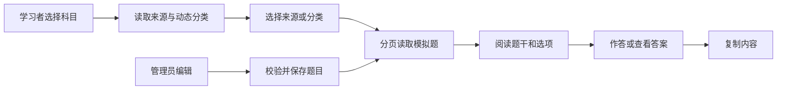

# 模拟题学习模块开发设计

> 本文档针对 408考研真题知识点阅读网站中的模拟题学习模块，描述该模块的需求、项目内结构与流程、数据库和 API 设计。

---

## 1. 需求

### 1.1 模块目标

模拟题学习模块解决模拟题来源多、分类不稳定、题目难以按科目集中练习的问题。它按来源、科目和题目 JSON 中的分类动态组织模拟题，提供分页阅读、题型筛选、选择题作答、答案显隐和复制，并与管理员维护流程相连。

**已确认事实**：模拟题存于 `mock_question`；`MockService` 提供分页、来源统计、来源列表、来源标题联动、科目/分类统计、详情和管理员 CRUD；`MockClassify.vue` 是当前学习端页面，`MockManage.vue` 是管理端页面。

**事实冲突**：模拟题分类没有独立的分类实体来源。分类管理页面的 mock 模式通过题目分类 JSON 动态生成临时节点；`MockManage.vue`的分类选项也来自 `MockService` 的动态聚合；但 `MockClassify.vue`当前复用 `ExamCategory` 树接口，再用 `MockQuestion` 数量装饰节点，因此要求持久化分类节点与题目分类名称保持一致。本文档将“模拟题分类直接由题目 JSON 聚合”作为目标方向。

**设计假设**：不把模拟题分类动态结果写回 `exam_category`，不新增来源表和学习记录表；来源和标题继续作为题目字段维护。

### 1.2 功能需求

| 编号 | 需求 | 可观察行为 |
|---|---|---|
| MOCK-01 | 科目入口 | 学习者看到启用科目及模拟题数量，选择科目后加载对应分类和题目。 |
| MOCK-02 | 来源筛选 | 学习者/管理员可按来源机构筛选模拟题；编辑器可根据来源加载不重复标题。 |
| MOCK-03 | 分类筛选 | 系统从题目分类 JSON 动态生成分类列表/统计，学习者选择分类后只看匹配题目。 |
| MOCK-04 | 分页阅读 | 题目列表支持题型、分类、关键词等筛选和加载更多，保持当前来源/科目上下文。 |
| MOCK-05 | 作答反馈 | 选择题可点击选项，显示正确/错误反馈并展示答案；主观题显示参考答案。 |
| MOCK-06 | 内容复制 | 可复制题干、选项、答案或完整内容为 Markdown/纯文本。 |
| MOCK-07 | 管理协作 | 管理员可在列表或学习卡片中创建、编辑和删除模拟题；写入后刷新列表和动态统计。 |

### 1.3 非功能需求

- **性能**：列表必须分页；来源、科目和分类统计尽量只读取所需字段，避免将所有 Markdown 内容作为导航数据传给客户端。
- **一致性**：模拟题按来源、标题和题号组合进行应用层查重；分类统计按题目 ID 去重总量，单个分类引用数可以高于总题数。
- **安全**：学习查询公开只读；管理写操作必须由服务端管理员依赖保护；题目 Markdown、SVG、公式和图片必须走统一清洗渲染。
- **可靠性**：来源切换、科目切换、分类切换和加载更多之间不能出现旧响应覆盖新筛选；来源标题联动失败时不能清空已经输入的有效标题。
- **可用性**：加载、空数据、无分类、无答案、无效选项 JSON、网络错误和重复提交均应有不同反馈；题型、难度和答案状态需要可访问文本。

### 1.4 范围、边界与不做项

- **本模块负责**：模拟题学习入口、来源/科目/分类/题型筛选、分页阅读、选择题即时反馈、答案显隐和复制。
- **题库内容维护负责**：模拟题来源、标题、题号、题型、内容、分类 JSON 和答案的新增/更新/删除。
- **学科目录模块负责**：科目和真题分类实体；模拟题分类仅由本模块/统计服务动态聚合。
- **不做项**：按年份组织模拟题、单题收藏、服务端作答记录、来源实体独立维护、AI 解析、模拟题 Word/Markdown 服务端导出和外部题库同步。

### 1.5 验收标准

1. 选择科目后，模拟题数量、动态分类树和题目列表均使用同一科目上下文；切换科目清理旧答案和分页状态。
2. 选择来源或分类后，分页结果只包含匹配题目；加载更多不重复、不漏题且不覆盖新筛选结果。
3. 动态分类只展示实际存在于模拟题数据中的分类；总题数按题目 ID 去重，分类数量可按分类引用计数。
4. 编辑来源后可加载该来源标题列表；来源、标题、题号组合重复时保存被拒绝。
5. 选择题选项解析成功时可作答并获得正确/错误反馈；主观题和无答案题不会出现误导性的选择题反馈。
6. 管理写操作仅管理员可执行；删除模拟题后列表、科目数量和分类统计更新，图片文件不被误删。
7. `content`、`options`、`answer` 中的 Markdown、公式、SVG 和图片在阅读和编辑预览中保持一致且安全。

## 2. 该项目的模块结构与流程

### 2.1 项目级关系

| 方向 | 当前项目位置 | 协作内容 |
|---|---|---|
| 学习入口 | `frontend/src/views/user/MockClassify.vue` | 加载科目、模拟题科目统计、动态分类树和分页题目。 |
| 管理入口 | `frontend/src/views/admin/MockManage.vue`、`frontend/src/components/business/MockEditDialog.vue` | 提供来源/科目/分类筛选、CRUD、JSON 导入和编辑表单。 |
| 题目展示 | `frontend/src/components/business/MockEntryCard.vue`、`MockItemHeader.vue`、`ExamQuestionCard.vue` | 复用通用题目卡片处理选项、答案和复制事件。 |
| 后端入口 | `backend-fastapi/app/api/v1/mock.py` | 暴露模拟题查询、统计、详情和管理员 CRUD。 |
| 业务/数据 | `backend-fastapi/app/services/mock_service.py`、`app/schemas/mock.py`、`app/models/entities.py` | 完成筛选、分页、动态分类聚合、查重和 `mock_question` 持久化。 |
| 依赖模块 | 账户与权限、学科目录、内容格式、图片资源、统计导出 | 提供管理员身份、科目/分类上下文、阅读渲染、图片访问和派生统计。 |

### 2.2 当前代码边界与冲突

后端 `mock.py` 直接创建 `MockService`，Service 使用异步 SQLModel Session 并在 `_to_response()` 中查询科目和作者名称；没有 Repository 层。`MockQueryParams` 已定义分页、来源、分类、科目、无分类、关键词和排序字段，但当前路由把这些字段作为 GET Query 参数传入。

前端 `MockClassify.vue`选择科目后并行加载分类树和题目，当前分类节点来自 `getEnabledCategoryTreeBySubjectWithStats(subjectId, 'mock')`，即共享 `ExamCategory` 节点加模拟题数量；`MockManage.vue`的分类选择来自 `getMockCategoriesBySubject`，直接从模拟题数据动态聚合；编辑弹窗通过 `getAllMockSources`/`getMockTitlesBySource`实现联动。

**规范冲突**：当前查询接口是 GET，写接口是 POST；前端请求字段同时存在 `subjectId`、`page_size` 等混用形式。`python-spec` 与后端规范要求所有 Web API 使用 POST + Request Schema、统一响应和规范分页；目标契约在第 4 节明确，当前实现仍需迁移。

### 2.3 核心业务流程

### 2.4 数据流和状态流

1. 页面读取启用科目；模拟题页面随后读取按科目统计并覆盖侧边栏题目数量。
2. `MockService.get_category_stats()`读取指定科目下的题目，解析 `category` JSON，生成分类计数和去重总数；管理统计页把它们转成临时分类节点。学习页当前另走共享 `ExamCategory` 树接口，存在两个分类来源。
3. `MockQueryParams`驱动分页查询；服务端按来源、科目、分类 JSON、关键词和无分类条件筛选，按白名单字段排序。
4. API 响应中的分类当前可能是 JSON 字符串，前端 `convertKeysToCamel` 只对 `category` 字符串做 JSON 转数组；题目卡片再解析 `options` 字符串。
5. `ExamQuestionCard.vue`本地维护当前选项和答案显隐；这些状态不会写入 `mock_question`。
6. 管理员保存后，MockManage/MockClassify 重新加载列表；删除题目只删除数据库记录，图片由资源治理模块后续扫描。

### 2.5 异常、重试、并发和事务

- **输入异常**：分页范围、排序字段/方向和创建更新字段由 Pydantic Schema 校验；题型、难度、选项结构和来源/内容完整性由 Service 业务校验补充。
- **资源/冲突**：题目不存在 404；来源+标题+题号重复 409；普通用户写操作 403；无 Token 401。
- **竞态**：切换科目、分类或来源时取消旧查询或使用请求序号；加载更多只接受仍属于当前筛选上下文的响应。
- **并发写入**：当前查重是应用层查询，数据库没有复合唯一约束；设计建议以 `(source, title, question_number)` 的实际口径增加数据库唯一保护，或在事务内可靠捕获唯一冲突。
- **事务**：当前 `SessionDep` 在请求结束统一提交/回滚，创建、更新、删除一个请求一个事务；Service 不主动提交。统计/列表/详情为只读。
- **重试**：统计、来源列表和题目查询可手动有限重试；创建/更新/删除不自动重试。删除后刷新失败时保留页面提示，不将失败当作已删除。
- **长任务**：当前没有后台任务或流式传输；动态分类为请求内内存聚合。若数据规模需要异步统计，必须另设持久任务及任务状态，不能把普通 BackgroundTasks 当作一致性保证。

### 2.6 关键技术选择

- **目标建议**：使用题目分类 JSON 动态聚合模拟题分类，不把动态结果写入 `ExamCategory`；同时让学习页和管理页使用同一动态聚合边界，消除当前共享分类树对持久化节点的隐式依赖。该选择不新增数据库表，但会调整学习页分类树 API。
- 使用分页接口承载学习端和管理端列表，学习端在前端按分类分组；服务端过滤负责缩小数据范围，前端题型过滤仍需与总数语义保持一致。
- 复用真题题目卡片和 Markdown 渲染，避免两套答案显隐与 XSS 规则；模拟题头部单独负责来源/标题/题号展示。

## 3. 数据库的设计

### 3.1 数据库与连接

- **数据库**：SQLite，默认 URL 为 `sqlite+aiosqlite:///./data/web408.db`。
- **访问方式**：`MockService` 使用异步 SQLModel `AsyncSession`；请求依赖负责 Session 生命周期和提交/回滚。
- **初始化与结构变化**：应用启动执行 `SQLModel.metadata.create_all`；没有迁移脚本。模型变化按当前定义直接重建开发数据库，但删除/重建已有数据库必须先获授权。
- **连接现状**：当前没有显式 `WAL` 和 `foreign_keys=ON`；设计建议在统一连接层开启，以改善并发读写和外键一致性。

### 3.2 `mock_question` 实体

| 字段 | 类型 | 可空/默认 | 约束与用途 |
|---|---|---|---|
| `id` | `INTEGER` | 数据库生成 | `PRIMARY KEY`，来自 `BaseModel`。 |
| `create_time` | `DATETIME` | 非空；UTC 工厂默认 | 创建时间。 |
| `update_time` | `DATETIME` | 非空；UTC 工厂默认并 on update | 管理列表排序和修订时间。 |
| `source` | `TEXT` | 非空 | 来源机构；编辑器必填。 |
| `question_number` | `INTEGER` | 可空 | 来源内题号。 |
| `question_type` | `TEXT` | 非空；默认 `ESSAY` | `CHOICE`/`ESSAY`，当前无 DB 检查约束。 |
| `title` | `TEXT` | 可空 | 来源下标题；与来源、题号共同查重。 |
| `content` | `TEXT` | 非空 | Markdown 题目内容。 |
| `options` | `TEXT` | 可空 | 选择题选项 JSON 字符串；主观题应为 NULL。 |
| `answer` | `TEXT` | 可空 | Markdown 答案/解析。 |
| `category` | `TEXT` | 可空 | JSON 分类数组字符串；用于动态分类和筛选。 |
| `subject_id` | `INTEGER` | 可空 | 外键 `subject.id`；当前允许无科目模拟题。 |
| `difficulty` | `TEXT` | 可空 | `EASY`/`MEDIUM`/`HARD`。 |
| `author_id` | `INTEGER` | 非空 | 外键 `user.id`；创建者。 |

### 3.3 关系、索引和约束

- `Subject 1:N MockQuestion`，`User 1:N MockQuestion`；模拟题不直接外键引用分类实体。
- 当前没有显式 `source`、`subject_id`、`question_number` 复合索引；列表常按来源/科目筛选、更新时间或题号排序。
- **设计建议**：评估 `(subject_id, source, question_number)`、`(source, title, question_number)` 等复合索引；唯一索引是否允许 NULL 组合要结合 SQLite 语义和业务是否要求题号必填后确定。
- 分类 JSON 的 LIKE 和内存解析无法充分利用普通索引；当前规模保持兼容，若规模扩大再单独设计规范化分类关联。
- Service 当前按来源、标题、题号应用层查重，数据库没有唯一约束；并发写入时必须增加数据库兜底或将冲突可靠映射为 409。

### 3.4 生命周期、删除、隐私和备份

- 模拟题创建后可编辑，删除为物理删除且无回收站/审计表；删除不自动删除图片文件。
- 来源和标题没有独立实体生命周期，删除最后一道题后来源/标题列表自然消失。
- 动态分类和统计不落库，每次按当前题目数据重新计算；缓存若存在只能作为短时派生数据，不能作为事实源。
- 内容可能包含上传图片 URL；备份时数据库与图片目录需要一致保护，导出不携带密码、Token 或内部路径。
- 结构变化按当前 SQLModel 定义直接重建，不创建迁移链或兼容表；本文档不执行数据库删除、重建或清理。

### 3.5 事务与一致性

创建/更新/删除由单请求事务拥有，查重与写入应处于同一事务边界。来源统计、分类统计和列表查询是只读，但分类统计读取所有符合条件的题目并在内存解析 JSON，统计结果与并发写入之间只保证单次查询时间点一致。SQLite 启用 WAL 后仍只有单写者，客户端应限制重复提交。

## 4. API 接口的设计

### 4.1 当前已实现边界（事实）

- 实际公共前缀为 `/api`，没有公开 `/api/v1` URL 段。
- `mock.py` 已有分页、来源查询、来源统计、来源列表、科目分类列表、分类统计、科目统计、来源标题列表、详情、创建、更新和删除路由。
- 查询路由当前主要使用 GET + Path/Query 参数，写路由使用 POST；统一成功响应实际为 `Response[T]`，分页结构为 `data`、`total`、`page`、`page_size`。
- `frontend/src/api/mock.js` 以 GET/POST 混合方式调用，`MockEditDialog.vue` 的写入字段使用 camelCase；这与后端 Schema 的 snake_case 约定存在边界转换不一致。

### 4.2 目标方法、响应和 DTO 规则

后续新增或修改接口全部使用 POST；所有 JSON Body 使用 Pydantic Request Schema，不使用 Query 参数承载筛选和分页。目标统一响应为 `ApiResponse[T]`，分页为 `ApiResponse[PaginatedResponse[T]]`，字段统一为 `lists` 和 `pagination`。当前 `Response` 及旧分页结构只作为事实记录，迁移必须同步前端请求入口和响应映射。

### 4.3 查询和统计接口

| 接口名称 | 目标路径与方法 | Request Schema / 输入 | 成功响应 | 鉴权、分页、错误 |
|---|---|---|---|---|
| 分页查询模拟题 | `POST /api/mock/query-page` | 现有 `MockQueryParams`：`page`、`page_size`、`source`、`category`、`subject_id`、`no_category`、`keyword`、`sort_field`、`sort_order`。 | `ApiResponse[PaginatedResponse[MockResponse]]`，列表为 `lists`。 | 公开只读；页码/大小和排序白名单校验；可取消旧请求。 |
| 按来源查询 | `POST /api/mock/query-by-source` | `MockSourceQueryRequest { source: str, category: str | null, subject_id: int | null }`。 | `ApiResponse[List[MockResponse]]`，按题号排序。 | 公开；来源为空或不存在返回空列表/422按契约区分。 |
| 查询来源统计 | `POST /api/mock/query-source-stats` | `MockSourceStatsRequest { category: str | null }`。 | `ApiResponse[List[MockSourceStatResponse]]`。 | 公开；按数量降序；只读可手动重试。 |
| 查询来源列表 | `POST /api/mock/query-sources` | `EmptyRequest`。 | `ApiResponse[MockSourcesResponse]`。 | 公开；按来源排序，数量来自题目表。 |
| 查询科目分类 | `POST /api/mock/query-categories-by-subject` | `MockSubjectRequest { subject_id: int }`。 | `ApiResponse[List[str]]`，去重排序。 | 公开；解析无效 JSON 时跳过并记录日志。 |
| 查询动态分类树 | `POST /api/mock/query-category-tree` | `MockCategoryTreeRequest { subject_id: int, only_non_empty: bool = true }`。 | `ApiResponse[List[MockCategoryTreeResponse]]`，节点含分类名、题数和子节点（模拟题分类无持久化 ID）。 | 公开；从 `MockQuestion.category` 聚合；结果是派生数据，不接受分类 CRUD。 |
| 查询分类统计 | `POST /api/mock/query-category-stats` | `MockSubjectRequest`。 | `ApiResponse[MockCategoryStatsResponse]`，含 `stats` 和去重 `total_count`。 | 公开；统计失败为 5xx，空数据为成功空结果。 |
| 按科目统计 | `POST /api/mock/query-subject-stats` | `EmptyRequest`。 | `ApiResponse[List[MockSubjectStatResponse]]`。 | 公开；供侧边栏覆盖模拟题数量。 |
| 查询来源标题 | `POST /api/mock/query-titles-by-source` | `MockSourceRequest { source: str }`。 | `ApiResponse[List[str]]`，去重排序。 | 公开或编辑器调用；来源为空 422。 |
| 查询详情 | `POST /api/mock/query-detail` | `MockDetailRequest { mock_id: int }`。 | `ApiResponse[MockResponse]`。 | 公开；不存在 404。 |

`MockSubjectStatResponse` 是目标设计的明确响应模型；当前代码的 `subject-stats` 使用 `Response[List[dict]]`，实现时必须用 Pydantic 响应模型替代无约束字典。

### 4.4 管理接口

| 接口名称 | 目标路径与方法 | Request Schema / 输入 | 成功响应 | 鉴权、事务与错误 |
|---|---|---|---|---|
| 检查重复 | `POST /api/mock/check-duplicate` | `MockDuplicateRequest { source: str, title: str | null, question_number: int | null, exclude_id: int | null }`。 | `ApiResponse[MockDuplicateCheckResponse]`。 | ADMIN；提示性查询，不替代 DB 唯一保护。 |
| 创建模拟题 | `POST /api/mock/create` | 现有 `MockCreateRequest`：来源、题号、题型、标题、内容、选项、答案、分类、科目、难度。 | `ApiResponse[MockResponse]`。 | ADMIN；题型结构/来源/内容 422，重复 409；作者取当前身份。 |
| 更新模拟题 | `POST /api/mock/update` | `MockUpdateRequest` + `mock_id`；只允许白名单字段部分更新。 | `ApiResponse[MockResponse]`。 | ADMIN；不存在 404，重复 409；不可自动重试。 |
| 删除模拟题 | `POST /api/mock/delete` | `MockDeleteRequest { mock_id: int, confirm: bool }`。 | `ApiResponse[None]`。 | ADMIN；物理删除，需确认；图片不随题目删除。 |

### 4.5 错误、响应和前端调用边界

- 422：分页、来源、题型、难度、选项 JSON 或请求结构错误。
- 401/403：缺少/失效凭证，或非管理员执行写操作。
- 404：模拟题、科目或其他明确资源不存在。
- 409：来源+标题+题号冲突、数据库唯一冲突或状态冲突。
- 5xx：SQLite、JSON 聚合或其他基础设施失败；不返回 SQL、堆栈、内部路径。
- API 层使用 `response_model`、统一 `success()`/`error()`；Service 只返回业务 DTO/数据或抛出业务异常，不返回 `ApiResponse`，不直接暴露 ORM 实体。
- `frontend/src/api/mock.js` 是唯一请求模块，页面/Composable 负责加载、空、错误和竞态状态；请求字段在 API 边界统一转换，不能由 `MockClassify.vue` 和 `MockManage.vue` 各自解析。
- 当前无取消、异步任务或流式接口；查询可取消，写入不自动重试。

### 4.6 兼容与待确认事项

- 当前真实 API 方法与 POST-only 规范不一致；目标契约会改变读取调用方式和分页响应字段，这是公开行为变化，实施前应一次性同步后端路由、Schema、`common.py`、`request.js` 和所有模拟题页面。
- 当前学习页和管理页的分类来源不一致；目标新增动态分类树接口后，学习页不再依赖 `ExamCategory` 的模拟题节点。该调整会改变分类树响应结构，但不改变题目分类 JSON 的存储结构。
- 当前分类动态聚合没有独立分类 ID；前端临时 ID 不能作为后端资源 ID提交。目标接口只接受题目分类名称或题目实体 ID，不接受临时节点 ID。
- 模拟题没有当前实现中的服务端导出接口；导出若要加入，应在统计/导出模块另行定义，不在本模块隐式增加。
