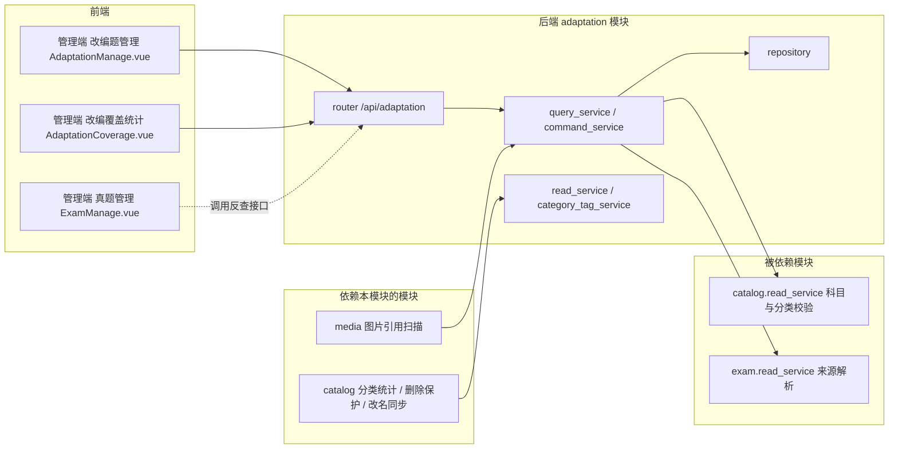
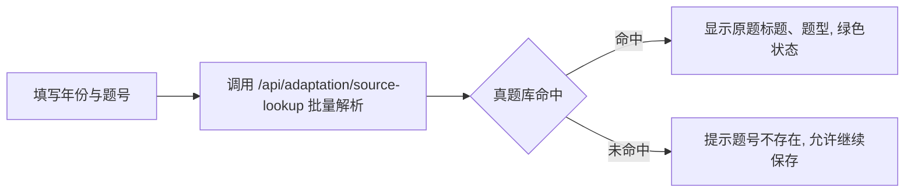
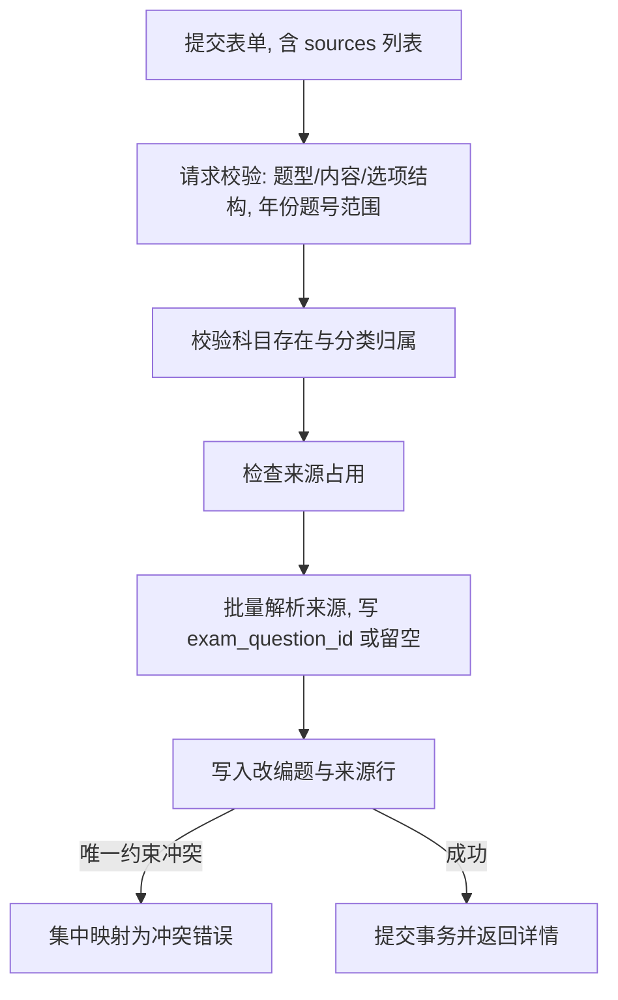
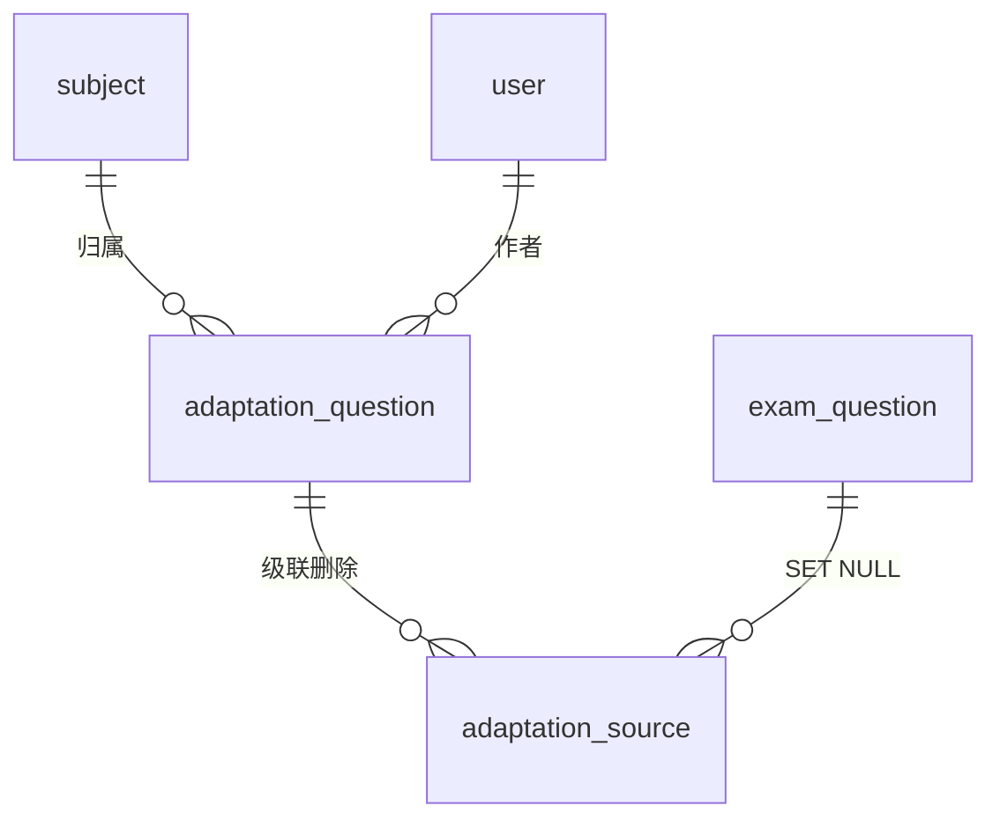

# 真题改编模块开发设计

> 本文档针对 408 考研真题知识点阅读网站中的真题改编模块，描述该模块的需求、项目内结构与流程、数据库和 API 设计。

---

## 1. 需求

### 1.1 背景与目标

当前项目已有两个题库：

- 真题：`exam_question`，按「年份 + 题号」组织，当前本地数据库快照中 2009—2025 年每年 47 题、2026 年 23 题，题号 1—40 为选择题、41—47 为综合应用题（本次只读核对结果）。
- 模拟题：`mock_question`，按「来源机构 + 标题 + 题号」组织。

内容维护者正在把真题改编为新的练习题目，录入时必须记录这批改编题来自「哪一年、哪一道或哪几道真题」。现有两个题库都无法承载这一信息：真题表自身的 `year` / `question_number` 表示真题本体，模拟题表的 `source` 字段语义是来源机构，把改编题塞进模拟题库会混用统计口径，也无法反查「某年某题被改编过几次」。

本模块的目标是：为改编题提供独立的题目库和来源引用关系，并让真题侧的改编覆盖情况可查询，支持管理端维护与统计。

### 1.2 功能需求

| 编号 | 需求 | 可观察行为 |
|---|---|---|
| F1 | 改编题独立成库 | 改编题与真题、模拟题互不影响，拥有独立的科目、分类、题型、难度、作者与时间字段 |
| F2 | 记录来源年份与题号 | 录入时填写来源年份、题号，可添加多行；同一改编题可引用多道真题，允许跨年份 |
| F3 | 来源题号范围 | 来源题号限制在 1—47，超出范围时前端与服务端拒绝提交 |
| F4 | 来源即时解析 | 录入表单填写完年份与题号后即可看到该真题是否存在及题目摘要；未命中时给出显式提示 |
| F5 | 来源复用提示 | 同一真题已被其他改编题引用时给出提示但不阻断；同一改编题重复引用同一来源时拒绝保存 |
| F6 | 来源有标注可筛选 | 管理端列表可区分「已标注来源」与「未标注来源」的改编题，未标注不会被静默忽略 |
| F7 | 真题侧反查 | 输入某年某题，可查询引用它的全部改编题（标题、题型） |
| F8 | 改编覆盖统计 | 按年份（可限定科目）给出真题总题数、已改编题数、未改编题号，并单独报告悬空来源数量 |
| F9 | 分类与图片联动 | 分类改名后改编题分类标签同步；分类删除校验计入改编题引用；改编题正文引用的图片被识别为已引用，不被未引用清理删除 |

### 1.3 非功能需求

- **权限**：查询类接口对匿名用户开放，与现有真题、模拟题查询一致；创建、更新、删除、来源占用检查接口必须经 `get_current_admin` 认证依赖，服务端权限为唯一安全边界，前端界面隐藏不作为授权手段。
- **数据一致性**：改编题与来源行的完整性由数据库唯一约束和外键保证，应用层校验只用于改善错误提示。
- **并发**：SQLite 以单写者模型运行，项目已开启 WAL 与 `busy_timeout=5000`；写事务由业务 Service 拥有并提交，重复提交由唯一约束兜底，不需要额外的乐观锁字段。
- **性能**：改编题列表必须分页；来源反查与覆盖统计按索引查询，不在请求路径扫描全表；来源解析批量进行，避免逐行查询造成的 N+1。
- **可靠性**：来源未命中真题库时不允许阻断录入，也不允许静默丢弃事实键；覆盖统计必须显式报告无法对应到真题库的来源数量。
- **隐私**：本模块只新增题目内容与作者 ID 引用，不采集新的用户个人数据；导出与统计不包含密码、Token 等敏感字段。
- **可用性**：管理端页面须覆盖加载、空结果、请求失败和提交中状态，不以空列表掩盖请求失败。

### 1.4 当前范围与不做项

当前范围：

1. 后端起编模块 `web408.modules.adaptation`：模型、Schema、仓储、查询与写入用例、只读边界、路由。
2. 管理端改编题录入、编辑、删除、来源占用提示与来源维护。
3. 真题侧反查接口与改编覆盖统计接口，以及管理端覆盖统计页面。
4. 分类联动（`question_type` 取值、改名同步、删除保护、分类统计计数）与媒体图片引用扫描接入。

明确不做：

| 不做项 | 原因与归属 |
|---|---|
| 出题工作台选题、Word 复制、PNG 导出支持改编题 | 下一期；本次不扩展 `views/admin/QuestionCompose.vue` 与其导出链路 |
| 改编题讲解过程图片（`exam_process_image` 同类能力） | 本次不做，改编题正文可继续使用 Markdown 内嵌图片 |
| 来源引用对真题的硬外键约束 | 真题库可能缺题（2026 年当前仅 23 题）或被删除，硬约束会阻断录入 |
| 分类收藏、学习进度等用户侧状态 | 现有收藏仍为浏览器本地，本模块不扩展服务端持久化 |
| 自动判定改编质量、相似度比对 | 无需求，且需要额外算法与成本评估 |

### 1.5 与相邻模块的职责边界

| 模块 | 本模块如何使用 | 本模块不做什么 |
|---|---|---|
| `catalog` | 通过 `CatalogReadService.validate_question_scope` 校验科目与分类归属 | 不创建、不修改科目与分类目录 |
| `exam` | 只读解析来源「年份 + 题号」，用于录入提示、反查展示与覆盖统计 | 不写入真题表，不修改真题表结构与真题接口行为 |
| `mock` | 复用 `question_content` 的字段与校验约定，形态保持一致 | 不读写模拟题数据 |
| `media` | 提供改编题正文与答案的引用文本供图片扫描 | 不管理物理文件，不实现上传与清理 |
| `auth` | 复用现有认证依赖与 `User` 作者关系 | 不新增角色与权限模型 |
| 前端管理端 | 复用现有表格、弹窗、表单、Markdown 渲染与请求封装 | 不新建请求实例、不绕过统一响应封装 |

### 1.6 验收标准

1. 录入来源「2021 年 + 15 题」时，若真题库存在该题则显示原题摘要；填写「2021 年 + 99 题」时提示该题号不存在，仍可保存，并在详情中标记为未解析来源。
2. 同一改编题重复添加同一来源行被唯一约束拦截；不同改编题引用同一真题允许保存，并在来源占用检查响应中提示已被引用。
3. 反查「2021 年 15 题」返回全部引用它的改编题，包含标题与题型。
4. 覆盖统计中 2021 年显示真题总数 47、已改编题数与未改编题号列表；来源中无法对应真题库的引用数单独报告。
5. 删除某改编题后，其来源行随之删除，覆盖统计与反查结果同步减少。
6. 分类改名后改编题分类标签同步为新名称；删除仍被改编题引用的分类被拒绝。
7. 改编题正文引用的图片在图片资源管理中显示为「已引用」，未引用清理不会删除该文件。

### 1.7 待确认事项

| 事项 | 当前处理 | 影响 |
|---|---|---|
| 真题管理页是否展示「已被 N 道改编题引用」 | 本期不修改 `exam` 接口，改编覆盖只在统计页与反查接口展示 | 若需在真题列表显示，需新增批量的按来源计数接口（可由本模块提供，`exam` 仍不需要改动） |
| `exercise` 类型预留的归属 | 保留不动，改编题使用 `adaptation` | 若未来把 `exercise` 用作通用习题库，需要再区分两类题目的分类统计口径 |

---

## 2. 该项目的模块结构与流程

### 2.1 项目级模块关系

本模块位于题库域，与 `exam`、`mock` 同级；依赖方向为 `adaptation` → `catalog` / `exam` 的只读边界，`catalog` 与 `media` 通过公开只读服务反向读取本模块，避免任何模块直接访问他人模型。



模块注册方式沿用现状：`backend-fastapi/src/web408/api/router.py` 增加 `router.include_router(adaptation_router, prefix="/adaptation", tags=["改编题管理"])`，由 `main.py` 以 `/api` 前缀统一挂载（`settings.server.api_prefix` 默认 `/api`）。`main.py` 需显式 `from web408.modules.adaptation import models as _adaptation_models`，使 `init_db()` 的 `SQLModel.metadata.create_all` 能建出本模块表；`pyproject.toml` 已声明 `namespace = true` 与 `module-name = "web408"`，新增子包无需修改打包配置。

### 2.2 后端代码边界

模块目录 `backend-fastapi/src/web408/modules/adaptation/`，文件职责如下（沿用 exam、mock 已形成的纵向分层，不新增空层）：

| 文件 | 职责 |
|---|---|
| `models.py` | `AdaptationQuestion`、`AdaptationSource` 两张表模型及与 `Subject`、`User`、`ExamQuestion` 的关系声明 |
| `schemas.py` | 查询参数、来源输入/输出、创建与更新请求、响应、来源占用检查、反查、覆盖统计的 Pydantic 模型 |
| `repository.py` | 改编题分页、按来源反查、来源行查询与替换、批量计数等持久化访问，只访问本模块两张表 |
| `mapper.py` | 实体到响应的纯字段转换，不含查询与事务 |
| `query_service.py` | 列表、详情、来源解析结果拼装、反查、覆盖统计、图片引用文本等读取用例，不提交事务 |
| `command_service.py` | 创建、更新、删除与来源替换用例，校验科目分类归属与题型结构，持有并提交写事务 |
| `read_service.py` | 对 `catalog` 公开分类引用与题目计数的不可变 DTO 边界 |
| `category_tag_service.py` | 分类改名时替换改编题 `category` JSON 中的旧名称，不反向依赖 `catalog` |
| `router.py` | `/api/adaptation` 下的全部 POST 接口、鉴权依赖与响应模型声明 |

对 `exam` 模块的改动仅限于为本模块增加来源解析只读查询（`repository.py` + `read_service.py`），不改现有方法签名与返回：

| 新增只读方法 | 返回 | 用途 |
|---|---|---|
| `resolve_sources(pairs) -> list[ExamSourceRead]` | 冻结 DTO：`id`、`year`、`question_number`、`title`、`question_type`、`subject_id` | 来源解析与录入提示 |
| `list_question_numbers(years) -> dict[int, list[int]]` | 年份 → 该年题号列表 | 覆盖统计的分母 |

### 2.3 前端代码边界

| 文件 | 职责 |
|---|---|
| `frontend/src/types/adaptation.ts` | 后端 DTO 到前端领域模型（camelCase）的类型：改编题、来源引用、查询参数、创建/更新请求、解析结果、反查结果、覆盖统计行 |
| `frontend/src/api/adaptation.ts` | 端点封装，统一走 `request`/`requestBlob`，请求体经 `convertKeysToSnake` 转换，方法全部为 `post` |
| `frontend/src/components/business/AdaptationSourceEditor.vue` | 受控来源编辑区：多行「年份 + 题号」，增删行，调用解析接口回填原题摘要与命中状态 |
| `frontend/src/views/admin/AdaptationManage.vue` | 管理端列表、筛选、分页、排序、编辑弹窗（含来源编辑区）、删除、来源占用提示；复用 `useAdminTable`、`Table`、`Dialog`、`Pagination`、`InputSelect`、`MultiSelectCascader`、`useQuestionForm`、`useJsonImport` |
| `frontend/src/views/admin/AdaptationCoverage.vue` | 覆盖统计页：年份 × 科目维度的总数、已改编数、未改编题号，点击查看引用该题的改编题 |
| `frontend/src/router/index.ts`、`components/business/Navigation.vue` | 提供 `/manage/adaptation`、`/manage/adaptation-coverage` 路由与管理端菜单入口 |

前端不新增请求实例，不直接拼接鉴权头；响应解包、`code !== 200` 判定、401/403/404/5xx 提示沿用 `frontend/src/api/request.ts` 现有拦截器。

### 2.4 核心业务流程

**流程一：来源即时解析（录入前）**



**流程二：创建或更新改编题**



更新时来源为全量替换：请求中给出 `sources` 即为该改编题的完整来源集合；`sources` 缺省表示不修改来源，空数组表示清空来源。

**流程三：真题侧反查与覆盖统计**

```mermaid
flowchart LR
    A[某年某题] --> B[/api/adaptation/by-source]
    B --> C[按 source_year + source_question_number 索引查询来源行]
    C --> D[返回引用它的改编题列表]
    E[年份或科目] --> F[/api/adaptation/source-coverage]
    F --> G[exam.read_service 取该年题号集合 作为分母]
    F --> H[adaptation_source 按年份题号去重计数 作为分子]
    G --> I[应用层比对, 得出未改编题号与悬空来源数]
    H --> I
```

### 2.5 数据流与状态流

- 创建：请求 → 结构校验（Pydantic）→ 业务校验（科目分类、题型结构）→ 来源占用提示 → 来源解析 → 两张表写入 → 提交 → 响应。
- 来源行状态：`未解析`（`exam_question_id` 为空，事实键仍保留）→ `已解析`（命中真题）；真题被删除时外键 `ON DELETE SET NULL` 回到 `未解析`，事实键不变。
- 删除：删除改编题时来源行由 `ON DELETE CASCADE` 一并删除，不做软删除、不保留历史版本。
- 读取：管理端列表与统计都走本模块查询用例，避免多套查询口径。

### 2.6 事务、异常与并发规则

- 事务所有者是 `AdaptationCommandService`：一次创建/更新/删除对应一个事务，写入完成后统一 `commit()`；查询用例与只读边界不提交、不回滚。
- 来源替换在同一事务内先删后插，保证不会出现「旧来源已删、新来源未写」的中间态。
- 异常沿用项目集中映射：结构错误由 `RequestValidationError` 处理，业务错误抛 `ValidationException`（422）、`NotFoundException`（404）、`ConflictException`（409），唯一约束冲突由 `IntegrityError` 处理器兜底，路由不重复 `try/except`。
- 并发写入由 SQLite 单写者与 `busy_timeout` 串行化；前端提交期间禁用重复提交按钮，服务端以唯一约束作为最终防线。
- 查询接口不引入缓存：数据规模为千级，索引查询已足够，避免缓存失效复杂度。

### 2.7 关键技术选择与依据

| 选择 | 依据 | 替代方案与不采用原因 |
|---|---|---|
| 来源引用用独立子表 `adaptation_source` | 需求本质是「多行引用 + 反查 + 覆盖统计」，子表可直接建索引、可做唯一约束与级联；项目已有 `mock_question_exam_mark` 这类独立表先例 | 主表两个字段无法表达多来源；`category` 那样的 JSON 数组列写法最省代码，但反查与覆盖统计需要全表扫描并逐行解析 JSON，且无法用数据库约束拦截重复 |
| 事实键用「年份 + 题号」，`exam_question_id` 仅作解析结果 | 真题库可能缺题或被删，事实键必须独立成立；同时保留 `exam_question_id` 便于核对命中的真题 | 只用外键则真题缺题时无法录入；只用事实键则每次核对都要再解析，且真题改年份/题号后无法感知 |
| 复用 `question_content` 的校验与序列化 | 与真题、模拟题保持同一套题型、选项与分类 JSON 规则，前端表单、JSON 导入与 Markdown 渲染可直接复用 | 自建一套字段与校验会增加三套口径 |
| 依赖方向单向：`adaptation` → `exam.read_service` | 真题侧反查与覆盖统计全部由本模块提供接口，`exam` 只增加只读方法，避免 `exam` 反向依赖新模块 | 在真题查询响应里内嵌改编计数会让 `exam` 依赖 `adaptation`，并改变真题接口公开响应 |
| 分类体系通过既有 `question_type` 通道扩展 | 目录模块已用 `exam`/`mock`/`exercise` 区分题目类型，新增 `adaptation` 与既有交互一致 | 另建一套分类接口会造成分类树与统计两套口径 |

`CategoryQuestionType` 现状为 `Literal["exam", "mock", "exercise"]`，其中 `exercise` 只在 JSON 导入示例中出现、没有对应实现（已确认的代码事实）。本模块采用**设计建议**：新增取值 `adaptation`，保留 `exercise` 不动，避免把「通用习题」语义与「真题改编」语义绑定。

---

## 3. 数据库的设计

### 3.1 数据库与连接方式

- 数据库：SQLite，文件位于 `backend-fastapi/data/web408.db`（运行时目录，不纳入版本控制的业务数据文件除外）。
- 访问方式：`sqlmodel` 异步 `AsyncEngine` + `aiosqlite`，会话由 `web408.database.connection` 统一创建。
- 连接级设置：项目已在 `configure_sqlite_connection` 中执行 `PRAGMA foreign_keys=ON`、`PRAGMA journal_mode=WAL`、`PRAGMA busy_timeout=5000`。本模块的级联删除与 `SET NULL` 依赖 `foreign_keys` 开启，不重复配置。
- 会话生命周期：HTTP 每请求一个 `AsyncSession`（`expire_on_commit=False`），依赖只负责提供与关闭会话，不隐式提交；写事务由 `AdaptationCommandService` 提交。
- 建表：应用启动时 `init_db()` 调用 `SQLModel.metadata.create_all`，新表随启动创建。

### 3.2 实体职责

| 表 | 职责 | 不负责 |
|---|---|---|
| `adaptation_question` | 改编题本体的题干、选项、答案、分类、科目、难度、作者与时间 | 不保存来源信息，不保存真题内容副本 |
| `adaptation_source` | 一条改编题到一道真题的来源引用（年份、题号、解析结果） | 不保存真题正文，不保存改编关系说明文本 |

### 3.3 `adaptation_question`

| 字段 | 类型 | 可空/默认 | 说明 |
|---|---|---|---|
| `id` | INTEGER | 非空，主键，自增 | 改编题 ID |
| `create_time` | DATETIME | 非空，应用写入 | 创建时间，`utc_now()`（UTC 无时区） |
| `update_time` | DATETIME | 非空，应用维护 | 更新时间，更新时由 `onupdate` 刷新 |
| `title` | TEXT | 可空 | 题目标题 |
| `question_type` | TEXT | 非空，默认 `'ESSAY'` | 题型，取值 `CHOICE`、`ESSAY` |
| `content` | TEXT | 非空 | Markdown 题目内容 |
| `options` | TEXT | 可空 | 选择题选项 JSON 文本 |
| `answer` | TEXT | 可空 | 答案与解析 |
| `category` | TEXT | 可空 | 分类名称数组 JSON 文本 |
| `subject_id` | INTEGER | 可空 | 科目 ID，外键 `subject.id` |
| `difficulty` | TEXT | 可空 | 难度，取值 `EASY`、`MEDIUM`、`HARD` |
| `author_id` | INTEGER | 非空 | 创建或维护者 ID，外键 `user.id` |

时间字段继承 `models/base.py` 的 `BaseModel`，与现有题库表保持一致；本模块不新增软删除、版本号或状态字段。

### 3.4 `adaptation_source`

| 字段 | 类型 | 可空/默认 | 说明 |
|---|---|---|---|
| `id` | INTEGER | 非空，主键，自增 | 来源引用 ID |
| `create_time` / `update_time` | DATETIME | 非空，应用维护 | 与主体表一致 |
| `adaptation_id` | INTEGER | 非空 | 改编题 ID，外键 `adaptation_question.id` |
| `source_year` | INTEGER | 非空 | 来源真题年份 |
| `source_question_number` | INTEGER | 非空 | 来源真题题号 |
| `exam_question_id` | INTEGER | 可空 | 解析命中的真题 ID，外键 `exam_question.id` |

### 3.5 约束、索引与依据

设计目标 DDL（尚未实现，仅表达约束与索引；时间列沿用 ORM 映射）：

```sql
CREATE TABLE adaptation_question (
    id INTEGER PRIMARY KEY AUTOINCREMENT,
    create_time DATETIME NOT NULL,
    update_time DATETIME NOT NULL,
    title TEXT,
    question_type TEXT NOT NULL DEFAULT 'ESSAY',
    content TEXT NOT NULL,
    options TEXT,
    answer TEXT,
    category TEXT,
    subject_id INTEGER REFERENCES subject(id) ON DELETE SET NULL,
    difficulty TEXT,
    author_id INTEGER NOT NULL REFERENCES user(id) ON DELETE RESTRICT,
    CHECK (question_type IN ('CHOICE', 'ESSAY')),
    CHECK (difficulty IS NULL OR difficulty IN ('EASY', 'MEDIUM', 'HARD'))
);

CREATE INDEX idx_adaptation_question_subject_id ON adaptation_question (subject_id);
CREATE INDEX idx_adaptation_question_author_id ON adaptation_question (author_id);

CREATE TABLE adaptation_source (
    id INTEGER PRIMARY KEY AUTOINCREMENT,
    create_time DATETIME NOT NULL,
    update_time DATETIME NOT NULL,
    adaptation_id INTEGER NOT NULL REFERENCES adaptation_question(id) ON DELETE CASCADE,
    source_year INTEGER NOT NULL,
    source_question_number INTEGER NOT NULL,
    exam_question_id INTEGER REFERENCES exam_question(id) ON DELETE SET NULL,
    CONSTRAINT uq_adaptation_source_ref UNIQUE
        (adaptation_id, source_year, source_question_number)
);

CREATE INDEX ix_adaptation_source_adaptation_id ON adaptation_source (adaptation_id);
CREATE INDEX ix_adaptation_source_exam_id ON adaptation_source (exam_question_id);
CREATE INDEX ix_adaptation_source_source ON adaptation_source (source_year, source_question_number);
```

| 约束/索引 | 对应用例 |
|---|---|
| 唯一 `(adaptation_id, source_year, source_question_number)` | 同一改编题不重复引用同一来源 |
| 外键 `subject_id` `SET NULL` | 科目删除后改编题仍在，科目归属清空，与真题、模拟题一致 |
| 外键 `author_id` `RESTRICT` | 有题目的作者不可被删除 |
| 外键 `adaptation_id` `CASCADE` | 删除改编题连带删除来源行 |
| 外键 `exam_question_id` `SET NULL` | 真题被删后保留来源事实键，仅丢失解析目标 |
| 索引 `adaptation_id` | 详情与编辑时按题读取来源行 |
| 索引 `(source_year, source_question_number)` | 真题侧反查与覆盖统计（按来源维度） |
| 索引 `exam_question_id` | 按已解析真题 ID 反查 |
| 索引 `subject_id` | 管理端按科目筛选与分类统计 |

不额外建立 `source_question_number` 单列索引：该列的选择性低，反查始终与年份同时使用。

### 3.6 实体关系



### 3.7 生命周期与数据保留

- 改编题为开发期业务数据，无软删除、无历史版本；删除即物理删除并级联删除来源行。
- 来源事实键（年份、题号）一旦写入不随真题变化自动改写；真题被删只清空 `exam_question_id`。
- 不保留操作日志与审计表；作者与时间字段足以定位最近维护人。
- 该表数据由管理员在管理端维护；导出能力本次不涉及，后续如需导出应复用 `reporting` 模块的导出编排，而不是在本模块内直接生成文件。

### 3.8 事务边界与一致性

- 写用例逐次提交，来源替换与主体写在同一事务内；来源的「全量替换」在事务内先删后插。
- 一致性要求：来源行的 `source_question_number` 必须落在 `1—47` 区间（与真题表题号约束一致），`source_year` 落在 `1990—2100`；这两条由 Schema 和服务端应用校验共同确认，避免非法年份进入覆盖统计。
- 不引入分布式事务与跨模块写：真题侧只读，分类改名由 `catalog` 在本模块提供的 `category_tag_service` 内完成，事务仍由 `catalog` 的用例持有。

### 3.9 结构变化与重建策略

- 沿用项目开发期策略：结构变化直接更新 Model 与建表定义，不创建迁移目录、版本表或兼容代码。
- 新表由 `create_all` 自动创建，**不需要重建现有数据库**，现有真题与模拟题数据不受影响。
- 若后续修改字段（例如新增来源说明字段），需要重建数据库时，必须先向用户提供绝对路径、重建原因、数据丢失范围、新结构来源与检查方式，获得明确授权后才能执行。

### 3.10 规范落地

- `sqlite-ops`：连接级 `foreign_keys=ON`、WAL、`busy_timeout` 依赖现有实现；唯一性由数据库约束保证，应用校验只改善提示；索引来自真实查询模式（反查、按题取来源、按科目筛选）；开发期直接以当前定义建表，不建测试库与迁移链。
- `python-spec`：模块内纵向分层，事务所有者唯一；仓储不自行提交；异步会话不在 `async def` 中执行阻塞操作；响应模型不直接暴露 ORM 实体，统一经 `mapper` 转换；每个新增 Python 文件带中文模块 docstring。

---

## 4. API 接口的设计

### 4.1 总则

- 全部接口使用 **POST**（项目规范统一要求），查询、详情、创建、更新、删除均不使用 GET/PUT/PATCH/DELETE。
- 路径前缀：`/api/adaptation`（`api/router.py` 中 `prefix="/adaptation"`，全局 `/api` 前缀由 `main.py` 统一挂载）。
- 请求体一律使用 Pydantic Request Schema，筛选与分页放在请求体中，不使用查询参数承载。
- 响应统一为 `ApiResponse[T]`（`code`、`message`、`data`）；列表统一为 `ApiResponse[PaginatedResponse[T]]`，数据字段为 `lists` 与 `pagination`。Service 只返回业务数据或抛业务异常，不返回响应壳。
- 鉴权：查询类接口不挂鉴权依赖（与真题、模拟题查询一致）；写入、删除、来源占用检查接口使用 `AuthUser = Depends(get_current_admin)`，作者取 `admin.user_id`。
- 错误：结构错误 422（`RequestValidationError`）、业务校验 422（`ValidationException`）、资源不存在 404（`NotFoundException`）、唯一冲突 409（`ConflictException` 或 `IntegrityError` 映射）、未认证 401、非管理员 403、基础设施错误 500；错误响应体沿用 `error_response` 的 `{code, message, data: null}`。
- 版本与兼容：沿用现有无版本前缀的契约；本模块为新增接口，不修改真题与模拟题的既有路径、字段与方法。

### 4.2 接口清单

| 接口名称 | 路径 | 鉴权 | 请求 Schema | 响应 Schema |
|---|---|---|---|---|
| 分页查询改编题 | `/api/adaptation/query` | 匿名 | `AdaptationQueryParams` | `ApiResponse[PaginatedAdaptationResponse]` |
| 改编题详情 | `/api/adaptation/{adaptation_id}/detail` | 匿名 | 路径参数 | `ApiResponse[AdaptationResponse]` |
| 科目分类列表 | `/api/adaptation/categories/{subject_id}` | 匿名 | 路径参数 | `ApiResponse[list[str]]` |
| 创建改编题 | `/api/adaptation` | 管理员 | `AdaptationCreateRequest` | `ApiResponse[AdaptationResponse]` |
| 更新改编题 | `/api/adaptation/{adaptation_id}` | 管理员 | `AdaptationUpdateRequest` | `ApiResponse[AdaptationResponse]` |
| 删除改编题 | `/api/adaptation/{adaptation_id}/delete` | 管理员 | 路径参数 | `ApiResponse[None]` |
| 来源占用检查 | `/api/adaptation/check-source-usage` | 管理员 | `AdaptationSourceUsageRequest` | `ApiResponse[AdaptationSourceUsageCheckResponse]` |
| 来源批量解析 | `/api/adaptation/source-lookup` | 匿名 | `AdaptationSourceLookupRequest` | `ApiResponse[list[AdaptationSourceLookupItem]]` |
| 真题侧反查 | `/api/adaptation/by-source` | 匿名 | `AdaptationBySourceRequest` | `ApiResponse[list[AdaptationBySourceItem]]` |
| 改编覆盖统计 | `/api/adaptation/source-coverage` | 匿名 | `AdaptationCoverageRequest` | `ApiResponse[list[AdaptationCoverageItem]]` |

### 4.3 请求与响应 Schema

以下为设计载荷，尚未实现。

**查询参数 `AdaptationQueryParams`**

| 字段 | 类型 | 约束 | 说明 |
|---|---|---|---|
| `page` / `page_size` | int | 默认 1 / 10，1—100 | 分页 |
| `subject_id` | int \| None | ≥1 | 科目筛选 |
| `category` | str \| None | ≤100 | 分类名称筛选 |
| `no_category` | bool \| None | — | 是否筛选无分类题目 |
| `keyword` | str \| None | ≤200 | 题干与标题关键词 |
| `question_type` | `CHOICE` \| `ESSAY` \| None | — | 题型筛选 |
| `source_year` | int \| None | 1990—2100 | 按来源年份筛选 |
| `source_question_number` | int \| None | 1—47 | 按来源题号筛选 |
| `source_state` | `all` \| `with_source` \| `without_source` | 默认 `all` | 是否已标注来源 |
| `sort_field` | Literal | `id` / `update_time` / `title` | 排序字段白名单 |
| `sort_order` | `asc` \| `desc` | 默认 `desc` | 排序方向 |

**来源输入 `AdaptationSourceRefInput`**

| 字段 | 类型 | 约束 | 说明 |
|---|---|---|---|
| `source_year` | int | 1990—2100，必填 | 来源真题年份 |
| `source_question_number` | int | 1—47，必填 | 来源真题题号 |

**创建请求 `AdaptationCreateRequest`（继承 `QuestionCreateFields`）**

在共用字段之外新增：`sources: list[AdaptationSourceRefInput]`（≤20 条，允许为空数组表示暂未标注来源）。

```json
{
  "title": "栈与队列综合练习",
  "question_type": "CHOICE",
  "subject_id": 1,
  "content": "下列关于栈的说法中，**错误**的是：",
  "options": { "A": "…", "B": "…", "C": "…", "D": "…" },
  "answer": "正确答案：C",
  "category": ["数据结构", "栈"],
  "difficulty": "MEDIUM",
  "sources": [
    { "source_year": 2021, "source_question_number": 15 },
    { "source_year": 2022, "source_question_number": 3 }
  ]
}
```

**响应 `AdaptationResponse`**：主体字段与 `ExamResponse` 对齐（`id`、`title`、`question_type`、`content`、`options`、`answer`、`category`、`subject_id`、`subject_name`、`difficulty`、`author_id`、`author_name`、`create_time`、`update_time`），另加：

| 字段 | 类型 | 说明 |
|---|---|---|
| `sources` | `list[AdaptationSourceRefResponse]` | 来源引用列表，按年份、题号升序 |
| `source_summary` | str | 展示用摘要，例如「改编自 2021 年第 15 题、2022 年第 3 题」；无来源时为空串 |

**来源引用响应 `AdaptationSourceRefResponse`**

| 字段 | 类型 | 说明 |
|---|---|---|
| `id` | int | 来源行 ID |
| `source_year` / `source_question_number` | int / int | 事实键 |
| `exam_question_id` | int \| None | 解析命中的真题 ID |
| `source_exists` | bool | 真题库中是否命中（由解析结果决定，不额外查询） |
| `exam_title` | str \| None | 命中的真题标题，用于来源展示与核对 |

**来源解析 `AdaptationSourceLookupItem`**：`source_year`、`source_question_number`、`exists`、`exam_question_id`、`exam_title`、`exam_question_type`。请求体为 `{ "sources": [...] }`，一次最多 20 条，服务端一次查询取回全部命中项。

**反查 `AdaptationBySourceRequest` / `AdaptationBySourceItem`**

- 请求：`source_year`、`source_question_number` 必填，`subject_id` 可选（仅用于统计视角过滤）。
- 响应项：`id`、`title`、`question_type`、`subject_id`、`subject_name`、`update_time`。

**覆盖统计 `AdaptationCoverageRequest` / `AdaptationCoverageItem`**

- 请求：`subject_id`（可选）、`years: list[int] | None`（不传表示统计真题库中全部年份）。
- 响应项：`year`、`total`（该年真题题目数）、`adapted`（被引用的真题题目数，按「年份 + 题号」去重）、`missing_numbers`（未改编题号列表）、`dangling_sources`（来源中无法对应真题库的引用条数）、`items`（可选：每题号 → 被引用次数）。

### 4.4 错误映射

| 场景 | 异常 | HTTP / 业务码 | 提示 |
|---|---|---|---|
| 选项与题型不匹配、内容为空 | `ValidationException` | 422 | 复用 `question_content.validation` 的消息 |
| 分类不属于指定科目或科目不存在 | `ValidationException` / `NotFoundException` | 422 / 404 | 沿用目录校验文案 |
| `source_question_number` 不在 1—47、年份越界 | 请求校验 | 422 | Pydantic 字段约束 |
| 重复引用同一来源 | `IntegrityError` 映射 | 409 | 「来源重复」 |
| 改编题 ID 不存在 | `NotFoundException` | 404 | 「改编题」 |
| 修改他人题目 | 不限制：改编题只有一个维护者角色 | — | 与真题、模拟题现状一致，均为管理员维护 |
| 数据库不可用 | `SQLAlchemyError` 处理器 | 500 | 固定公开消息，不泄露 SQL |

来源未命中真题库**不是错误**：`source-lookup` 返回 `exists: false`，保存继续，覆盖统计中计入 `dangling_sources`。

### 4.5 分页、排序与筛选

- 列表统一使用 `lists` + `pagination`（`page`、`page_size`、`total`、`total_pages`），与真题、模拟题一致。
- 排序字段白名单化，不接受任意列名；默认 `update_time desc`。
- 关键词搜索范围限定为 `title` 与 `content`，避免全字段扫描造成隐式性能问题。
- 管理端列表额外支持 `source_state`，用于识别「已录入但未标注来源」的题目。

### 4.6 幂等性与重复提交

- 创建不是幂等操作；来源重复由来源表唯一约束兜底为 409。
- 更新与删除按 ID 语义天然幂等；删除不存在的 ID 返回 404，不静默成功。
- 来源替换在事务内完成，重复提交同一份来源集合不会产生重复行（唯一约束保证）。
- 前端在提交期间禁用确认按钮，并对旧请求结果做丢弃处理。

### 4.7 前端调用边界

- `frontend/src/api/adaptation.ts` 使用统一实例 `request`（`api/request.ts`），请求体经 `convertKeysToSnake` 转换；响应拦截器已负责 `code !== 200` 判定、`data` 驼峰化与 401/403/404/5xx 提示，页面不重复解析底层错误。
- 类型分层：`types/adaptation.ts` 中的 `AdaptationQuestionDto` 表示线格式，`AdaptationQuestion`、`AdaptationSourceRef` 表示前端领域模型（camelCase），表单模型复用 `useQuestionForm` 的 `QuestionForm` 并扩展 `sources` 字段。
- 管理端页面复用 `useAdminTable`（筛选、分页、排序、科目与分类选项），来源编辑区由 `AdaptationSourceEditor.vue` 承担：受控 `props.modelValue` + `emit('update:modelValue')`，行级增删，输入去抖后调用 `source-lookup`，并按编辑页与新建页区分「来自已保存详情」与「来自表单输入」的数据来源。
- 竞态与取消：科目/分类切换与关键词搜索沿用现有项目的请求版本号方式（只接受最新响应），切换科目时清理失效的分类与列表状态；提交失败保留用户输入。

### 4.8 其他模块调用关系

| 调用方 | 调用点 | 边界 |
|---|---|---|
| `catalog.category_query_service` | `AdaptationReadService.count_questions_with_categories` / `count_question_references` / `list_question_categories` | 返回不可变 DTO，不暴露 ORM |
| `catalog.category_command_service` | 分类改名调用 `AdaptationCategoryTagService.rename_category`；删除分类前调用 `count_question_references` | 事务由 `catalog` 持有，本模块服务不提交 |
| `catalog` 分类接口 | `question_type="adaptation"` 的分类树、统计与题目计数 | 需要在 `CategoryQuestionType` 增加取值并补全三处分支 |
| `media.reference_reader` | `AdaptationQueryService.list_image_reference_texts()` | 只返回文本，不做文件操作；图片引用展示名使用 `[改编题] {title}` |
| `exam` | 新增 `resolve_sources` 与 `list_question_numbers` 只读方法 | 不改变真题现有响应与接口 |
