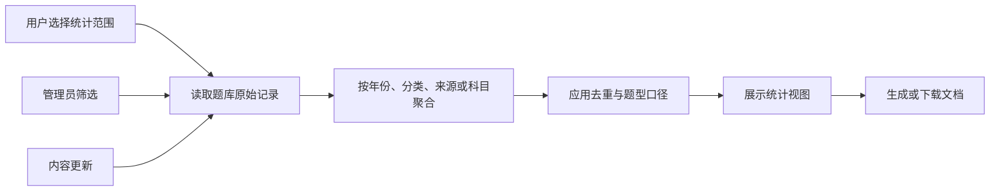

# 统计与导出模块开发设计

> 本文档针对 408考研真题知识点阅读网站中的统计与导出模块，描述该模块的需求、项目内结构与流程、数据库和 API 设计。

---

## 1. 需求

### 1.1 模块目标

统计与导出模块把真题和模拟题的原始记录聚合成学习入口、分类覆盖和题库运营视图，并把选定范围转换为可保存的文档。它解决“题库有多少内容、内容分布在哪里、如何带走当前资料”三个问题。

**已确认事实**：年份统计由 `ExamService.get_year_stats()`提供；真题分类统计由 `ExamService.get_category_stats()`和 `ExamCategoryService.get_category_stats()`分别提供；模拟题统计由 `MockService`提供；年份页面在浏览器生成 Markdown/Word，管理员分类统计页面通过后端导出只包含汇总数据的 Markdown/Excel。

**已确认事实**：不同分类统计入口仍有各自的数据来源，但真题分类统计接口已返回按题目 ID 去重的 `total_count`，并将分类引用总数单独返回；分类项按题目 ID 在单个分类内去重，一题多分类时可同时计入多个分类。当前响应同时返回按科目、分类层级和 `order_num` 排列的 `category_tree`，供统计页和导出使用。

**设计假设**：统计保持实时派生查询，不新增统计快照表；在当前本地 SQLite 规模下先采用请求内聚合，超过可接受响应时间后再单独设计持久化任务。

### 1.2 功能需求

| 编号 | 需求 | 可观察行为 |
|---|---|---|
| STAT-01 | 真题年份统计 | 展示各年份真题总数、选择题数和主观题数，按年份降序。 |
| STAT-02 | 真题分类统计 | 按可选科目以章节→知识点层级展示分类题数及题型分布，支持表头升序/降序切换并明确总题数去重口径。 |
| STAT-03 | 模拟题统计 | 展示模拟题按来源、科目和分类的数量，支持动态分类场景。 |
| STAT-04 | 学习入口聚合 | 年份或科目入口使用统计结果进入对应真题阅读上下文。 |
| STAT-05 | 真题资料导出 | 学习者可按年份或科目导出 Markdown/Word；内容保持题号和题型顺序。 |
| STAT-06 | 统计结果导出 | 管理员可导出当前科目筛选范围的分类汇总统计，不包含题目明细。 |
| STAT-07 | 失败可解释 | 空结果、统计查询失败、导出格式不支持、文件生成失败分别反馈。 |

### 1.3 非功能需求

- **口径一致性**：所有“实际题目数”按题目 ID 去重；分类计数表示该分类引用的题目数，一题多分类时分类计数之和不等于总题数是允许的；有子级的目录节点显示自身及后代题目 ID 并集，叶子知识点显示直接引用数。
- **性能**：统计查询应限制筛选范围，避免为每个分类逐条发起查询；导出应按稳定排序读取，避免无界内存增长。
- **可靠性**：统计响应和导出内容来自同一明确筛选上下文；生成文件失败不能返回成功提示或留下半成品文件。
- **安全与隐私**：统计导出不包含题目内容、答案或图片链接；权限、内容范围和下载响应不得泄露内部路径、Token 或作者密码。
- **可用性**：前端区分首次加载、刷新、空统计和错误；统计导出按钮在无数据时不可提交；下载失败要保留可重试入口。

### 1.4 范围、边界与不做项

- **本模块负责**：真题/模拟题实时统计、统计口径、学习入口所需聚合和文档导出边界。
- **题库内容模块负责**：题目原始数据和内容正确性；统计不修正脏数据。
- **目录模块负责**：科目、章节、真题分类实体及启用状态；统计只读取目录上下文。
- **阅读模块负责**：单题答案显隐、复制和浏览器当前题目集合的临时格式化；统计模块不保存作答状态。
- **不做项**：随机出题统计、学习进度、用户行为分析、定时统计快照、异步任务队列和 Word 服务端生成；分类统计 Excel 仅生成汇总工作表，不扩展为题目明细或复杂报表。`ExamRandomStat` 表当前没有被本模块使用。

### 1.5 验收标准

1. 年份统计按年份返回总数、选择题数和主观题数，三者满足选择题数 + 主观题数 = 总数。
2. 分类统计明确区分“分类引用题数”和“去重题目总数”；同一题含多个分类时去重总数只增加一次。
3. 模拟题来源/科目/分类统计与对应筛选范围一致，空范围返回成功的空集合而非错误。
4. 学习端按年份/科目导出内容的题号顺序稳定，导出是否含答案与用户选择一致，失败时不提示成功。
5. 统计管理页面按科目筛选后只显示该科目的章节/知识点统计，并仅支持三个数量列升序/降序；排序先作用于章节合计，再作用于章节内知识点；导出文件只包含当前筛选范围的汇总数据，不包含题目明细。
6. 非管理员不能执行受保护统计导出；统计查询失败、无数据、无权限和文件生成失败分别映射为可理解状态。

## 2. 该项目的模块结构与流程

### 2.1 项目级关系

| 方向 | 当前项目位置 | 协作内容 |
|---|---|---|
| 真题统计入口 | `backend-fastapi/app/api/exam.py`、`app/services/exam_query_service.py`、`app/services/exam_export_service.py` | 年份统计、分类统计、索引、按科目导出和管理员分类统计汇总导出。 |
| 分类统计入口 | `backend-fastapi/app/api/exam_category.py`、`app/services/category_query_service.py` | 跨科目分类总量、启用分类数和题目引用去重统计。 |
| 模拟题统计入口 | `backend-fastapi/app/api/mock.py`、`app/services/mock_query_service.py` | 来源、科目和动态分类统计。 |
| 前端学习调用方 | `frontend/src/views/user/ExamIndex.vue`、`ExamList.vue`、`ExamClassify.vue`、`MockClassify.vue` | 使用年份、科目和分类统计构造阅读入口。 |
| 前端管理调用方 | `frontend/src/views/admin/ExamCategoryStats.vue`、`CategoryManage.vue` | 显示分类统计、科目筛选，并通过 Blob 接口下载分类统计文件。 |
| 导出/内容协作 | `frontend/src/components/business/ExamQuestionCard.vue`、`QuestionCopyMenu.vue`、`ExamList.vue` | 单题复制和浏览器端 Markdown/Word 文档生成。 |
| 下游 | 学习入口、分类树、题库运营 | 消费统计数量和导出文件，不反向修改原始题目。 |

### 2.2 当前代码边界与事实缺口

后端统计逻辑分散在真题、分类和模拟题 Query Service 中，未形成独立的统计 Service；持久化读取由各领域 Repository 通过异步 SQLModel Session 完成，部分 JSON 分类展开在内存中完成。

- `ExamIndex.vue`使用年份统计作为入口。
- `ExamList.vue`按当前年份在浏览器拼接 Markdown 和 `docx`；`ExamClassify.vue`的科目导出通过 `api/exam.ts` 的 `requestBlob` 调用后端 `/api/exam/export`，当前服务实际只生成 Markdown。
- `ExamCategoryStats.vue`读取真题分类统计，按科目→章节→知识点层级展示，并分别展示去重题目总数和分类引用总数；有子级的目录节点展示子树合计，叶子知识点展示直接引用数；只有选择题数、主观题数和总题数列支持表头升序/降序，排序时先排章节合计再排章节内知识点；通过 `api/exam.ts` 的 `requestBlob` 调用 `/api/exam/export-category-stats` 导出默认层级顺序的 Markdown/Excel。
- `CategoryManage.vue`的真题统计使用分类统计接口，模拟题统计使用模拟题科目/分类接口；动态模拟题分类不是统计表中的持久化分类。

**当前契约**：统计读取接口使用 POST + Request Schema，响应使用统一 `ApiResponse`；真题科目导出和管理员分类统计导出通过 `api/exam.ts` 的 `requestBlob` 请求文件流。分类统计导出请求使用 POST，支持 `markdown`/`xlsx`，由管理员权限依赖保护，文件只包含统计汇总。

### 2.3 核心流程

### 2.4 数据流和状态流

1. 统计请求接收科目、分类、年份、来源或题型范围；Request Schema 负责类型和范围，Service 负责查询和聚合。
2. 真题年份统计直接按 `year` 分组；真题/模拟题分类统计先读取分类 JSON，再在内存展开；真题统计将题目标签映射到分类目录树，以科目顺序和各级 `order_num` 作为默认层级，表格排序仅改变当前视图；来源统计按 `source` 分组。
3. 统计结果只存在当前 HTTP 响应和前端页面状态；没有统计快照表或缓存失效事件。
4. 浏览器端导出从当前已加载题目生成 Blob；后端导出读取指定科目题目并生成文件流。导出不改写题库，也不记录下载历史。
5. 题目新增/更新/删除后，调用方主动刷新统计；没有消息总线保证所有已打开页面实时同步。
6. 图片在导出内容中以题目原文中的引用保留；图片文件生命周期由图片资源模块负责。

### 2.5 异常、并发、事务和任务规则

- **统计读取**：校验错误 422，资源不存在 404（如指定科目不存在时按契约决定），数据库/JSON 解析基础设施错误为 5xx；无记录是成功空结果。
- **去重异常**：无效分类 JSON 不应使整个统计失败，应跳过并记录受控日志；同时在管理侧提供数据质量可见性，不能把跳过的数据计入总量。
- **并发**：统计和导出是读操作，和管理员写入之间只保证查询时点的一致性；同一页面的快速筛选只接受最新响应。
- **事务**：当前 `SessionDep` 创建请求级 AsyncSession 并负责关闭，统计/导出不写数据库，不应主动提交；异常时会话回滚。若后续引入导出审计记录，应由独立用例拥有写事务。
- **重试**：统计读可有限手动重试，导出可重新发起；不要自动重复非幂等的未来审计写入。当前没有后台任务、取消协议或流式任务。
- **长导出**：当前文件生成在请求内完成；若题库规模使响应时间或内存不可接受，应另行设计持久任务、任务 ID、状态和清理策略，不能把普通 BackgroundTasks 当作可靠导出队列。

### 2.6 关键技术选择

- 继续使用派生统计，避免在当前小型本地题库中维护易失效的统计快照。
- 统计聚合集中到明确的 Service 边界，API 只做校验/响应，前端不把分类计数之和当作去重总数；若展示该数值，必须明确标为分类引用总数。
- Markdown/Word 导出按场景拆分：阅读端可在浏览器生成轻量文档，服务端导出用于跨页面或大范围内容；两者共用题号、题型、答案包含和图片引用语义。
- 真题分类统计以分类目录树提供章节/知识点分组：一级分类作为章节，子分类作为知识点；有子级的目录节点使用子树汇总，叶子节点使用直接引用统计；统计页只有三个数量列可排序，排序先按章节合计再按章节内部知识点，只改变当前视图，不写回分类目录，导出复用同一棵统计树。

## 3. 数据库的设计

### 3.1 本模块不直接持久化统计数据

统计与导出模块不新增或直接维护统计表，也不保存导出文件记录。统计事实由以下现有实体负责：

- `exam_question`：真题年份、题型、科目、分类 JSON 和内容，是真题统计与导出的来源。
- `mock_question`：模拟题来源、题型、科目、分类 JSON 和内容，是模拟题统计的来源。
- `subject`：科目名称和启用状态，是统计筛选和展示上下文。
- `exam_category`：真题分类目录和启用状态，用于分类管理统计；题目本身没有分类外键。

`ExamRandomStat` 虽然存在于 `entities.py`，但当前没有统计/导出调用方；它不属于本模块的数据契约，也不能被误用为学习统计。

### 3.2 连接、查询和索引边界

- 数据库为 SQLite，默认通过 `sqlite+aiosqlite:///./data/web408.db` 使用异步 SQLModel `AsyncSession`。
- `SessionDep` 每请求创建并关闭 Session；统计/导出只读，异常时会话回滚。
- 应用启动调用 `SQLModel.metadata.create_all`；数据库保留历史 `schema_migrations` 记录但不再维护迁移脚本，当前仍没有完整通用迁移框架。本模块不改变 Schema，不执行数据库删除、重建或清理。
- `connection.py` 已设置 `check_same_thread=False`、WAL、`foreign_keys=ON` 和 busy timeout；统计模块沿用统一连接配置，不单独修改。
- 当前查询按 `year`、`subject_id`、`source`、`update_time`、`question_number` 和 JSON 文本筛选/排序，实体没有完整显式索引。索引应由题库模块依据实际查询计划评估，统计模块不凭空增加索引。

### 3.3 统计口径与生命周期

| 统计对象 | 计算规则 | 生命周期 |
|---|---|---|
| 年份总题数 | 统计该年份的题目记录数。 | 随 `exam_question` 读时计算。 |
| 年份题型数 | 按 `question_type=CHOICE`计选择题，其余合法主观题计入主观题；非法题型应先校验或单独暴露。 | 随题目更新即时变化。 |
| 分类引用题数 | 每个分类内按题目 ID 去重；一题多个分类可在多个分类各计 1。 | 随题目分类 JSON变化即时变化。 |
| 分类总题数 | 所有分类关联题目 ID 的并集数量，不是分类计数之和。 | 仅作为响应派生字段，不落库。 |
| 来源题数 | 按 `mock_question.source`分组计题目记录数。 | 来源没有独立实体，最后一道题删除后来源自然消失。 |
| 导出内容 | 读取当前科目筛选范围，输出去重题数、分类引用数及分类/题型汇总，不输出题目明细。 | 文件为临时 HTTP 结果，不长期保留。 |

### 3.4 备份、脱敏和数据删除

备份责任归属于题库数据库和文件存储的所有者；统计模块只读不拥有原始数据删除权。分类统计导出不包含题目内容、答案和图片引用，仍应按调用者权限控制并避免将 Token、密码哈希、SQL、真实文件路径带入文件。删除题目或分类后不保留统计快照，下一次统计从剩余数据重新计算。

## 4. API 接口的设计

### 4.1 当前已实现边界（事实）

- 实际前缀为 `/api`，当前统计查询使用 POST + Request Schema。
- 真题已实现 `/api/exam/year-stats`、`/api/exam/category-stats` 和 `/api/exam/export`；模拟题已实现来源/科目/分类统计接口；分类模块已实现跨科目分类统计。
- 当前 JSON 成功响应是 `ApiResponse[T]`、`code=200`；真题分类统计响应包含 `total_count`（题目 ID 去重）、`category_reference_count`（分类引用总数）和按目录顺序排列的 `category_tree`，节点包含直接统计、子树去重统计和题型拆分。
- 分类统计导出已实现为管理员专用 `POST /api/exam/export-category-stats`，支持 `format=markdown|xlsx`；返回只含统计汇总的临时文件流，不写入数据库或文件存储。

### 4.2 目标契约与统一方法

所有新增或改动统计/导出接口均使用 POST。筛选条件必须放进 Pydantic Request Schema JSON Body，不使用 Query 参数；当前 JSON 响应已使用 `ApiResponse[T]`，若未来返回分页明细使用 `ApiResponse[PaginatedResponse[T]]`，字段为 `lists` 和 `pagination`。文件导出成功时返回文件流，失败必须在开始流式响应前返回统一错误。

> 4.3、4.4 的路径和 DTO 是目标契约命名；当前已实现路径以 4.1 为准。当前分类统计导出实际使用 `POST /api/exam/export-category-stats`，不是旧的 `/api/exam/category-stats/export`，且请求只包含 `subject_id` 和 `format`。

### 4.3 统计查询接口

| 接口名称 | 目标路径与方法 | Request Schema / 输入 | 成功响应 | 鉴权、口径和错误 |
|---|---|---|---|---|
| 真题年份统计 | `POST /api/exam/query-year-stats` | `ExamYearStatsRequest { category: str | null, subject_id: int | null }`。 | `ApiResponse[List[ExamYearStatResponse]]`。 | 公开只读；按年份降序；总数=选择题+主观题。 |
| 真题分类统计 | `POST /api/exam/query-category-stats` | `ExamCategoryStatsRequest { subject_id: int | null }`。 | `ApiResponse[ExamCategoryStatsResult]`，含分类项、分类引用数、题型数、distinct 总题数，以及按科目→章节→知识点和目录顺序排列的 `category_tree`。 | 公开或管理页按现有权限确认；无效 JSON跳过并计入数据质量日志；目录缺失标签归入未归档节点。 |
| 真题分类目录统计 | `POST /api/exam-category/query-stats` | `CategoryStatsRequest { question_type: Literal['exam','mock'] }`。 | `ApiResponse[ExamCategoryStatResponse]`，按科目返回分类数、启用分类数和去重题数。 | 公开读取或 ADMIN 由调用页面决定；不接受 `exercise` 作为有效实现值。 |
| 模拟题来源统计 | `POST /api/mock/query-source-stats` | `MockSourceStatsRequest { category: str | null, subject_id: int | null }`。 | `ApiResponse[List[MockSourceStatResponse]]`。 | 公开；按来源计数；空结果成功返回。 |
| 模拟题科目统计 | `POST /api/mock/query-subject-stats` | `EmptyRequest`。 | `ApiResponse[List[MockSubjectStatResponse]]`。 | 公开；供侧边栏覆盖科目题数。 |
| 模拟题分类统计 | `POST /api/mock/query-category-stats` | `MockSubjectRequest { subject_id: int }`。 | `ApiResponse[MockCategoryStatsResponse]`，分类项和 distinct `total_count`。 | 公开；分类项计数与总量分开解释。 |

### 4.4 导出接口

| 接口名称 | 目标路径与方法 | Request Schema / 输入 | 成功结果 | 鉴权、幂等和错误 |
|---|---|---|---|---|
| 按科目导出真题 | `POST /api/exam/export-by-subject` | `ExamExportRequest { subject_id: int, format: Literal['markdown'], include_answer: bool = true }`。 | Markdown 文件流，文件名和 Content-Type 正确。 | 沿用学习端公开只读边界；按年份/题号排序；重复调用只生成临时结果。 |
| 按年份导出真题 | `POST /api/exam/export-by-year` | `ExamYearExportRequest { year: int, subject_id: int | null, category: str | null, format: Literal['markdown','docx'], include_answer: bool = true }`。 | 文件流；Word 如由浏览器生成则该接口不必提供。 | 公开或按内容权限确认；大范围导出需限制大小。 |
| 导出分类统计 | `POST /api/exam/export-category-stats` | `ExamCategoryStatsExportRequest { subject_id: int | null, format: Literal['markdown','xlsx'] }`。 | 只含分类汇总且按章节→知识点目录顺序排列的 Markdown/Excel 文件流。 | ADMIN；请求内生成临时文件，不保存导出记录。 |

`ExamExportRequest` 等名称是目标设计模型；当前代码只有 `ExamQueryParams` 和按科目导出参数，不能用 `body: dict` 替代新 Request Schema。浏览器端生成的 Word 文件属于前端内部调用边界，不是服务端 API。

### 4.5 API 层、Service 层和前端边界

- API 层负责 Request Schema、认证依赖、`response_model`、`success()`/`error()`和文件响应；不直接写 SQL。
- Service 层只返回统计数据或导出结果/抛出业务异常，不返回 `ApiResponse`，不把 ORM 实体作为统计响应。
- Pydantic 响应模型应使用明确的分类统计项、去重总数、题型数量和来源项，禁止 `Response[List[dict]]`作为长期契约。
- 422 表示范围/格式错误；401/403 表示认证/权限；404 表示科目等资源不存在；409 表示导出范围或状态冲突；5xx 表示数据库、JSON 聚合或文件生成失败。
- `frontend/src/api/exam.ts`、`mock.ts`和`category.ts`是 JSON 请求的统一入口；`request.ts`集中校验响应信封、转换字段并区分 JSON/Blob。页面不得自行拼接导出 URL，分类统计页面通过统一 Blob 请求入口下载文件。
- 统计查询可取消或只接受最新响应；导出请求在浏览器侧应区分加载、下载、失败和取消。当前没有后台任务、事件或 SSE。

### 4.6 兼容与风险说明

真题分类统计的去重总数和分类引用总数已在接口中分开表达，统计树按默认章节/知识点层级返回，有子级节点使用子树去重数、叶子节点使用直接引用数；统计表支持表头升序/降序切换，管理员可按科目导出只含汇总数据的 Markdown/Excel。真题科目导出当前只支持 Markdown，Word 由 `ExamList.vue` 在浏览器端生成。导出是请求内生成的临时文件，不记录下载历史；若题库规模导致响应时间或内存不可接受，仍需另行设计异步导出任务。
