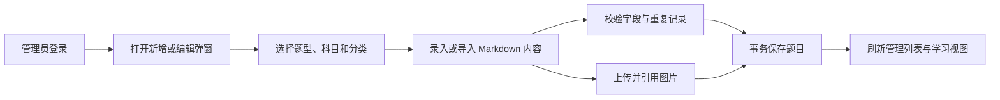

# 题库内容维护模块开发设计

> 本文档针对 408考研真题知识点阅读网站中的题库内容维护模块，描述该模块的需求、项目内结构与流程、数据库和 API 设计。

---

## 1. 需求

### 1.1 模块目标

题库内容维护模块为管理员提供真题和模拟题的录入、修订、删除和结构化导入能力，保证题目能够被学习端按年份/来源、科目、题型、分类和难度正确读取。它需要同时维护 Markdown 内容和题目元数据，并在保存前阻止明显的结构错误和重复记录。

**已确认事实**：真题和模拟题分别保存于 `exam_question`、`mock_question`；前端使用 `ExamEditDialog.vue`、`MockEditDialog.vue`和 `useQuestionForm.js`；后端分别由 `exam.py`/`ExamService`和 `mock.py`/`MockService`处理；新增/更新/删除路由使用管理员依赖。

**已实现约束**：前端 API 层统一将 camelCase 转换为 snake_case；题目请求使用分类数组和结构化 A-D 选项，后端 Schema/Service 对题型、选项、难度、科目和分类归属进行校验，并由数据库复合唯一索引兜底。

**设计假设**：维持两张题目表和现有 JSON 文本存储，不引入统一题目表或题目版本表；管理员写操作同步完成，不使用异步任务。

### 1.2 功能需求

| 编号 | 需求 | 可观察行为 |
|---|---|---|
| QMS-01 | 真题维护 | 管理员可新增、编辑和物理删除真题，录入年份、题号、题型、科目、分类、难度和内容。 |
| QMS-02 | 模拟题维护 | 管理员可新增、编辑和物理删除模拟题，录入来源、标题、题号、题型、科目、分类、难度和内容。 |
| QMS-03 | 题型结构 | 选择题必须有题干、A-D 选项和答案解析字段；主观题不保存选择题选项。 |
| QMS-04 | Markdown 内容 | 题干、选项和答案支持 Markdown、数学公式、代码、SVG 和图片引用，并可实时预览。 |
| QMS-05 | 分类与科目 | 编辑题目时只能从对应科目的目录中选择新分类；历史未定义分类需要可识别地保留或修订。 |
| QMS-06 | 结构化导入 | 管理员可粘贴单道题目的 JSON，解析后填充表单；非法 JSON 或字段结构错误不应覆盖当前有效表单。 |
| QMS-07 | 重复保护 | 真题按年份/题号、模拟题按来源/标题/题号检查重复；更新时排除当前记录。 |
| QMS-08 | 操作反馈 | 保存、删除、查重、详情加载失败和权限错误均给出明确反馈，并刷新受影响列表和统计。 |

### 1.3 非功能需求

- **安全**：只有服务端确认的 ADMIN 可写；作者 ID 从当前身份取得，客户端不得提交或修改作者；Markdown/HTML/SVG 通过统一安全配置处理；错误响应不泄露 SQL、堆栈和文件绝对路径。
- **数据一致性**：题型、选项、答案、分类和科目关系必须在一个写事务内校验；重复检查不能只依赖前端或事前查询。
- **并发**：两个管理员同时编辑同一题目时，当前项目没有版本号/乐观锁；目标至少要防止唯一性竞态，并明确后写覆盖或增加更新时间冲突检测。
- **可靠性**：保存失败不得关闭编辑弹窗或提示成功；删除后列表、导航、统计和图片引用扫描的下一次读取应反映新状态。
- **性能**：编辑详情只加载一条题目；管理列表使用分页；JSON 导入和 Markdown 预览在浏览器内完成，不能阻塞其他页面。
- **可用性**：表单区分新增/编辑、真题/模拟题、选择题/主观题；加载、保存、删除、空数据和冲突均有独立状态。

### 1.4 范围、边界与不做项

- **本模块负责**：题目内容和元数据的写入、编辑详情读取、重复检查、管理员操作和单题 JSON 导入。
- **账户与权限模块负责**：登录身份、管理员依赖和 Token 校验；本模块不自定义权限体系。
- **学科目录模块负责**：科目、章节、真题分类的创建/维护和父子关系；本模块只消费目录选项。
- **图片资源模块负责**：图片上传、文件命名、引用扫描和删除；本模块只保存 Markdown 中的图片引用。
- **统计/阅读模块负责**：题目查询、展示、统计和导出；本模块不保存答案显隐、作答结果或浏览记录。
- **不做项**：题目版本历史、审核发布流、批量文件导入、用户协作编辑、自动 AI 解析、题目-分类关联表和回收站。

### 1.5 验收标准

1. 未登录或普通用户调用任一题目写接口均被拒绝；管理员创建记录时作者自动取当前身份。
2. 新增/更新选择题缺少 A-D 任一选项或内容为空时被拒绝；主观题不会残留旧选择题选项。
3. 真题重复键和模拟题重复键在并发写入下仍有数据库或事务级兜底；更新当前记录不误报自身重复。
4. 年份/来源、题号、题型、难度、科目和分类字段保存后可被学习端读取；分类数组和选项 JSON 不因字段映射丢失。
5. JSON 解析失败只提示错误，不覆盖已有表单；合法导入后题型、内容、选项、答案、分类和难度正确填充。
6. 保存、删除和详情加载的成功/失败状态明确；删除后管理列表和相关统计重新读取，图片文件不被题目删除动作直接删除。
7. Markdown、公式、代码、SVG 和图片内容在编辑预览及阅读页面使用同一安全渲染规则。

## 2. 该项目的模块结构与流程

### 2.1 项目级关系

| 方向 | 当前项目位置 | 协作内容 |
|---|---|---|
| 管理列表 | `frontend/src/views/admin/ExamManage.vue`、`MockManage.vue` | 分页、筛选、排序、查看、编辑和删除入口。 |
| 编辑表单 | `frontend/src/components/business/ExamEditDialog.vue`、`MockEditDialog.vue` | 新增/编辑、题型切换、JSON 导入、表单提交和结果反馈。 |
| 表单共享 | `frontend/src/composables/useQuestionForm.js`、`useJsonImport.js` | 题型字段、选项组装、分类加载、JSON 宽松解析。 |
| 内容编辑 | `frontend/src/components/basic/MarkdownEditor.vue`、`MarkdownViewer.vue` | Markdown 预览、公式、SVG 和图片上传引用。 |
| 后端入口 | `backend-fastapi/app/api/v1/exam.py`、`mock.py` | 真题/模拟题详情、查重和管理员 CRUD。 |
| 业务处理 | `backend-fastapi/app/services/exam_service.py`、`mock_service.py` | 查重、实体创建/更新/删除、响应转换和作者/科目补充。 |
| 数据契约 | `backend-fastapi/app/schemas/exam.py`、`mock.py`、`app/models/entities.py` | 请求/响应模型以及两张题目表。 |
| 上游依赖 | 账户与权限、学科目录、图片资源 | 提供 ADMIN、科目/分类选择和图片 URL。 |
| 下游 | 历年真题学习、模拟题学习、统计与导出、图片引用治理 | 消费保存后的题目、分类 JSON 和 Markdown 内容。 |

### 2.2 当前代码边界与事实冲突

后端采用 Router → Service → Schema/Model 的横向结构，没有 Repository。`ExamService` 和 `MockService`都在 Service 中完成数据库查询和 DTO 转换，事务由请求 Session 依赖在请求结束时提交/回滚。

前端编辑流程为：弹窗打开时加载科目/分类，编辑模式加载详情或使用列表传入对象，编辑器保存本地 Markdown，提交时组装选项 JSON 和分类字段，再调用对应 API。`MarkdownEditor.vue`的图片上传是独立请求，上传成功后先把 URL 插入文本，题目保存属于后续请求。

当前需要在实施时优先修正的事实差异：

- `ExamEditDialog.vue`提交的 `categoryIds` 与后端 `ExamCreateRequest.category` 不同名，且后端当前 Schema 将 category 声明为字符串；`MockEditDialog.vue`使用 `buildSubmitData`时又使用另一套字段形态。
- `ExamResponse` 和 `MockResponse` 均返回分类数组和结构化选项，前端请求层统一处理命名转换。
- 选择题/主观题结构由 Pydantic 和 Service 双重校验，主观题不会保留选择题选项。
- 数据库迁移已增加真题、模拟题复合唯一索引，应用层查重仅用于友好提示。

题库查询、详情、查重和维护接口均已使用 POST + Request Schema；Service 只返回业务数据，路由统一包装为 `ApiResponse`。

### 2.3 核心业务流程

### 2.4 数据流和状态流

1. 管理页面选择新增/编辑；编辑时可使用列表已有对象，或调用详情接口读取最新题目。
2. `useQuestionForm`把选择题选项 A-D 保存在独立表单字段，提交前序列化为 `options`；分类在表单中是数组，提交时转换为数据库可保存的 JSON 表示。
3. JSON 导入只在浏览器解析单道题，支持一定程度的反斜杠/引号修复；解析完成后仍需经过前端表单和后端 Request Schema/业务校验。
4. 图片上传先写文件并返回 URL，再由编辑器把 URL写入 `content`/`answer`/`options`；题目保存失败时可能留下未引用图片，由资源治理模块清理。
5. API 层取得当前 `AuthUser`，Service 校验重复、内容和关系后写入 `exam_question`或`mock_question`；作者 ID只来自当前用户。
6. 写请求结束后 Session 提交；页面收到成功响应后关闭弹窗并刷新列表/统计，失败则保留表单和错误信息。

### 2.5 异常、重试、并发、事务和任务

- **输入校验**：Pydantic 负责类型、长度、年份/题号范围、枚举和请求结构；Service 负责题型与选项、分类归属、科目存在、重复性和作者边界。
- **业务错误**：题目不存在 404；未登录 401；非管理员 403；重复键 409；题型内容缺失、分类/科目不合法 400/422；数据库/文件基础设施失败 5xx。
- **重复提交**：前端保存按钮使用 saving 状态禁止重复点击；后端不对创建/更新自动重试。删除前必须二次确认。
- **并发编辑**：当前没有 `version` 字段。最低兼容方案是后写覆盖并在响应中返回最新 `update_time`；推荐在后续公开契约中加入 `expected_update_time`，不匹配时返回 409，避免管理员覆盖他人修订。
- **事务**：当前 `get_async_session`是事务所有者，一个创建/更新/删除请求覆盖查重与写入；Service 辅助函数不提交。若同时写题目和审计记录，应由同一用例事务拥有。
- **重试**：详情/分类读取可以手动重试；创建/更新/删除不能自动重放；图片上传失败可以用户重新选择文件，但不能自动无限重传。
- **后台任务**：当前没有后台任务、流式保存或批量导入；单题 JSON 解析在浏览器同步完成。大批量导入需独立设计任务状态和回滚，不在本模块隐式实现。
- **日志**：记录管理员 ID、题目类型、题目 ID和结果即可；不记录完整题干、答案、Token、密码或图片内容。

### 2.6 关键技术选择

- 两张题目表分别保留真题年份和模拟题来源语义，避免用可空字段拼接一张难以约束的通用表。
- Markdown/选项/分类在数据库仍以现有文本形式保存，API/Mapper 负责 typed DTO 与存储文本之间转换；这样可兼容当前数据，同时把校验集中在边界。
- JSON 导入保持客户端能力，不新增“原始 JSON”服务端存储；服务器只接受已校验的题目字段。
- 题目删除与图片删除分离，避免删除题目时未经引用扫描就破坏其他题目共享的图片文件。

## 3. 数据库的设计

### 3.1 数据库与连接

- **数据库**：SQLite，默认 URL 为 `sqlite+aiosqlite:///./data/web408.db`。
- **访问方式**：`ExamService`/`MockService`使用异步 SQLModel `AsyncSession`，由 `SessionDep`每请求注入并在结束提交/回滚/关闭。
- **初始化**：应用启动执行 `SQLModel.metadata.create_all`；现有数据库已通过 `scripts/migrate_high_priority.py` 迁移并保留题库数据，后续结构变更需新增明确迁移并保留备份。
- **连接现状**：只设置 `check_same_thread=False`，未显式启用 WAL 和 `foreign_keys=ON`。设计建议在统一连接层补齐，尤其是作者/科目外键和并发读写行为。

### 3.2 `exam_question` 实体

| 字段 | 类型 | 可空/默认 | 约束与用途 |
|---|---|---|---|
| `id` | `INTEGER` | 数据库生成 | `PRIMARY KEY`。 |
| `create_time` / `update_time` | `DATETIME` | 非空；基类 UTC 默认，更新时间 on update | 生命周期和排序。 |
| `year` | `INTEGER` | 非空 | 真题年份；请求当前限制 1990～2100。 |
| `question_number` | `INTEGER` | 可空 | 题号；当前编辑器允许不填。 |
| `question_type` | `TEXT` | 非空；默认 `ESSAY` | `CHOICE`/`ESSAY`；当前无 DB CHECK。 |
| `title` | `TEXT` | 可空 | 题目标题。 |
| `content` | `TEXT` | 非空 | Markdown 题干。 |
| `options` | `TEXT` | 可空 | 选择题选项 JSON 字符串。 |
| `answer` | `TEXT` | 可空 | Markdown 答案/解析。 |
| `category` | `TEXT` | 可空 | 分类 JSON 数组字符串。 |
| `subject_id` | `INTEGER` | 可空 | 外键 `subject.id`；当前允许空科目历史数据。 |
| `difficulty` | `TEXT` | 可空 | `EASY`/`MEDIUM`/`HARD`。 |
| `author_id` | `INTEGER` | 非空 | 外键 `user.id`，由当前管理员取得。 |

### 3.3 `mock_question` 实体

| 字段 | 类型 | 可空/默认 | 约束与用途 |
|---|---|---|---|
| `id` | `INTEGER` | 数据库生成 | `PRIMARY KEY`。 |
| `create_time` / `update_time` | `DATETIME` | 非空；基类 UTC 默认，更新时间 on update | 生命周期和管理排序。 |
| `source` | `TEXT` | 非空 | 来源机构。 |
| `question_number` | `INTEGER` | 可空 | 来源/标题下题号。 |
| `question_type` | `TEXT` | 非空；默认 `ESSAY` | `CHOICE`/`ESSAY`。 |
| `title` | `TEXT` | 可空 | 来源下标题。 |
| `content` | `TEXT` | 非空 | Markdown 题干。 |
| `options` | `TEXT` | 可空 | 选择题选项 JSON 字符串。 |
| `answer` | `TEXT` | 可空 | Markdown 答案/解析。 |
| `category` | `TEXT` | 可空 | 分类 JSON 数组字符串。 |
| `subject_id` | `INTEGER` | 可空 | 外键 `subject.id`。 |
| `difficulty` | `TEXT` | 可空 | `EASY`/`MEDIUM`/`HARD`。 |
| `author_id` | `INTEGER` | 非空 | 外键 `user.id`。 |

### 3.4 约束、索引和关系

- `Subject 1:N ExamQuestion/MockQuestion`，`User 1:N ExamQuestion/MockQuestion`；题目不直接引用 `ExamCategory`，分类依靠 JSON 名称。
- 当前唯一性由 Service 预检查：真题为 `(year, question_number)`，仅在题号非空时检查；模拟题为 `(source, title, question_number)`。
- **设计建议**：为真题和模拟题分别增加与业务口径一致的复合唯一保护（对非空题号使用 SQLite 部分唯一索引或等价约束），并把唯一冲突映射为 409；是否要求题号必填需产品确认，不能用新约束静默改变已有可空语义。
- **设计建议**：评估真题 `(year, subject_id, question_number)`、模拟题 `(subject_id, source, question_number)`和管理列表更新时间索引；索引依据应来自实际查询计划，不能只按字段数量堆叠。
- `options`/`category`属于 JSON 文本，普通索引不能正确支持成员查询；当前保持存储兼容，校验和解析放在 Schema/Service。将来改为关联表属于独立数据模型变更。
- `subject_id`和`author_id`为可/非空外键；开启 SQLite 外键后，删除科目/账户的行为必须先定义，不能让级联默认删除题目。

### 3.5 内容状态、删除和隐私

- 题目没有草稿/发布状态，保存后立即对学习查询可见；编辑为直接更新，删除为物理删除，无回收站和版本历史。
- 选择题目标不保存空的旧选项；切换为主观题时 `options=NULL`。答案可以为空，但阅读端必须正确显示“暂无答案”而不是假装有解析。
- 新分类值应与当前科目启用目录匹配；历史未定义分类保留原文本并在编辑器标记，不能因目录刷新自动丢失。
- 删除题目不会删除图片；资源治理模块根据所有题目文本重新扫描引用后清理。
- 备份和导出必须保护 Markdown 中可能出现的个人/内部内容；不返回密码、Token、数据库绝对路径或内部日志。

### 3.6 事务与结构变化

一个创建/更新/删除用例由请求级 AsyncSession 拥有事务，查重、科目/分类校验和题目写入在同一事务内完成；文件上传与题目写入是两个独立边界，失败时通过未引用清理处理孤立图片。SQLite 适合当前小型本地题库，启用 WAL 后仍只有单写者，写锁冲突应转为可理解的重试错误。

结构变化只更新 SQLModel 当前定义和建表来源，不创建迁移目录或兼容脚本；执行现有数据库重建前必须提供绝对路径、损失范围和检查方式并获得用户授权。本次只生成设计文档，不操作数据库。

## 4. API 接口的设计

### 4.1 当前已实现边界（事实）

- 公共前缀实际为 `/api`，没有公开 `/api/v1` URL 段。
- 真题写接口位于 `exam.py`：创建/更新/删除为 POST，并由 `get_current_admin`保护；详情和查重当前分别使用公开查询路由。
- 模拟题写接口位于 `mock.py`：创建/更新/删除为 POST 并由管理员保护；编辑详情、来源标题等读取由公开查询路由提供。
- 当前统一响应为 `ApiResponse[T]`，`code=200`表示成功；Service 返回 `ExamResponse`/`MockResponse`，路由包装响应。
- 前端编辑器通过 `exam.js`、`mock.js` 统一使用 POST，API 层负责 camelCase/snake_case、分类数组和选项对象转换。

### 4.2 目标方法、响应和 DTO 规则

题目维护接口全部使用 POST，路径用动作语义区分，不通过 HTTP 方法区分操作。JSON 请求全部使用 Pydantic Request Schema；统一响应为 `ApiResponse[T]`，API 层使用 `response_model`，Service 不返回 `ApiResponse`或 ORM 实体。

推荐将题目请求的业务字段规范化为：

- 前端领域字段：`questionType`、`questionNumber`、`subjectId`、`category: string[]`、`options: {A:string,B:string,C:string,D:string}`。
- API Request Schema 字段：snake_case；`category`接收字符串数组，`options`接收可校验的对象或明确 JSON 字符串二选一，不能同一接口混用。
- 存储字段：按当前模型将分类和选项序列化为 JSON 文本；响应 DTO 再解析为前端约定形态。

这是设计建议；实施前需一次性同步 Schema、Mapper、前端 `request.js`和编辑页面，不能只改一个字段名。

### 4.3 真题维护接口

| 接口名称 | 目标路径与方法 | Request Schema / 输入 | 成功响应 | 鉴权、事务和错误 |
|---|---|---|---|---|
| 检查真题重复 | `POST /api/exam/check-duplicate` | `ExamDuplicateRequest { year: int, question_number: int | null, exclude_id: int | null }`。 | `ApiResponse[ExamDuplicateCheckResponse]`。 | ADMIN；提示性查询；不替代数据库唯一保护。 |
| 创建真题 | `POST /api/exam/create` | `ExamCreateRequest`或目标 `ExamQuestionCreateRequest`：年份、题号、题型、标题、内容、选项、答案、分类、科目、难度。 | `ApiResponse[ExamResponse]`。 | ADMIN；作者取当前 `AuthUser.user_id`；字段/题型 422，重复 409；单请求事务。 |
| 更新真题 | `POST /api/exam/update` | `ExamUpdateRequest` + `exam_id`；只允许题目内容和业务元数据字段，禁止修改作者。 | `ApiResponse[ExamResponse]`。 | ADMIN；不存在 404、重复 409、并发版本冲突 409；不可自动重试。 |
| 删除真题 | `POST /api/exam/delete` | `ExamDeleteRequest { exam_id: int, confirm: bool }`。 | `ApiResponse[None]`。 | ADMIN；物理删除、不可撤销；图片不联动删除。 |
| 查询编辑详情 | `POST /api/exam/query-detail` | `ExamDetailRequest { exam_id: int }`。 | `ApiResponse[ExamResponse]`。 | 公开读取；编辑器可调用；不存在 404。 |

### 4.4 模拟题维护接口

| 接口名称 | 目标路径与方法 | Request Schema / 输入 | 成功响应 | 鉴权、事务和错误 |
|---|---|---|---|---|
| 检查模拟题重复 | `POST /api/mock/check-duplicate` | `MockDuplicateRequest { source: str, title: str | null, question_number: int | null, exclude_id: int | null }`。 | `ApiResponse[MockDuplicateCheckResponse]`。 | ADMIN；提示性查询；不替代数据库唯一保护。 |
| 创建模拟题 | `POST /api/mock/create` | `MockCreateRequest`或目标 `MockQuestionCreateRequest`：来源、题号、题型、标题、内容、选项、答案、分类、科目、难度。 | `ApiResponse[MockResponse]`。 | ADMIN；作者取当前身份；来源/内容/题型 422，重复 409。 |
| 更新模拟题 | `POST /api/mock/update` | `MockUpdateRequest` + `mock_id`；禁止修改作者。 | `ApiResponse[MockResponse]`。 | ADMIN；不存在 404、重复 409、并发冲突 409。 |
| 删除模拟题 | `POST /api/mock/delete` | `MockDeleteRequest { mock_id: int, confirm: bool }`。 | `ApiResponse[None]`。 | ADMIN；物理删除、需确认；图片不联动删除。 |
| 查询编辑详情 | `POST /api/mock/query-detail` | `MockDetailRequest { mock_id: int }`。 | `ApiResponse[MockResponse]`。 | 公开读取；不存在 404。 |

### 4.5 校验、错误和响应模型

- `question_type`只允许 `CHOICE`/`ESSAY`；`difficulty`只允许 `EASY`/`MEDIUM`/`HARD`。Pydantic 负责枚举和字段范围，Service 负责题型关联规则。
- `content`必填；选择题 `options`必须是 A-D 完整对象，答案可为空但若提供必须是可展示文本；主观题将 `options`规范化为 NULL。
- 真题 `year`限制 1990～2100，题号若填写限制 1～1000；模拟题来源 1～100 字符，标题最多 200 字符，题号若填写限制 1～1000。
- 有分类时必须有科目并完成目录校验；历史未定义分类在更新未改变时保留，新增分类值应来自该科目的可选目录。
- 422表示请求结构/字段错误；401/403表示认证/权限；404表示题目不存在；409表示重复或并发冲突；5xx表示数据库/文件边界失败。
- 全局异常处理器应把内部异常映射为安全公开消息；当前兜底处理器返回 `str(exc)`，实施该模块时必须避免题干、SQL、路径和堆栈外泄。

### 4.6 前端调用、幂等和并发落地

- `ExamEditDialog.vue`/`MockEditDialog.vue`发起创建/更新，`ExamManage.vue`/`MockManage.vue`发起删除；统一通过 `frontend/src/api/exam.js`、`mock.js`和 `request.js`。
- API 层集中完成 camelCase 领域模型与 snake_case Request Schema、分类数组和选项对象/文本的转换；页面不直接构造第二套请求。
- 编辑详情加载可被取消；保存中禁用按钮并保留失败表单；删除确认后只发起一次请求。
- 当前前端直接使用列表对象编辑模拟题，真题更多使用 ID再次查询；目标应在响应中返回 `update_time`并在需要时携带期望更新时间，防止陈旧编辑覆盖新内容。
- JSON 导入是本地函数边界，不是服务端 API；它只填充表单，最终仍需服务端 Schema/Service 校验。
