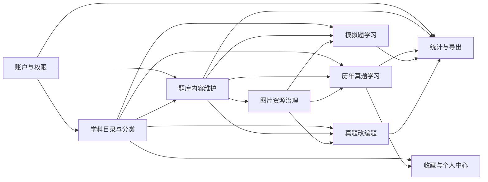
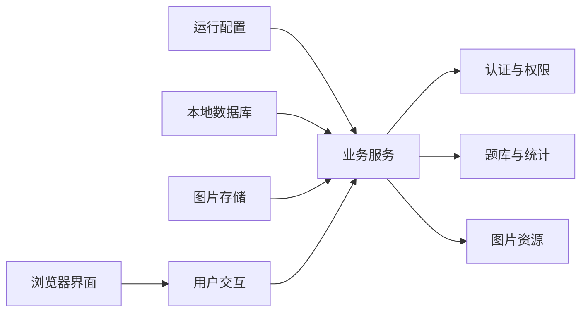
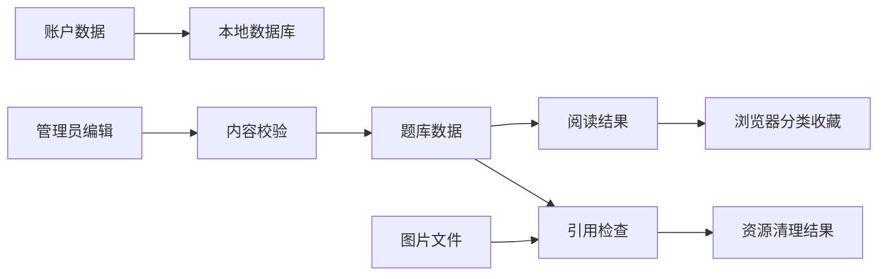
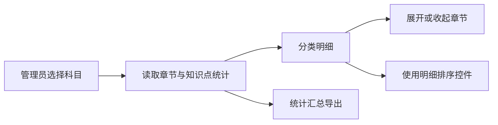

# 408考研真题知识点阅读网站 — 模块说明文档

> 本文档说明系统的业务功能设计、模块边界和协作关系。
> 项目结构导航文档负责说明代码组织；本文档负责说明业务模块如何支撑产品能力。
> 更新日期：2026-09-20
>
> **项目基础信息**
>
> | 类别 | 技术/版本 | 用途 |
> |---|---|---|
> | 前端框架 | Vue `^3.4.27` + TypeScript `~5.9.0` | 构建用户浏览界面和管理员操作界面；应用源码启用严格类型检查 |
> | 前端构建 | Vite `^7.3.6`、`@vitejs/plugin-vue` `^6.0.1` | 前端开发与构建 |
> | 前端运行时 | Node.js `^20.19.0 || >=22.12.0`（Vite 7 要求；package.json 未声明 engines） | 执行前端开发、类型检查、测试与构建脚本 |
> | 前端路由与状态 | Vue Router `^4.3.2`、Pinia `^2.1.7` | 页面导航、认证状态和科目缓存 |
> | UI 与图标 | 项目自定义基础组件、Font Awesome `^7.2.0` | 表单反馈、交互组件和图标 |
> | 样式 | Tailwind CSS `^4.1.18`、PostCSS `^8.5.6` | 页面布局与视觉样式 |
> | HTTP 客户端 | Axios `^1.7.2` | 前后端数据交互 |
> | Markdown | `@kangc/v-md-editor` `^2.3.18`、highlight.js `^11.11.1` | 题目、选项和答案的编辑与阅读 |
> | 数学公式 | KaTeX `^0.16.25` | 数学公式预处理与展示 |
> | 文档导出 | docx `^9.5.1` | 浏览端 Word 文档导出 |
> | 后端语言 | Python `3.12`；项目要求 `>=3.12` | 后端业务服务运行时 |
> | 后端框架 | FastAPI；版本未固定 | 提供业务服务和后台管理能力 |
> | 后端服务运行时 | Uvicorn；版本未固定 | 承载 FastAPI 应用 |
> | 数据模型与数据库 | SQLModel、aiosqlite；版本未固定；SQLite 版本未固定 | 本地题库、账户和目录数据持久化 |
> | 校验与配置 | Pydantic、pydantic-settings；版本未固定 | 输入校验和环境配置 |
> | 认证安全 | python-jose、pwdlib[argon2]；版本未固定 | 登录凭证、密码保护和权限判断 |
> | 文件处理 | python-multipart、aiofiles；版本未固定 | 图片上传和异步文件写入 |
> | 外部服务 | 当前未确认配置 AI Provider 或其他必选外部服务 | 现有业务以本地数据库和文件存储为主 |
>
> 版本仅采用依赖清单中的声明；未固定的后端依赖不推测具体版本。

---

## 1. 文档定位

本文档面向需要理解产品功能、模块边界和跨模块业务流的开发者、维护者及评审人员。它与项目结构导航文档分工：前者回答“系统为用户解决什么问题、模块如何协作”，后者回答“具体代码在哪里”。建议先阅读第 2～4 节建立全局认识，再阅读第 5～9 节定位具体模块和业务闭环，最后用第 10 节核对开发决策。

## 2. 系统功能定位

### 2.1 一句话定位

这是一个面向 408 考研备考的题库阅读与运营系统，帮助学习者按科目、年份、来源和知识分类阅读真题、模拟题和真题改编题、查看解析并整理分类收藏，同时为管理员提供题库内容、分类、改编来源和图片资源维护能力。

### 2.2 核心能力方向

系统围绕“结构化组织—高效阅读—内容维护—统计输出—个人整理”五个方向设计：

| 能力方向 | 业务目标 |
|---|---|
| 题库结构化组织 | 用科目、章节、层级分类、年份和来源建立可检索的题目上下文；真题分类统计按“章节→知识点”组织层级。 |
| 真题、模拟题与改编题阅读 | 让学习者从年份、科目、来源、改编来源或分类进入题目，连续阅读题干、选项和答案解析。 |
| 真题改编追踪 | 让内容维护者记录改编题对应的一道或多道真题，并通过反查与覆盖统计规划改编进度。 |
| 题库内容维护 | 让管理员录入、修改、删除题目，区分选择题与主观题，并保留 Markdown 内容能力。 |
| 统计与导出 | 通过年份、分类、题型、来源和科目统计帮助了解题库覆盖情况，并输出可携带文档。 |
| 个人分类整理 | 让学习者收藏常用题目分类，并从个人中心快速回到对应的真题浏览上下文。 |
| 图片与公式内容 | 支持题目中的公式、代码、SVG 和图片内容在编辑与阅读场景中保持可读性。 |

## 3. 端侧职责划分

| 端侧或边界 | 职责定位 | 设计关注点 |
|---|---|---|
| 学习者界面 | 提供登录注册、真题/模拟题/改编题阅读、筛选、作答反馈、复制、导出和收藏入口。 | 首次加载、空状态、答案显隐、题目定位，以及窄屏（<768px）用吸顶目录入口 + 底部目录抽屉完成科目、年份、分类和题号导航的移动端阅读体验。 |
| 管理员界面 | 提供科目、分类层级与顺序、真题、模拟题、改编题、改编覆盖统计和图片资源维护。 | 权限门槛、表单校验、重复数据、删除确认和操作后的列表一致性。 |
| 后端业务服务 | 统一承载身份校验、题库查询、目录聚合、统计、内容校验和文件管理。 | 业务规则集中、事务边界清晰、错误可理解、公开查询与管理员操作隔离。 |
| 本地数据库 | 保存账户、科目、章节、分类、真题、模拟题、改编题及改编来源关联元数据。 | 科目归属、父子层级、题目唯一性、引用关系和删除约束。 |
| 图片文件存储 | 保存题目 Markdown 中引用的上传图片，并接受阅读端访问。 | 文件类型与大小、文件名安全、引用扫描和删除后的内容风险。 |
| 浏览器本地状态 | 保存登录会话辅助信息、科目缓存、页面导航状态和分类收藏。 | 明确本地数据与服务端数据的边界，不把浏览器收藏误认为跨设备同步。 |
| 外部服务边界 | 当前没有已确认的 AI Provider 或其他必选外部服务。 | 现有功能不能依赖未配置的外部服务；外部依赖必须有独立失败边界。 |

## 4. 功能模块总览

当前按业务语义拆分为 9 个模块，通用能力不计入业务模块数量。

| 模块 | 模块定位 | 核心产出 | 直接依赖关系 |
|---|---|---|---|
| 账户与权限 | 识别使用者身份并控制普通用户与管理员的能力范围。 | 登录状态、角色判断、管理员操作门槛。 | 被所有管理模块依赖；与题目阅读模块协作提供条件性管理入口。 |
| 学科目录与分类 | 为题库建立科目、章节和层级分类上下文。 | 科目列表、分类树、分类统计维度和可选分类。 | 依赖账户与权限进行维护；被真题、模拟题、维护、统计和收藏模块依赖。 |
| 历年真题学习 | 让学习者按年份、科目和分类连续阅读历年真题。 | 年份入口、题目卡片、答案反馈、复制和导出结果。 | 依赖学科目录、题库内容和内容格式支撑；被收藏与统计导向。 |
| 模拟题学习 | 让学习者按来源、科目和分类阅读模拟题并进行即时练习。 | 来源入口、分类题目列表、答案反馈和复制结果。 | 依赖学科目录、题库内容和内容格式支撑；与统计模块协作。 |
| 真题改编题 | 让内容维护者录入真题改编题、维护多道真题来源，并让学习者浏览改编题。 | 改编题主体、来源引用、来源解析、真题反查和覆盖统计。 | 依赖账户与权限、学科目录、真题只读边界、题库内容和图片资源；被学习、统计和目录联动使用。 |
| 题库内容维护 | 让管理员维护真题、模拟题和改编题的完整内容及业务元数据。 | 新增、编辑、删除后的题目记录和可阅读内容。 | 依赖账户与权限、学科目录、内容格式和图片资源；产出供阅读与统计使用。 |
| 收藏与个人中心 | 让学习者保存常用题目分类并快速回访。 | 按科目组织的本地分类收藏和跳转上下文。 | 依赖账户状态、学科目录和真题学习；不依赖服务端收藏数据。 |
| 统计与导出 | 将题库内容聚合为年份、分类、题型、来源和科目视图，并按科目—章节—知识点层级组织统计与导出。 | 按科目分组的分类明细、学习端 Markdown/Word 导出；管理员分类统计支持只含汇总数据的 Markdown/Excel 导出。 | 依赖题库内容、学科目录和内容格式；分类统计导出受管理员权限保护。 |
| 图片资源治理 | 管理题目内容中的图片文件、引用关系和清理结果。 | 图片预览、引用清单、单张删除和未引用清理。 | 依赖账户与权限、真题/模拟题/改编题内容和文件存储；被 Markdown 编辑与阅读场景使用。 |

## 5. 各业务模块说明

### 5.1 账户与权限

- **定位**：为系统建立可信的使用者身份，并将题库维护能力限制在管理员范围内。
- **核心功能**：
  - 用户注册并创建普通学习账户。
  - 使用用户名和密码登录系统。
  - 在页面中保持登录状态并展示当前用户身份。
  - 区分普通用户和管理员可见的导航与操作。
  - 在凭证失效或账户被禁用时阻止继续访问受保护内容。
- **设计边界**：不负责题目内容、目录结构、收藏内容或图片文件本身；它只负责“谁在使用”和“是否有权限”，不替代各业务模块的内容校验。
- **依赖与协作**：
  - **本模块依赖**：本地账户数据和统一安全支撑。
  - **被谁依赖**：题库内容维护、目录维护、统计管理和图片治理依赖管理员身份；个人中心依赖登录用户上下文。
- **开发关注点**：
  - 注册和登录失败信息应足够明确，但不能暴露敏感数据。
  - 管理员权限必须在服务端和界面两侧同时成立，不能只隐藏按钮。
  - 登录失效后应清理会话上下文，并避免旧页面继续提交管理操作。
  - 角色判断应使用统一来源，避免页面各自维护一套权限规则。

### 5.2 学科目录与分类

- **定位**：把题库从平面题目集合组织成以科目为入口、以章节和分类为上下文的学习目录。
- **核心功能**：
  - 向学习者展示启用的科目及其题目数量。
  - 按科目展开多级分类树，支持选择分类进入题目列表。
  - 为真题提供可维护的层级分类。
  - 为题目编辑提供可选择的分类和父级分类。
  - 为真题和模拟题管理提供按当前科目分类树展示的单选分类筛选；选择父分类时按其子树范围查询，未归档历史分类集中在独立的“未归档分类”节点下。
  - 维护科目名称、编码、排序和启用状态。
  - 提供章节层级数据作为目录基础；当前没有独立的章节管理用户闭环。
  - 在真题分类统计中，将一级真题分类作为章节、下级分类作为知识点，沿用分类树的层级作为默认分组。
  - 根据题目引用情况展示分类数量和可删除性。
- **设计边界**：不保存题干、答案和选项内容；不决定题目的阅读布局；真题和模拟题管理筛选优先复用当前科目的分类树，题目数据用于补充统计和识别未归档历史分类；未归档分类不能伪装成目录中的正式父子关系。真题分类统计中的章节和知识点是现有真题分类树的展示层级，不另行读取独立知识点数据。
- **依赖与协作**：
  - **本模块依赖**：账户与权限、题库数据统计和本地数据库。
  - **被谁依赖**：真题学习、模拟题学习、题库维护、统计与导出、收藏模块依赖科目和分类上下文。
- **开发关注点**：
  - 分类必须始终归属于正确科目，父分类不能跨科目挂接。
  - 层级变化要避免自引用、循环引用和破坏已有题目上下文。
  - 删除前必须区分子分类引用和题目引用，不能只检查界面上是否显示。
  - 多标签题目参与统计时要区分“标签出现次数”和“实际题目数”。
  - 启用状态应同时影响学习者导航、管理筛选和编辑选择，不能只影响其中一侧。
  - 管理页分类筛选必须保留父子层级；单选父分类时由后端按子树范围筛选，未归档分类只能作为独立兜底分组。
  - 真题分类统计的章节/知识点展示语义必须与目录树一致，不能在统计页另建一套层级关系。
  - 真题分类统计的分类明细默认按目录层级呈现，排序控件只作用于当前统计视图，不修改分类目录顺序或题库数据。

### 5.3 历年真题学习

- **定位**：为学习者提供从年份入口到连续题目阅读的真题学习路径，并支持答案复盘与内容带走。
- **核心功能**：
  - 按年份查看真题数量并进入指定年份。
  - 按科目和层级分类浏览真题。
  - 点击父分类时展示该分类及其启用子孙分类；多标签题目按题目 ID 去重，并只在左侧分类树中最后一个匹配标签的分组中显示。
  - 选中父分类后，宽屏在内容区域右侧展示当前已加载题目分组的分类大纲，支持跳转到对应分组并随滚动高亮当前位置；窄屏（<768px）改为吸顶目录入口 + 底部目录抽屉，同一批分组以抽屉内的“本页分组”锚点呈现。
  - 按题型、分类和关键词缩小阅读范围。
  - 连续查看题干、选择题选项和参考答案。
  - 对选择题进行点击作答并获得正确/错误反馈。
  - 单独显示或隐藏每道题的答案解析。
  - 通过“过程”菜单上传和查看与当前真题独立关联的讲解过程图片；所有访问真题的用户可查看，只有管理员可上传、删除和调整顺序。
  - 复制题目、选项、答案或完整内容为 Markdown/Word 富文本；Word/WPS 复制中的公式保留不带 Markdown `$` 分隔符的原始 LaTeX，SVG/图片按图片形式复制并保持居中，独立图片高度固定为 3.00 厘米并按原比例计算宽度，通过 HTML 尺寸属性和内联样式保持纵横比；图片复制提供题目+选项、答案和全部三种范围。
  - 将当前题目集合导出为可携带文档。
- **设计边界**：不负责题目的新增、修改和删除；不负责分类定义和统计口径；过程图片不写入题干、选项或答案 Markdown，也不参与答案显隐、复制和导出；管理员在阅读页看到的编辑入口只是维护模块的协作入口，内容规则仍由题库内容维护负责。阅读端的多标签去重只影响当前展示分组，不改变题目分类 JSON，也不替代统计模块的分类引用口径。分类大纲只索引当前已经加载并实际展示的分组，不承诺一次列出分页尚未加载的全部子分类。
- **依赖与协作**：
  - **本模块依赖**：学科目录与分类、题库内容、Markdown/公式/图片内容支撑。
  - **被谁依赖**：收藏与个人中心通过分类上下文回到本模块；统计与导出复用本模块的阅读语义。
- **开发关注点**：
  - 年份和题号顺序必须稳定，导航选中项要与右侧题目内容保持一致。
  - 父分类筛选必须覆盖其启用子孙分类，分组顺序跟随左侧分类树；多标签题目只归入最后一个匹配标签，不能在多个分组重复显示。
  - 分类大纲只在父分类范围内且存在已加载分组时出现；点击大纲只定位内容，不改变目录筛选（宽屏为左侧分类树，窄屏为目录抽屉）或题目跳转上下文。
  - 筛选、加载更多和路由切换时不能让旧结果覆盖新选择，并应同步刷新分类大纲。
  - 答案默认应保持隐藏，用户主动查看后才改变当前题目的答案状态；打开或关闭过程图片不能改变答案状态。
  - 选择题选项、解析、公式、代码和图片应使用一致的内容展示规则；过程图片使用独立弹窗的大图阅读布局。
  - 从管理场景定位到题目时，应保留科目、分类和题目位置上下文。

### 5.4 模拟题学习

- **定位**：为学习者提供按来源和知识分类组织的模拟练习入口，形成与真题相似但不混淆的阅读体验。
- **核心功能**：
  - 按科目查看模拟题数量和分类树。
  - 按来源机构筛选模拟题。
  - 按分类、题型和关键词缩小题目范围。
  - 选中父分类时，宽屏在内容区域右侧查看当前已加载分组的分类大纲并跳转到对应模拟题区域；窄屏改由吸顶目录入口打开底部目录抽屉，在抽屉内用“本页分组”锚点跳转。
  - 查看选择题选项、主观题内容和答案解析。
  - 对选择题进行即时作答并获得反馈。
  - 隐藏或显示单题答案。
  - 复制题目、选项、答案或完整内容为 Markdown/Word 富文本；Word/WPS 复制中的公式保留不带 Markdown `$` 分隔符的原始 LaTeX，SVG/图片按图片形式复制并保持居中，独立图片高度固定为 3.00 厘米并按原比例计算宽度，通过 HTML 尺寸属性和内联样式保持纵横比；图片复制提供题目+选项、答案和全部三种范围。
  - 从管理列表定位到指定模拟题。
- **设计边界**：不把模拟题当作按年份组织的真题；不负责来源机构和题目内容的维护；学习端的题目分类统计仍来自模拟题数据，但管理端分类筛选复用科目分类树，并将无法映射的历史标签归入“未归档分类”。分类大纲是当前阅读结果的定位辅助，不改变模拟题分类筛选、来源筛选或分页范围。
- **依赖与协作**：
  - **本模块依赖**：学科目录与分类、题库内容、来源统计和 Markdown/公式/图片内容支撑。
  - **被谁依赖**：统计与导出依赖模拟题的来源、科目和分类聚合；题库维护通过编辑结果反哺本模块。
- **开发关注点**：
  - 来源、标题和题号共同构成模拟题的识别上下文，不能只按题号判断重复。
  - 模拟题分类统计来自题目数据时，分类树、题目数量和空分类过滤要保持一致；管理筛选使用目录树，并单独处理未归档标签。
  - 父分类的分类大纲必须与当前已加载、已按题型过滤的内容分组一致，不能展示无法定位的分页外分类。
  - 切换科目或分类时应重置答案状态、分页上下文和分类大纲激活状态。
  - 真题与模拟题的筛选、统计和管理规则应保持相似体验，但不能强行共用不适用的业务字段。
  - 来源和标题选择之间的联动不能覆盖用户已经输入的有效内容。

### 5.5 真题改编题

- **定位**：保存和阅读由一道或多道历年真题改编形成的新题，明确记录改编来源，避免把改编题混入模拟题来源机构语义。
- **核心功能**：
  - 独立维护改编题题干、选项、答案、科目、分类、题型、难度和题集内题号。
  - 一道改编题关联一道或多道真题来源，允许跨年份，并可记录综合应用题小问。
  - 输入年份与题号时即时解析真题库，显示原题摘要；未命中时保留来源事实并提示核对。
  - 按标题与题集内题号查重；同一真题被多个改编题引用时提示但不阻断。
  - 从指定年份/题号反查改编题，按年份和科目统计已改编题、未改编题号及悬空来源。
  - 用户端按科目和分类浏览改编题，并查看来源摘要与答案解析。
- **设计边界**：不复制真题正文；来源以年份、题号和可选小问为事实键，解析出的真题 ID 只用于跳转和核对；不负责出题工作台、Word/PNG 导出和真题过程图片能力。
- **依赖与协作**：依赖账户权限、学科目录、真题只读解析、题目内容校验和图片资源治理；目录模块负责分类统计、改名同步和删除保护；媒体模块负责扫描改编题正文图片引用。
- **开发关注点**：来源引用必须防止同一改编题重复引用同一来源；删除改编题级联删除来源，删除真题只清空解析目标；覆盖统计按真题题号去重，不能把多个小问重复计为多道改编题。

### 5.6 题库内容维护

- **定位**：让管理员以可校验、可阅读的方式维护真题、模拟题和改编题的题干、选项、答案及题库元数据。
- **核心功能**：
  - 新增、编辑和删除真题。
  - 新增、编辑和删除模拟题。
  - 新增、编辑和删除改编题，维护一个或多个真题来源的年份、题号和小问。
  - 在模拟题管理表格中通过“出题”下拉按钮复制完整 Word 内容、导出题目+选项 PNG 图片或切换出题状态；Word 复制成功后自动设置为“已出题”，图片导出不改变出题状态，管理员可手动切换恢复。
  - 在出题工作台按筛选条件滚动加载模拟题，沿章节树选择题目范围，跨加载批量选择并调整顺序，将选中题目合并复制为 Word 富文本；批量复制成功后一次性更新选中题目的出题标记。
  - 出题工作台选中章节后，内容区只显示该章节（含其子知识点）的题目、汇总为一个分组；只有选择“全部章节”时才按目录节点分组。章节树用于筛选题目范围，不做页内锚点跳转。
  - 真题和模拟题管理表格支持按 ID、时间、题号等字段排序。
  - 按来源、科目、分类、关键词和出题状态筛选模拟题；出题工作台额外提供题型（选择题/主观题）筛选，题目管理表格只展示题型列、不提供题型筛选。
  - 新增模拟题时打开空白表单，清除上一次编辑内容并将内容区域滚动位置重置到顶部。
  - 分别录入选择题和主观题内容。
  - 设置年份或来源、题号、科目、分类、难度和答案解析。
  - 通过结构化文本快速导入单题内容，并支持只更新题目、选项和答案解析而保留基础信息。
  - 在保存前校验必填内容、选项完整性和重复题目。
  - 在真题卡片中维护过程图片，支持管理员上传、删除和调整展示顺序；过程图片关联记录独立于题目主体。
  - 修改后立即回到管理列表或学习页面验证结果。
- **设计边界**：不负责学习者的阅读布局、答案显隐状态和收藏；不自行定义科目/分类体系；不负责图片文件生命周期，但真题过程图片的关联和排序由本模块维护，改编题来源引用由改编题模块维护，文件校验、引用扫描和清理由图片资源治理负责。
- **依赖与协作**：
  - **本模块依赖**：账户与权限、学科目录与分类、内容格式支撑、图片资源治理。
  - **被谁依赖**：历年真题学习、模拟题学习、真题改编题、统计与导出、图片引用检查直接消费维护后的题库内容。
- **开发关注点**：
  - 真题按年份与题号组合防重，模拟题按来源、标题与题号组合防重，改编题按标题与题集内题号组合防重，来源引用按改编题、年份、题号和小问组合防重。
  - 选择题必须同时保证题干、选项和答案解析的业务完整性；主观题不能误带旧选项。
  - Markdown、公式、代码、SVG 和图片引用应在导入、保存、阅读之间保持语义稳定。
  - 删除是不可逆内容操作，必须经过清晰确认并刷新所有受影响的列表和统计。
  - 真题过程图片单独存储在 `exam_process_image` 表中；删除真题时级联清理关联记录，图片文件由现有未引用清理机制处理。
  - 出题状态单独存储在 `mock_question_exam_mark` 表中，不修改模拟题主体；删除模拟题时由外键级联清理对应状态。
  - 出题工作台的选中集合只存在于当前浏览器页面，不形成可恢复的出题单或历史记录；批量 Word 复制复用单题的公式、图片和剪贴板降级逻辑。
  - 出题工作台的章节导航是题目范围筛选，不是页内锚点定位：选中章节即缩小题目集合并只渲染该章节一个分组，不保留“展示全部章节再滚动到对应位置”的阅读形态。
  - 编辑分类时要兼容历史题目已有但当前目录未定义的分类，避免无意丢失原内容。
  - 改编题来源未命中真题库时保留年份/题号事实并提示核对，不把未解析来源静默丢弃；删除真题只解除解析目标，不删除改编来源事实。

### 5.7 收藏与个人中心

- **定位**：帮助学习者把常用的科目分类保存为个人入口，减少重复查找成本。
- **核心功能**：
  - 按科目查看已收藏的题目分类。
  - 添加或取消某个科目下的分类收藏。
  - 显示收藏数量和收藏时间顺序。
  - 一次性清空全部分类收藏。
  - 从收藏项打开对应的真题分类浏览页面。
  - 在个人中心查看当前登录用户的角色信息。
- **设计边界**：当前收藏对象是“科目下的真题分类”，不是单道题、学习进度或服务端题库记录；收藏只保存在当前浏览器，不承诺跨设备同步，也不改变题目和分类的真实数据。
- **依赖与协作**：
  - **本模块依赖**：账户状态、启用科目、真题分类列表和真题学习入口。
  - **被谁依赖**：没有其他模块依赖收藏结果；它只向真题学习提供带科目和分类上下文的跳转。
- **开发关注点**：
  - 收藏唯一性必须同时考虑科目和分类名称，不能只按分类名称去重。
  - 分类被管理员修改或删除后，个人中心应能容忍历史收藏失效。
  - 清空和取消操作必须有明确确认与即时反馈。
  - 不要把本地收藏数量解释为服务端用户数据或题目学习统计。

### 5.8 统计与导出

- **定位**：把题库内容转化为学习入口和运营视图，帮助用户按范围带走资料、帮助管理员判断题库覆盖情况。
- **核心功能**：
  - 展示真题按年份的总量、选择题量和主观题量。
  - 展示真题按分类、科目的题目统计。
  - 按科目、章节和知识点的层级展示真题分类统计，通过可折叠分组明细查看知识点；明细支持按目录顺序、选择题数、主观题数和总题数切换排序。
  - 展示模拟题按来源、科目和分类的数量。
  - 展示真题改编覆盖：按年份/科目统计已被改编的真题题号、未改编题号、改编次数和悬空来源。
  - 在分类统计中区分总分类数、启用分类数和实际题目数。
  - 从年份或科目阅读场景导出 Markdown 或 Word 文档。
  - 分类统计支持只含汇总数据的 Markdown 及 Excel 导出，导出范围跟随科目筛选，并保持科目—章节—知识点的默认层级。
  - 多分类题目按题目 ID 计算去重总题数，同时单独展示分类引用总数。
- **设计边界**：统计是题库内容的派生结果，不是独立事实源；导出不修改题目、分类或用户数据；统计模块不负责修正脏数据，也不替代内容维护中的校验。
- **排序边界**：分类明细排序是当前页面的临时展示状态，不写回分类目录；统计查询使用分类树提供章节/知识点分组，统计导出保持默认层级顺序。

#### 真题分类统计展示规则

- **层级**：先按科目分组；一级真题分类作为章节，子分类作为章节内知识点；存在更深层级时按原分类树继续展示。
- **明细**：按科目和章节分组展示，章节默认展开，可单独或全部收起；明细默认按目录顺序，排序控件可按选择题数、主观题数或总题数切换升序/降序，不保存为目录顺序。
- **展示范围**：以目录节点为明细行，零题数或已禁用节点保留并标明状态；题目引用但目录中不存在的标签单独归入明细末尾的“未归档分类”。
- **视觉语义**：总题数通过相对题量条形辅助比较，选择题和主观题用独立颜色及数值表达；条形不表示百分比，分类计数也不能相加推导题目总数。
- **数量口径**：章节及其他有子级的目录节点显示自身及所有后代分类的题目 ID 去重数；叶子知识点显示本节点直接引用题目数；总题数与分类引用总数继续分开表达。

- **依赖与协作**：
  - **本模块依赖**：题库内容、学科目录与分类、真题来源只读边界、内容格式化和账户权限。
  - **被谁依赖**：真题首页、分类管理、改编覆盖统计和学习页面使用统计结果作为入口或提示；导出结果供学习者或管理员带走。
- **开发关注点**：
  - 多标签题目统计必须明确“按题目去重”还是“按分类引用计数”；有子级的目录节点汇总使用自身及后代分类的题目 ID 并集。
  - 分类统计必须先按科目建立章节—知识点树；分类明细通过排序控件临时调整，不能把临时排序写回目录或误当作统计口径。
  - 统计筛选范围要与当前科目、分类和题型上下文一致。
  - 导出内容应保持章节/知识点顺序、题号顺序、题型标识、分类信息和答案包含策略。
  - 统计为空时应明确区分“没有数据”和“加载失败”，目录缺失的题目标签不能静默消失。

### 5.9 图片资源治理

- **定位**：维护真题、模拟题和改编题正文内容及真题讲解过程图片的文件与引用关系，减少无效资源并降低误删造成的阅读损坏。
- **核心功能**：
  - 在题目编辑过程中上传图片并插入内容。
  - 在真题卡片中为每道真题上传、查看、排序和删除独立的讲解过程图片。
  - 删除过程图片时只解除真题关联，物理文件进入未引用清理流程，不立即删除文件。
  - 查看图片预览、文件大小和最后修改时间。
  - 查看图片被哪些真题、模拟题或改编题引用。
  - 只筛选当前未被题目引用的图片。
  - 删除指定图片。
  - 批量清理真题、模拟题和改编题都未引用的图片。
- **设计边界**：只治理题目阅读相关图片，不负责通用资源下载和资源业务元数据；过程图片关联独立于题干、选项和答案 Markdown；不自动改写已经保存的题目内容；图片删除也不等于题目引用同步修复。
- **依赖与协作**：
  - **本模块依赖**：账户与权限、题库内容、Markdown 内容支撑和图片文件存储。
  - **被谁依赖**：题库内容维护使用上传能力；真题学习、模拟题学习和改编题学习使用图片访问能力。
- **开发关注点**：
  - 上传必须限制允许的图片类型和大小，并使用安全的存储名称。
  - 引用检查必须覆盖真题、模拟题和改编题的题干、选项及答案内容，以及真题过程图片关联记录。
  - 单张删除与未引用批量清理必须明确告知不可恢复和可能影响。
  - 已被引用的图片不能被“未引用清理”误判为孤立资源。
  - 文件系统状态与题库文本引用可能短暂不一致，管理界面应提供刷新和失败反馈。

## 6. 通用支撑能力

### 6.1 身份认证与权限支撑

- **职责与使用原则**：统一提供登录身份、账户状态和管理员判断；所有管理动作都以服务端权限结果为最终依据，界面只负责提供友好入口和反馈。
- **开发时应避免**：只依赖前端隐藏按钮、在不同页面复制角色判断、把登录成功误认为管理员授权，或在会话失效后继续复用旧身份。

### 6.2 统一响应与错误处理

- **职责与使用原则**：让成功、校验失败、未找到、无权限、冲突和服务器异常拥有一致的用户反馈语义；业务层应返回可理解的领域消息，界面层统一展示。
- **开发时应避免**：在页面中为同一类错误各写一套解释、把所有失败都显示成“网络错误”、向用户暴露密钥、数据库细节或堆栈信息。

### 6.3 内容格式与安全渲染

- **职责与使用原则**：统一处理 Markdown、数学公式、代码、SVG、图片和答案内容，使编辑预览与阅读展示尽量一致，同时保留必要的安全过滤。
- **图文比例**：编辑预览、阅读和 PNG 复制共用正文/选项角色。当前实现的正文 384×288px、选项 140×112px 是防溢出的保护性上限，不是所有图片的目标显示尺寸；2009 年真题第 3 题使用的是 890×1024 的 PNG 纵向示意图，达到高度上限后仍会压过正文。因此默认策略应是“紧凑显示 + 特殊图单独放大”，候选校准值为正文 18em×12em、选项 8em×6em，未完成浏览器验收前不视为最终值。
- **格式与内容角色**：PNG/JPEG/GIF/WebP 与 SVG 使用相同的布局上限；文件格式只决定加载或坐标处理方式，不决定视觉尺寸。原图像素、白边和图内文字密度不能直接等同于推荐显示尺寸。
- **单图覆盖**：在 Markdown 中使用 HTML 图片/SVG 的 `width` 或允许的内联宽度指定更小尺寸；`media-wide` 类允许密集图突破默认紧凑上限，仍受原图和容器宽度限制；`media-inline` 类将符号图限制到正文约 1.4 倍字高。导出画布中的文本默认左对齐并按画布宽度正常换行，正文混排不强制换行，独立插图居中，选项插图左对齐。写法见题库内容维护模块设计的“插图显示与单图覆盖”。
- **SVG 与放大**：仅规范化内容插图，排除 KaTeX 和嵌套 SVG；缺少 viewBox 时只依据明确的固定宽高补充渲染副本，信息不足或非法时保留原样。图片和可规范化 SVG 支持点击或键盘打开可滚动的原尺寸预览，预览不触发选项作答。
- **复制边界**：PNG 复制不取消媒体约束，禁用预览交互；学习端提供“题目+选项、答案、全部”三种范围，管理端“导出题目图片”固定使用“题目+选项”范围；当前仍保持 760px 画布和 2 倍采样。Word/WPS 富文本复制会将独立图片设置为 3.00 厘米高度，按原图比例设置宽度，并通过 HTML 尺寸属性和内联样式保持纵横比；明确标记为行内符号的图片不套用固定高度。采样倍率只控制整张图片的像素清晰度，不能修复插图与文字的相对比例；复制版式还必须保证标题、标签不被拆行。
- **开发时应避免**：让不同题目页面使用不同的 Markdown 规则、把保护性上限当作推荐尺寸、直接信任任意 HTML/SVG、无差别修改所有 svg 的样式、在格式转换中破坏反斜杠和换行，或为临时显示单独拼接未过滤内容。

### 6.4 状态、缓存与异步反馈

- **职责与使用原则**：区分首次加载、筛选刷新、分页追加、提交保存、删除操作和失败重试；对科目、导航和页面位置使用有边界的缓存，避免重复请求和旧结果覆盖新状态。
- **开发时应避免**：只设置一个全局加载标记、重复点击造成并发提交、切换科目后沿用旧答案状态、无限等待无重试入口，或把缓存当作永久事实。

### 6.5 题目数据边界与命名转换

- **职责与使用原则**：在前后端边界统一处理题目元数据、分类列表、选项和时间字段的形态转换；业务模块内部使用稳定的业务语义，不把存储形态泄漏到用户体验中。
- **开发时应避免**：让每个页面自行解析分类和选项、混用真题与模拟题字段、在局部转换中丢失未定义分类，或通过隐式字段猜测题目类型。

### 6.6 浏览器本地状态与导航上下文

- **职责与使用原则**：集中管理登录辅助信息、科目缓存、分类收藏、当前筛选、滚动位置和题目定位，使跨页面跳转可恢复且边界清楚。父分类阅读时，分类大纲只作为当前内容区域内的定位索引（宽屏在内容区右侧，窄屏在目录抽屉内），不写入 URL hash，也不替代目录入口/抽屉中的科目与分类选择。
- **开发时应避免**：把本地收藏当作服务端数据、在新标签页跳转时丢失科目/分类上下文、使用过期页面状态覆盖新数据，或在退出登录后保留不应继续使用的身份信息。不要把尚未加载的分页分组生成成可点击但没有目标的导航项。

### 6.7 基础交互与可访问性

- **职责与使用原则**：统一按钮、表单、弹窗、表格、树、提示、空状态和键盘操作的视觉与交互反馈；重要操作应有明确名称、焦点和状态变化。
- **开发时应避免**：用纯颜色表达唯一状态、让图标按钮缺少可理解名称、删除操作没有确认、加载/空/错误状态混为一谈，或让移动端无法完成核心浏览操作。

### 6.8 外部依赖边界

- **职责与使用原则**：当前系统以本地数据库、浏览器和本地图片文件为主要运行边界；未配置的 AI Provider 或其他外部服务不能被当作现有业务前提。
- **开发时应避免**：在题目录入、统计或阅读闭环中隐式依赖外部服务、没有超时和降级策略就增加网络调用，或把外部服务失败转化为题库数据损坏。

## 7. 模块间关键关系

### 7.1 模块依赖关系

该图中的箭头表示“后者依赖前者”：账户与目录提供基础上下文，题库内容向真题、模拟题和改编题阅读、统计和资源治理提供事实数据；改编题还通过真题只读边界获取来源解析。

### 7.2 核心学习业务流向

该图表示从学习入口到最终产出的完整路径，真题使用年份上下文，模拟题使用来源上下文，改编题使用真题来源摘要上下文；选中父分类时，分类大纲作为当前已加载内容分组之间的定位入口，三类题库共享科目、分类和内容阅读体验。

### 7.3 配置与运行依赖关系

运行配置决定数据库、凭证、上传和跨域等边界；业务服务依赖本地数据库和图片存储，浏览器界面通过用户交互使用这些能力，当前没有必选 AI 或其他外部服务节点。

### 7.4 数据与任务边界

账户和题库数据进入本地持久化边界，阅读结果是派生展示状态，分类收藏停留在浏览器本地；图片清理必须以题库引用检查结果为依据，不能把清理结果写回题目内容。

### 7.5 真题分类统计的层级与明细排序

分类明细按科目和目录层级展示，章节支持展开或收起，并支持临时升降序排序；导出保持默认的科目和目录层级。

### 7.6 真题改编来源与覆盖关系

改编来源以年份和题号为稳定事实键，一道改编题可以关联多道跨年份真题；真题删除时只解除解析目标，不删除改编来源事实。覆盖统计按真题题号去重，同一改编题的多个小问不能重复扩大改编题数。

## 8. 典型业务闭环

### 8.1 学习者完成一次历年真题复习

1. 学习者进入真题学习入口，选择目标科目和年份。
2. 系统根据年份生成题目导航，并加载该年份的题目内容。
3. 学习者在题目列表中按分类或题型缩小范围，按题号顺序阅读；如果选择父分类，宽屏可通过右侧分类大纲、窄屏可通过目录抽屉内的“本页分组”跳转到当前已加载的子分类分组。
4. 对选择题点击选项，系统给出正确/错误反馈；主观题直接阅读题干。
5. 学习者主动显示答案解析，使用 Markdown、公式、代码和图片完成复盘。
6. 学习者复制单题或完整内容，必要时导出当前题目集合，完成资料整理。

### 8.2 学习者按来源完成模拟题练习

1. 学习者进入模拟题入口并选择科目。
2. 系统加载该科目的模拟题分类和来源统计。
3. 学习者选择来源、分类或题型，系统刷新题目列表和分页状态；如果选择父分类，可通过分类大纲在已加载分组之间跳转。
4. 学习者阅读题干和选项，对选择题进行作答。
5. 学习者查看答案解析、复制错题内容或继续加载下一批题目。
6. 学习者切换科目或分类时，系统重新建立对应的模拟题阅读上下文。

### 8.3 管理员新增或修订一道题目

1. 管理员登录并进入题库内容维护入口。
2. 选择真题、模拟题或改编题，并填写年份/来源/真题来源、题号、科目、分类、题型和难度等上下文；新增模拟题时系统先清空旧表单并将编辑区域回到顶部；改编题可维护多行真题来源。
3. 在选择题和主观题表单之间选择对应内容结构，录入题干、选项和答案解析。
4. 需要批量整理时，粘贴结构化文本并检查解析后的字段。
5. 系统校验必填内容、分类归属和题目重复规则，拒绝不完整或冲突的记录。
6. 保存后刷新管理列表、阅读页面和相关统计，确认新内容可被学习者使用。

### 8.4 管理员治理分类与图片资源

1. 管理员选择科目并查看分类层级、启用状态和题目引用统计。
2. 创建、编辑或停用真题分类时，先确认父分类关系和已有题目引用；一级分类作为章节，子分类作为知识点；分类统计在分组明细中切换排序，且不修改分类目录。
3. 在题目编辑过程中上传图片，完成题目内容中的图片引用。
4. 管理员进入图片资源治理入口，查看预览、引用题目和未引用筛选结果。
5. 对单张图片或全部未引用图片进行确认后删除，并刷新资源列表。
6. 回到题目、分类和统计页面复核阅读内容、统计数量以及表格升降序切换没有产生意外影响。

### 8.5 学习者建立并使用分类收藏

1. 学习者在真题分类浏览中确定经常复习的科目分类。
2. 将该分类加入个人收藏，并看到收藏数量和状态反馈。
3. 在个人中心按科目查看收藏列表，确认收藏的分类上下文。
4. 点击收藏项打开对应的真题分类浏览页面。
5. 学习者可取消单项收藏或清空全部收藏；题库原始内容不受影响。

### 8.6 管理员维护一道真题改编题

1. 管理员进入改编题管理入口，填写题集标题、题号、科目、分类、题型、难度和题目内容。
2. 在来源编辑区添加一行或多行真题来源，填写年份、题号和可选小问；来源可以跨年份。
3. 系统批量查询真题库并展示原题摘要；无法命中时提示核对，但保留年份/题号事实，不阻断内容先行录入。
4. 保存前校验题型结构、科目分类归属、标题/题号重复和同源改编提示。
5. 保存后，管理员可从真题来源反查改编题，或在覆盖统计页查看已改编与未改编题号。
6. 用户端按科目和分类浏览改编题，查看来源摘要、题干和答案解析；改编题正文图片纳入统一引用扫描。

## 10. 后续开发参考原则

1. 管理能力必须同时受服务端权限和界面权限约束，不能把隐藏管理按钮当作安全边界。
2. 真题按“年份与题号”识别重复，模拟题按“来源、标题与题号”识别重复，二者不能混用唯一性规则。
3. 科目是目录的一级边界，分类和父分类必须归属于同一科目；管理页分类筛选使用科目分类树并按父分类子树查询，无法映射的历史标签归入未归档节点；真题分类统计把一级分类作为章节、子分类作为知识点，层级以分类树为准。
4. 真题分类统计的分类明细通过排序控件切换升序/降序，排序只作用当前统计页面，不修改分类目录顺序或其他学习页面。
5. 多标签题目的阅读展示按题目 ID 去重，只归入左侧分类树中最后一个匹配标签；统计仍必须区分题目 ID 去重数、分类引用数和章节子树并集数，分类展示数量不能直接冒充题库实际题目总数。
6. 选择题和主观题共享阅读体验，但必须分别校验选项、答案和内容结构，不以空字段掩盖题型差异。
7. Markdown、公式、代码、SVG 和图片必须经过统一内容处理与安全渲染，不能由单个页面自行放宽规则。
8. 答案展示应保持用户主动触发，筛选、翻页和切换科目时应清理不再适用的答案状态，并同步重建父分类内容大纲的分组和激活状态。
9. 题库查询、统计和导出必须区分加载、空结果、失败和成功状态，不能用空列表掩盖请求失败。
10. 图片清理只能依据真题、模拟题和改编题引用检查执行；分类收藏继续保持浏览器本地、按科目分类的边界，不能在没有服务端持久化契约时宣称跨设备同步或学习进度能力。
11. 改编题来源使用年份、题号和可选小问作为事实键，一道改编题允许关联多道跨年份真题；来源解析出的真题 ID 只能作为可选跳转目标，不能替代事实键。
12. 删除改编题必须级联删除来源引用；删除真题只能清空改编来源的解析目标，不得删除年份、题号和小问事实。
13. 改编覆盖统计按真题年份与题号去重，同一改编题的多个小问不能重复扩大已改编题数；无法对应真题库的来源必须单独报告。
14. 改编题分类、图片引用和题目内容应接入现有目录与媒体治理边界，不能为了新增题库而另建一套分类 JSON、Markdown 安全或图片清理规则。
